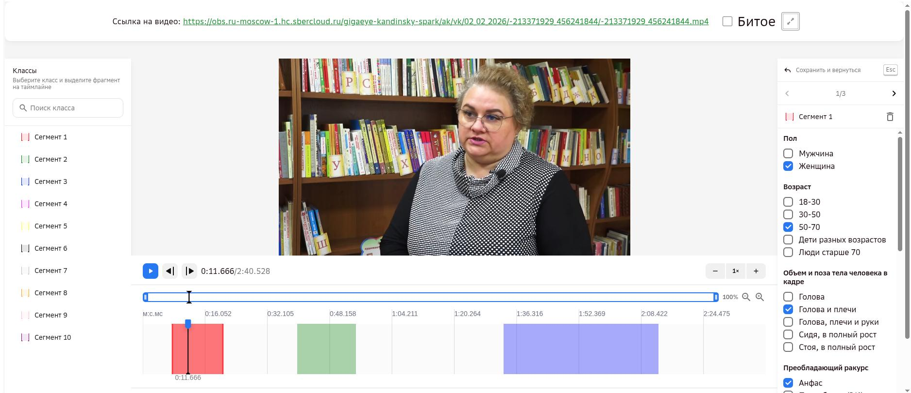

# Обзор проекта «Аватар. 2 этап (заявки 26-28)»

> ⚠️ **Этот мануал — только про 2 этап** (заявки 26-28). У проекта есть отдельный **3 этап**
> (заявка 46) — идёт следующим шагом сразу после 2 этапа: там уже размечают сегменты, нарезанные
> на 2 этапе, другой классификатор (19 вопросов). Материал по 3 этапу вынесен в отдельный мануал —
> [../manual-3-etap/00-overview.md](../manual-3-etap/00-overview.md).

## Цель проекта

Проект «Аватар» — сбор видео для обучения **S2V-модели** (генерация говорящего человека:
по исходному изображению человека и аудиодорожке с речью модель генерирует реалистичное
видео этого говорящего человека).

Задача оператора — на предоставленном видео **выделить сегменты**, подходящие для обучения
такой модели, и описать каждый сегмент через **классификатор** (см. [04-classifier.md](04-classifier.md)).
`[Инстр. Kandinsky-Аватар, стр.1]`

## Базовые термины и роли

| Термин | Определение |
|---|---|
| **Сегмент** | Непрерывный фрагмент видео, подходящий для обучения модели (точные критерии длительности и артефактов — [02-segments.md](02-segments.md)). На одном видео сегментов может быть несколько, у каждого — свой классификатор. `[Инстр. Kandinsky-Аватар, стр.1]` |
| **Классификатор** | Набор характеристик, которыми описывается каждый сегмент (пол, возраст, поза, ракурс, освещение, фон и т.д.), нужен для балансировки итогового датасета. Подробнее — [04-classifier.md](04-classifier.md). `[Инстр. Kandinsky-Аватар, стр.1]` |
| **«Битое» видео** | Если на видео нет ни одного сегмента, подходящего под критерии, всё видео помечается галочкой «Битое» (вместо выделения сегментов). `[Инстр. Kandinsky-Аватар, стр.1]` |

| Роль | Что делает |
|---|---|
| **Оператор нарезки / асессор / исполнитель** | Размечает сегменты на видео и заполняет классификатор. |
| **Валидатор** | Проверяет разметку оператора, находит ошибки (см. [06-common-mistakes.md](06-common-mistakes.md)). |
| **Руководитель группы (РГ)** | Менеджер Data Light. Отвечает за оперативное управление командой асессоров (доступы, онбординг и адаптация новичков, командные и личные встречи), финансовые и аналитические процессы проекта, а также за взаимодействие с заказчиком. |
| **Заказчик** | Финальная инстанция. Рассматривает оспаривания ошибок валидатора (см. ниже) и периодически сам проверяет пулы напрямую, публикуя ОС с оценкой точности (score) каждого асессора (см. [10-qa-log.md](10-qa-log.md)). |

## Структура проекта

Работа выполняется на платформе **Tagme**. Задания на разметку выкладываются пулами внутри
**заявок** — асессоры (операторы) работают именно с пулами конкретной заявки.

Текущий, **2-й этап** проекта состоит из **трёх заявок**, которые отличаются друг от друга
**длиной исходного видео**, а не требованиями к разметке — все критерии из этого мануала
одинаковы для всех трёх:

| Заявка | Длина исходного видео | Полное название |
|---|---|---|
| **26** | 240–420 сек | Заявка_26_Тариф_2_Kandinsky_Аватар_сбор видео для S2V-модели_Генерация говорящего человека_2 этап (240_420)_Даталайт |
| **27** | 0–240 сек | Заявка_27_Тариф_2_Kandinsky_Аватар_сбор видео для S2V-модели_Генерация говорящего человека_2 этап (0_240)_Даталайт |
| **28** | 420 сек – ∞ | Заявка_28_Тариф_2_Kandinsky_Аватар_сбор видео для S2V-модели_Генерация говорящего человека_2 этап (420_inf)_Даталайт |

`[скриншот платформы Tagme, чат, 05.08.2026]`

Общение с руководителем группы и остальными участниками проекта (асессорами), а также
дополнительные материалы по проекту — в приватном канале **«TAG ME Аватары»** на платформе
**Mattermost**; доступ к нему руководитель группы открывает после успешной сдачи экзамена.

> Длина исходного видео — это длительность самого сырого видео-источника, а не сегмента,
> который из него выделяется (сегмент по-прежнему 10–300 сек, см. [02-segments.md](02-segments.md)).

> На 2 этапе каждое задание выполняет только **один** асессор (однократное перекрытие) — в
> отличие от 3 этапа, где каждое задание одновременно выполняют **три** разных асессора
> (тройное перекрытие, см. [мануал 3 этапа](../manual-3-etap/00-overview.md#нормативы)).
> `[Уточнение пользователя, 12.08.2026]`

> ⚠️ **Первые кадры сегмента должны быть качественными.** Модель получает на вход одну
> фотографию человека и аудио с речью, а не всё видео — и эту фотографию чаще всего берут из
> **самого начала** выделенного сегмента. Поэтому именно там лицо должно быть хорошо видно,
> человек не отвёрнут и не перекрыт, даже если остальная часть сегмента снята хуже.
> `[Инстр. Kandinsky-Аватар, стр.1]`

## Интерфейс разметки

*Слева — список сегментов, снизу — таймлайн с уже выделенными фрагментами, справа — поля
классификатора для выбранного сегмента (пример: Сегмент 1, «Голова и плечи», «Анфас»,
50-70 лет). Галочка «Битое» — в правом верхнем углу, у ссылки на видео.*
`[Инстр. Kandinsky-Аватар, стр.1]`

Самое важное в работе — правильно найти и выделить [сегмент](02-segments.md); то, как именно вы потом заполните
классификатор, вторично. Формального порога согласованности ответов классификатора между
асессорами нет (многие поля прямо признаны оценочными, см.
[04-classifier.md](04-classifier.md#поля-классификатора)) — а вот
требования к качеству самого выбора сегмента (не пропустить водяной знак/рамку/склейку, найти
подходящий «золотой кадр» среди монтажа) жёсткие и именно по ним чаще всего прилетают серьёзные
ошибки. `[Видео с разбором ошибок — Аватар 2 этап]`

## Обратная связь по выполненным заданиям

После выполнения заданий валидатор проверяет каждого асессора, оставляет комментарии (см. «Мои
ответы») и дополнительно даёт обратную связь через руководителя группы — эту обратную связь
обязательно нужно учитывать.

Но при этом обратная связь (ОС) от валидатора — не абсолютная истина. Если ваша разметка
кажется вам верной, а комментарий валидатора — нет, **не соглашайтесь автоматически**:
аргументированно переспрашивайте и, если нужно, оспаривайте. Заказчик рассматривает такие
обращения и может поправить валидатора.

**Как устроено оспаривание ошибки:**
1. Асессор пишет в тред Mattermost, указывая ссылку на видео и аргументированное возражение.
2. Наставник из числа опытных асессоров валидирует запрос: либо возвращает возражение, либо
   принимает его и передаёт руководителю для дальнейшей отправки заказчику.
3. Возражение передаётся заказчику: он либо подтверждает ошибку (её исправят), либо нет — и
   объясняет почему.

## Как оценивается качество работы

На 2 этапе числового порога качества нет (в отличие от 3 этапа, где оценка идёт автоматически по
ханипотам — см. [мануал 3 этапа](../manual-3-etap/00-overview.md#нормативы)). Каждое задание, и
экзаменационное, и обычное рабочее, проверяет валидатор **вручную**: он оставляет комментарии по
каждому асессору (см. «Мои ответы») и дополнительно даёт обратную связь через руководителя
группы (см. выше). Решения о предупреждениях/отключении принимаются по совокупности найденных
валидатором ошибок (см. ниже), а не по проценту прохождения контрольных заданий.

Отдельно у заказчика есть внутренний норматив времени на задание (ориентир — около 270 секунд) и
практика квалифицировать как «фрод» одновременное выполнение двух заданий одним асессором
(28.05.2026). Это управленческий контроль качества, а не критерий разметки — знать о нём полезно
для понимания, почему можно получить предупреждение/отключение даже при формально верной
разметке. `[Почта. ОС по Заявкам 26-28, 28.05.2026]`

### Как принимается решение о предупреждении асессору

Команда несколько раз спрашивала заказчика, по какому принципу выносятся официальные
предупреждения — в частности, достаточно ли одной найденной ошибки в проверенном ролике из
партии, или решение опирается на больший объём данных, не всегда видимый самому асессору. Ответ
заказчика (07.08.2026): предупреждение выносится не за единичную ошибку саму по себе, а по
совокупности критериев — если асессор **игнорирует требования инструкции**, **повторяет одни и
те же ошибки**, **не учитывает обратную связь** (в т.ч. не изучает свои ошибки в сервисе «Мои
ответы») и **не показывает положительной динамики**. При этом заказчик может смотреть не только
задания, ушедшие на валидацию, но и **другие задания асессора**, не попавшие в выборку проверки —
поэтому в системе может быть не видно всех данных, на основании которых принято решение.
Официального процента выборки от объёма партии заказчик не назвал. `[Разметка ВК видео — ОС
07.08.2026]`

## Полезные материалы

Дополнительные видео от команды (памятка «Аватар. 2 этап», доработанная опытными асессорами):

- **Видео-обучение проекта:** <https://disk.yandex.ru/i/D4QDrevCpmCfhA>
- **Видео с разбором ошибок:** <https://disk.yandex.ru/i/6WmBFAJtREVl4w>

`[Памятка «Аватар 2 этап», стр.1]`

Видео с лайфхаками для разметки — на странице [«Лайфхаки»](08-lifehacks.md).

## История проекта: этапы во времени

Проект «Аватар» не шёл строго последовательно — команда несколько раз переключалась между 2 и
3 этапом:

- **Февраль 2026** — запуск 2 этапа (заявки 26-28) с нуля: первый экзамен, первые пулы.
  Проходной балл экзамена — ≥70% сразу с самого старта. Ближе к концу февраля объём на 2 этапе
  иссяк («То, что сейчас загружено на второй этап, это завершающие данные на разметку»,
  27.02.2026).
- **Март – середина мая 2026** — команда переключилась на **3 этап** (заявка 46, другой,
  более детальный классификатор — не входит в этот мануал).
- **18.05.2026** — 2 этап **перезапущен**: новый объём задач, часть асессоров без опыта на
  2 этапе должны заново сдать экзамен (это и есть источник всех материалов с тегом «Ступень 2» в
  [10-qa-log.md](10-qa-log.md)). На встрече в этот день заказчик и Data Light договорились
  **объединить** требования по качеству с 3 этапа с требованиями к сегментам на 2 этапе — этим
  объясняется, почему более поздние ОС по 2 этапу иногда используют более строгие/детальные
  критерии, чем исходная официальная инструкция.
- **С 18.05.2026 по сегодня (05.08.2026)** — 2 этап работает непрерывно, периодически совмещаясь
  с небольшими партиями 3 этапа.

`[Переписка в Telegram с заказчиком, 03.02–05.08.2026]`

⚠️ **Важное уточнение связи между этапами (07.08.2026):** переключение команды между 2 и 3 этапом
не случайно — **3 этап является продолжением 2 этапа**, а не отдельным независимым проектом: на
3 этапе оцениваются те же самые видео, которые до этого были найдены и нарезаны на сегменты на
2 этапе (см. подробности в [мануале 3 этапа](../manual-3-etap/00-overview.md#как-3-этап-связан-со-2-этапом)).
Именно поэтому история чередования этапов выше — это, по сути, чередование фаз одного и того же
пайплайна («нарезать» → «оценить нарезанное»), а не два параллельных проекта. При этом **допуск к
этапам разный**: экзамен 2 этапа не даёт доступа к 3 этапу и наоборот — это два отдельных
допуска. `[Уточнение пользователя, 07.08.2026]`

> Как проходит входной экзамен — см. отдельную страницу [«Экзамен и допуск»](00b-exam.md); как
> оценивается текущее качество работы уже нанятой команды — см. [выше](#как-оценивается-качество-работы).

## Как читать этот мануал

Разделы идут по этапам процесса: общие требования → сегменты → что размечаем/не размечаем →
заполнение классификатора → частые ошибки → FAQ → лайфхаки.
Отдельно от рабочего процесса — [«Экзамен и допуск»](00b-exam.md): как проходит входной
экзамен и допуск к рабочим пулам. Дополнительно:
[10-qa-log.md](10-qa-log.md) — полный журнал реальных проверок ОС заказчика,
[11-example-library.md](11-example-library.md) — банк калибровочных видео-примеров по критериям.

У проекта два источника инструкций: **официальная инструкция заказчика** (тег
`[Инстр. Kandinsky-Аватар]`) и **памятка, дополненная опытными асессорами** (тег
`[Памятка «Аватар 2 этап»]`) — она местами даёт более подробные или чуть отличающиеся
формулировки. Расхождения между ними по ходу работы разобраны и сведены в единые правила
остального мануала.
