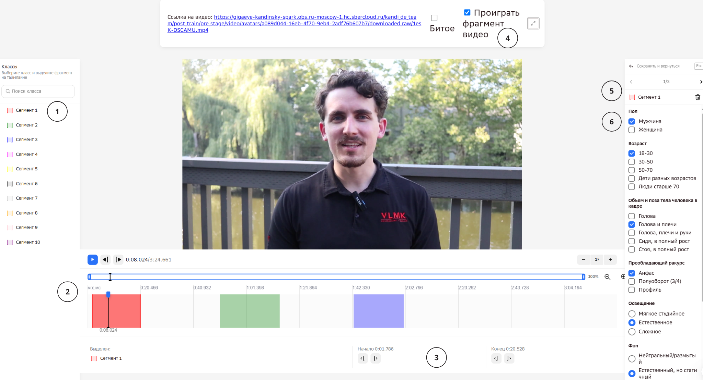

# Обзор проекта «Аватар. 2 этап (заявки 26-28)»

> ⚠️ **Этот мануал — только про 2 этап** (заявки 26-28). У проекта есть отдельный **3 этап**
> (заявка 46) — идёт следующим шагом сразу после 2 этапа: там уже размечают сегменты, нарезанные
> на 2 этапе, другой классификатор (19 вопросов). Материал по 3 этапу вынесен в отдельный мануал —
> [../manual-3-etap/00-overview.md](../manual-3-etap/00-overview.md).

## Цель проекта

Проект «Аватар» — сбор видео для обучения **S2V-модели** (генерация говорящего человека:
по исходному изображению человека и аудиодорожке с речью модель генерирует реалистичное
видео этого говорящего человека).

Задача оператора — на предоставленном видео **выделить сегменты**, подходящие для обучения
такой модели, и **заполнить классификатор** для каждого сегмента (см. [04-classifier.md](04-classifier.md)).
`[Инстр. Kandinsky-Аватар, стр.1]`

## Базовые термины и роли

| Термин | Определение |
|---|---|
| **Сегмент** | Непрерывный фрагмент видео, подходящий для обучения модели (точные критерии длительности и артефактов — [02-segments.md](02-segments.md)). На одном видео сегментов может быть несколько (**максимум 10**), у каждого — свой классификатор. `[Инстр. Kandinsky-Аватар, стр.1]` |
| **Классификатор** | Набор характеристик, которыми описывается каждый сегмент (пол, возраст, поза, ракурс, освещение, фон и т.д.), нужен для балансировки итогового датасета. Подробнее — [04-classifier.md](04-classifier.md). `[Инстр. Kandinsky-Аватар, стр.1]` |
| **«Битое» видео** | Если на видео нет ни одного сегмента, подходящего под критерии, всё видео помечается галочкой «Битое» вместо выделения сегментов — сегмент и «Битое» несовместимы, старые сегменты перед вердиктом нужно удалить. Подробнее — [05b-what-not-to-label.md](05b-what-not-to-label.md#когда-видео-помечается-битое). `[Инстр. Kandinsky-Аватар, стр.1]` |

| Роль | Что делает |
|---|---|
| **Оператор нарезки / асессор / исполнитель** | Размечает сегменты на видео и заполняет классификатор. |
| **Валидатор** | Проверяет разметку оператора, находит ошибки (см. [06-common-mistakes.md](06-common-mistakes.md)). |
| **Руководитель группы (РГ)** | Менеджер Data Light. Отвечает за оперативное управление командой асессоров (доступы, онбординг и адаптация новичков, командные и личные встречи), финансовые и аналитические процессы проекта, а также за взаимодействие с заказчиком. |
| **Заказчик** | Финальная инстанция. Даёт обратную связь (ОС) с ошибками и качеством каждого асессора. |

## Структура проекта

Работа (включая экзамен) выполняется на платформе **Tagme**, в личном кабинете каждого асессора;
доступ к ней выдаёт **руководитель группы Data Light**. Задания на разметку выкладываются пулами
внутри **заявок** — асессоры (операторы) работают именно с пулами конкретной заявки.

Текущий, **2-й этап** проекта состоит из **трёх заявок**, которые отличаются друг от друга
**длиной исходного видео** (длительностью самого сырого видео-источника, из которого будут
выделяться сегменты):

| Заявка | Длина исходного видео | Полное название |
|---|---|---|
| **26** | 240–420 сек | Заявка_26_Тариф_2_Kandinsky_Аватар_сбор видео для S2V-модели_Генерация говорящего человека_2 этап (240_420)_Даталайт |
| **27** | 0–240 сек | Заявка_27_Тариф_2_Kandinsky_Аватар_сбор видео для S2V-модели_Генерация говорящего человека_2 этап (0_240)_Даталайт |
| **28** | 420 сек – ∞ | Заявка_28_Тариф_2_Kandinsky_Аватар_сбор видео для S2V-модели_Генерация говорящего человека_2 этап (420_inf)_Даталайт |

`[скриншот платформы Tagme, чат, 05.08.2026]`

⚠️ **Требования и критерии** разметки из этого мануала **одинаковы** для всех трёх
вышеуказанных заявок.

На 2 этапе каждое задание выполняет только один асессор (**однократное перекрытие**) — в
отличие от 3 этапа, где каждое задание одновременно выполняют три разных асессора (тройное
перекрытие, см. [мануал 3 этапа](../manual-3-etap/00-overview.md#структура-проекта)).
`[Уточнение пользователя, 12.08.2026]`

Общение с руководителем группы и остальными участниками проекта (асессорами), а также
дополнительные материалы по проекту — в приватном канале **«TAG ME Аватары»** на платформе
**Mattermost**; доступ к нему руководитель группы открывает после успешной сдачи экзамена.

## Нормы активности на проекте

15в неделю

заданий по заявке 26

30в неделю

заданий по заявке 27

10в неделю

заданий по заявке 28

55в неделю

заданий суммарно по всем заявкам, если какая-то из заявок закончилась

14дней

порог неактивности до отключения

**Придерживаемся таких еженедельных цифр:**

- **заявка 26** — 15 заданий;
- **заявка 27** — 30 заданий;
- **заявка 28** — 10 заданий,

**или 55 заданий в совокупности за неделю по всем заявкам** — в случае, когда какая-то заявка
заканчивается.

**Отключение от проекта** происходит при **неактивности дольше 14 дней подряд** или при
**невыполнении еженедельной нормы** (помимо решений об отключении из-за качества работы — см.
[ниже](#как-оценивается-качество-работы)).

**Возврат к работе.** Тем, кто долго не размечал на проекте (более 2 недель) или был отключён,
нужно пройти по порядку:

1. [тестирование по 2 этапу](07-testirovanie.md) на этом сайте;
2. **новое обязательное тестирование на платформе Tagme** — [ссылка на
   тестирование](https://tagme.sberdevices.ru/company/2333b37d-9d19-418b-80bf-385244dc77de/project/b95bf728-a010-4e77-8aae-5f21d6732f3b/tasks?size=10&page=1);
3. [экзамен](#экзамен-и-допуск).

Это три разных шага: тестирование на Tagme — отдельное, оно не совпадает ни с тестированием на
сайте, ни со стандартным входным экзаменом.

**Допуск к 3 этапу** (заявка 46) даётся только при условии выполнения еженедельной нормы.

`[Уточнение пользователя, 18.09.2026 и 21.09.2026; Ответы заказчика на вопросы из разных писем,
21.09.2026]`

## Экзамен и допуск

≥80%

порог входного экзамена

10

экзаменационных заданий

2

попытки

15минут

таймер на каждый кейс

⚠️Прежде чем приступать к экзамену, обязательно изучите официальную инструкцию по проекту и
этот мануал целиком — правильные ответы на экзамене строятся именно на этих материалах.
После этого обязательно пройдите [тестирование по 2 этапу](07-testirovanie.md): успешный
результат (не менее 90 %) — условие допуска к экзамену на платформе Tagme.

`[Уточнение пользователя, 12.08.2026]`

Допуск к 2 этапу даёт только входной экзамен. Каждое задание проверяет валидатор вручную и даёт
обратную связь через руководителя группы; итоговая оценка — % верных ответов:

1. **Первая попытка** — 10 заданий. Наберёте **≥80%** — доступ к обычным рабочим пулам (заявки
   26/27/28) откроется сразу.
2. **Если порог не набран**, валидатор даёт обратную связь по всем ошибкам первой попытки — её
   обязательно нужно учесть перед пересдачей. Открывается вторая попытка: снова 10 заданий, но
   уже другие видео, и снова нужен порог ≥80%.
3. **Третьей попытки не даётся** — при провале второй попытки результат финальный, «Экзамен не
   сдан».

`[Переписка в Telegram с заказчиком, 04.02.2026; Разметка ВК видео — ОС экзамен 2 этап 05.08;
Почта DataLight — Re: Результаты экзамена (2 этап. Аватар), 28.07.2026]`

**Формат экзамена:**

- На заданиях экзамена рекомендуется отсматривать видео **на скорости x1 (не ускоряя)** —
  торопиться не стоит, важнее не пропустить склейку или смену кадра; **в сомнительных участках**
  видео можно и нужно **замедлять**.
  `[Транскрибация «Видео обучение проекта» — Аватар 2 этап; Комментарии для мануала ко 2 этапу
  Аватара, 04.09.2026]`
- **На второй попытке** (в случае пересдачи) выдаются **другие видео**, не те же самые.
  `[Встреча с новичками по 2 этапу, 29.07.2026]`

**Нельзя пропустить кейс досрочно:** если видео/кейс попался сложный или просто хочется сделать
паузу — предусмотренный вариант это выйти и сделать перерыв (15-30 минут) либо переключиться на
другую заявку; сам кейс при этом никуда не денется — покинуть его раньше времени и взять другой
нельзя, кейс освобождается для другого асессора только после того, как полностью истечёт время,
отведённое на него. Это организационное правило платформы, а не критерий разметки.
`[Встреча с новичками по 2 этапу, 29.07.2026]`

`[Разметка ВК видео — ОС Экзамен 18.05 СТ2 и ОС экзамен 2 этап 05.08]`

### На чём чаще всего проваливаются на экзамене

По итогам проверок экзаменов чаще всего баллы снимают за эти ошибки. Перед экзаменом прочитайте
каждое правило и откройте раздел по ссылке.

1. **Границы — по речи.** Сегмент начинается с первого слова и заканчивается на последнем: без
   молчания по краям и без обрыва посреди речи, если дальше нет артефакта.
   [Границы сегмента](02-segments.md#длительность-и-границы-сегмента) ·
   [Молчание](05b-what-not-to-label.md#молчание)
2. **Ни одной склейки и смены кадра внутри сегмента.** Перед сохранением проиграйте выделенный
   фрагмент кнопкой «Проиграть фрагмент видео» и отступите от склейки на 3–4 кадра.
   [Склейки](05b-what-not-to-label.md#склейки) ·
   [Как выделять сегменты в интерфейсе](02-segments.md#как-выделять-сегменты-в-интерфейсе)
3. **«Битое» — только если во всём видео нет ни одного подходящего участка от 10 секунд.**
   Смотрите видео целиком, без перемотки: подходящий отрезок бывает не в начале. И наоборот: если
   водяной знак есть на всём видео или звук не совпадает с губами (липсинк) — это «Битое», сегменты
   не выделяем.
   [Когда видео помечается «Битое»](05b-what-not-to-label.md#когда-видео-помечается-битое)
4. **Не дробите лишнее.** Если между фрагментами нет артефакта и они не отличаются ракурсом,
   объёмом тела или эмоцией — это один сегмент; короткая пауза (1–2 сек) не повод делить.
   Однотипных сегментов достаточно 1–2.
   [Когда объединять/делить сегмент](02-segments.md#когда-объединятьделить-сегмент)
5. **Ни закадрового голоса, ни наложенного текста.** Голос за кадром (например, интервьюера),
   субтитры, титры-плашки и затемнение экрана в границы сегмента не берём (короткое «угу» — не
   в счёт).
   [Закадровый голос](05b-what-not-to-label.md#закадровый-голос) ·
   [Монтажное наложение](05b-what-not-to-label.md#монтажное-наложение)
6. **Одно значение — один человек.** Если в кадре один человек, в каждом поле стоит одна галочка
   (исключение — язык, если два языка звучат заметную долю сегмента). Проверьте все поля перед
   отправкой. [Общие правила классификатора](04-classifier.md#общие-правила)
7. **Тип речи считается по тем, кто издаёт звук.** Говорит или поёт один человек — «Монолог»
   (даже если в кадре двое или интервьюер за кадром), двое и более — «Диалог»; если второй
   человек что-то произносит вслух, даже «ага», это уже диалог. Актёрская видеовизитка —
   «подготовленный» монолог. [Тип речи](04-classifier.md#8-тип-речи)
8. **Эмоции: «Нейтральные/спокойные» — только когда эмоций почти нет.** Радость, интерес —
   «положительные»; злость, напряжённость, раздражение, сомнение — «серьёзные/негативные».
   [Эмоции](04-classifier.md#7-эмоции-и-выражение-лица)
9. **Ракурс: анфас, полуоборот, профиль.** Пока виден второй (дальний) глаз — это полуоборот;
   профиль — когда дальний глаз не виден. Ставьте один вариант, преобладающий в сегменте.
   [Преобладающий ракурс](04-classifier.md#4-преобладающий-ракурс)

`[ОС экзамен 2 этап 05.08 и 21.09.2026]`

Самые частые ошибки на экзамене с примерами на реальных видео из проверок — на странице
[«Частые ошибки»](06-common-mistakes.md).

## Интерфейс разметки

1. *Список сегментов слева.*
2. *Таймлайн снизу с уже выделенными фрагментами.*
3. *Точные тайминги начала/конца выделенного фрагмента.*
4. *Ссылка на видео, галочка «Битое» и кнопка «Проиграть фрагмент видео» — воспроизводит только
   выбранный сегмент, а не всё видео целиком (подробности —
   [02-segments.md](02-segments.md#как-выделять-сегменты-в-интерфейсе)).*
5. *Панель кейса — сохранить и вернуться, порядковый номер сегмента в партии, выбранный сегмент с
   кнопкой его удаления.*
6. *Поля классификатора для выбранного сегмента (пример на скриншоте: Сегмент 1, «Мужчина»,
   «18-30», «Голова и плечи», «Анфас», «Естественное», «Естественный, но статичный»).*

`[Скриншот интерфейса Tagme, обновлено 03.09.2026]`

В работе — два приоритета. **Во-первых**, правильно найти и выделить [сегмент](02-segments.md):
требования к качеству самого выбора сегмента (не пропустить водяной знак/рамку/склейку, найти
подходящий «золотой кадр» среди монтажа) жёсткие, и именно по ним чаще всего прилетают серьёзные
ошибки. `[Видео с разбором ошибок — Аватар 2 этап]`

**Во-вторых** — правильно заполнить [классификатор](04-classifier.md#поля-классификатора), особенно
поля со строгими требованиями. Формального порога согласованности ответов между асессорами нет,
большинство полей признаны оценочными — но не все: **пол и язык** заказчик проверяет так же строго,
как границы сегмента, а поля **«Объём и поза тела»**, **«Тип речи»**, **«Количество людей в кадре»** и
**«Баланс по пению/говорению»** на практике — самые частые источники ошибок и предупреждений
исполнителям; подробности — в
[«Частых ошибках»](06-common-mistakes.md).

⚠️ **«Оценочное» не значит «любой ответ пройдёт»:** заказчик проверяет разметку по всей
строгости. Исключение — по-настоящему неочевидные случаи (например, возраст не всегда легко
определить между «18-30» и «30-50»). Но если ошибка очевидна (на видео пожилая женщина, а в
классификаторе — «18-30») — это обычная засчитываемая ошибка.
`[Комментарии для мануала ко 2 этапу Аватара, 04.09.2026]`

## Как оценивается качество работы

85%

общий норматив качества

~270сек

внутренний ориентир времени на задание

85% — это общий норматив качества на 2 этапе. **Личный % считается по каждому пулу отдельно:**
не по всем вашим заданиям в нём, а по выборке из них, которую проверяет валидатор — поэтому даже
1–2 ошибки в этой выборке могут заметнее повлиять на итоговый %, чем кажется по общему объёму
сделанной работы. Поэтому важнее не сам процент, а конкретные комментарии валидатора к ошибкам
(«Мои ответы») — именно они показывают, что нужно исправить.
`[Переписка в Telegram с заказчиком, 15–16.09.2026]`

⚠️ **Номер ошибки в «Моих ответах» не равен номеру сегмента.** Если ошибка относится к
конкретному сегменту, ищите его номер в тексте комментария валидатора, а не по порядку ошибок.
`[Разметка ВК видео — ОС 2 этап, вердикт заказчика, 21.09.2026]`

✅ **Если ваш результат выше нормы** — это хороший результат, но он не отменяет необходимости
знакомиться с ОС по своим ошибкам.

🔴 **Если результат ниже нормы** — нужно срочно пересмотреть комментарии валидатора в сервисе
«Мои ответы», заново пройтись по инструкции и прояснить все непонятные моменты.
`[Разметка ВК видео — ОС 2 этап, 03.09.2026]`

В отличие от 3 этапа, где оценка идёт полностью автоматически по ханипотам (см.
[мануал 3 этапа](../manual-3-etap/00-overview.md#как-оценивается-качество-работы)), на 2 этапе
оценку **проверяет валидатор вручную** (и на экзамене, и на обычных рабочих заданиях) — по
выборке из заданий асессора (см. выше «Личный % считается по каждому пулу отдельно»); он оставляет
комментарии
по найденным ошибкам (см. «Мои ответы») и дополнительно даёт обратную связь через руководителя
группы (см. ниже).

**Решения о предупреждениях/отключении** принимаются по совокупности найденных валидатором
ошибок:

- асессор игнорирует требования инструкции,
- повторяет одни и те же ошибки,
- не учитывает обратную связь (в т.ч. не изучает «Мои ответы»),
- не показывает положительной динамики.

`[Разметка ВК видео — ОС 07.08.2026]`

Отдельно у заказчика есть **норматив времени на задание (~270 секунд)** и практика считать
**«фродом»** одновременное выполнение двух заданий одним асессором — это управленческий контроль,
а не критерий разметки, но из-за него можно получить предупреждение даже при формально верной
разметке. `[Почта. ОС по Заявкам 26-28, 28.05.2026]`

## Обратная связь по выполненным заданиям

После выполнения заданий валидатор проверяет каждого асессора, оставляет комментарии (см. «Мои
ответы») и дополнительно даёт обратную связь через руководителя группы — эту обратную связь
обязательно нужно учитывать.

При этом обратную связь можно и нужно обсуждать: если ваша разметка кажется вам верной, а
комментарий валидатора вызывает сомнения — **не соглашайтесь автоматически**, а аргументированно
переспрашивайте и, если нужно, оспаривайте. Заказчик рассматривает такие обращения и принимает
по ним итоговое решение.

**Как устроено оспаривание ошибки:**
1. Асессор пишет в тред Mattermost, указывая ссылку на видео и аргументированное возражение.
2. Наставник из числа опытных асессоров валидирует запрос: либо возвращает возражение, либо
   принимает его и передаёт руководителю для дальнейшей отправки заказчику.
3. Возражение передаётся заказчику: он либо подтверждает ошибку (её исправят), либо нет — и
   объясняет почему.

## Полезные материалы

Дополнительные видео от команды:

- **Видео-обучение проекта:** <https://disk.yandex.ru/i/D4QDrevCpmCfhA>
- **Видео с разбором ошибок:** <https://disk.yandex.ru/i/6WmBFAJtREVl4w>

`[Памятка «Аватар 2 этап», стр.1]`

## История проекта: этапы во времени

Проект «Аватар» не шёл строго последовательно — команда несколько раз переключалась между 2 и
3 этапом:

- **Февраль 2026** — запуск 2 этапа (заявки 26-28) с нуля: первый экзамен, первые пулы.
  Проходной балл экзамена — ≥70% сразу с самого старта. Ближе к концу февраля объём на 2 этапе
  иссяк («То, что сейчас загружено на второй этап, это завершающие данные на разметку»,
  27.02.2026).
- **Март – середина мая 2026** — команда переключилась на **3 этап** (заявка 46, другой,
  более детальный классификатор — не входит в этот мануал).
- **18.05.2026** — 2 этап **перезапущен**: новый объём задач, часть асессоров без опыта на
  2 этапе должны заново сдать экзамен (это и есть источник материалов с тегом «Ступень 2»,
  использованных как примеры в мануале). На встрече в этот день заказчик и Data Light договорились
  **объединить** требования по качеству с 3 этапа с требованиями к сегментам на 2 этапе — этим
  объясняется, почему более поздние ОС по 2 этапу иногда используют более строгие/детальные
  критерии, чем исходная официальная инструкция.
- **С 18.05.2026 по сегодня (05.08.2026)** — 2 этап работает непрерывно, периодически совмещаясь
  с небольшими партиями 3 этапа.

`[Переписка в Telegram с заказчиком, 03.02–05.08.2026]`

⚠️ **Важное уточнение связи между этапами (07.08.2026):** переключение команды между 2 и 3 этапом
не случайно — **3 этап является продолжением 2 этапа**, а не отдельным независимым проектом: на
3 этапе оцениваются те же самые видео, которые до этого были найдены и нарезаны на сегменты на
2 этапе (см. подробности в [мануале 3 этапа](../manual-3-etap/00-overview.md#как-3-этап-связан-со-2-этапом)).
Именно поэтому история чередования этапов выше — это, по сути, чередование фаз одного и того же
пайплайна («нарезать» → «оценить нарезанное»), а не два параллельных проекта. При этом **допуск к
этапам разный**: экзамен 2 этапа не даёт доступа к 3 этапу и наоборот — это два отдельных
допуска. `[Уточнение пользователя, 07.08.2026]`

> Как проходит входной экзамен — см. [выше](#экзамен-и-допуск); как
> оценивается текущее качество работы уже нанятой команды — см. [выше](#как-оценивается-качество-работы).

## Как читать этот мануал

Разделы идут по этапам процесса: [общие требования](01-general-requirements.md) →
[сегменты](02-segments.md) → [что размечаем](05-what-to-label.md)/[не
размечаем](05b-what-not-to-label.md) → [заполнение классификатора](04-classifier.md) →
[частые ошибки](06-common-mistakes.md) → [банк примеров](11-example-library.md).
Экзамен и допуск к рабочим пулам разобраны выше на этой же странице — см.
[«Экзамен и допуск»](#экзамен-и-допуск).

У проекта два источника инструкций: **официальная инструкция заказчика** (тег
`[Инстр. Kandinsky-Аватар]`) и **памятка, дополненная опытными асессорами** (тег
`[Памятка «Аватар 2 этап»]`) — она местами даёт более подробные или чуть отличающиеся
формулировки. Расхождения между ними по ходу работы разобраны и сведены в единые правила
остального мануала.
