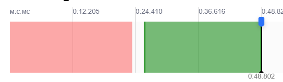
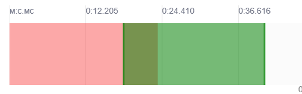
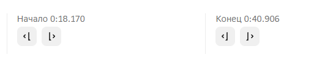
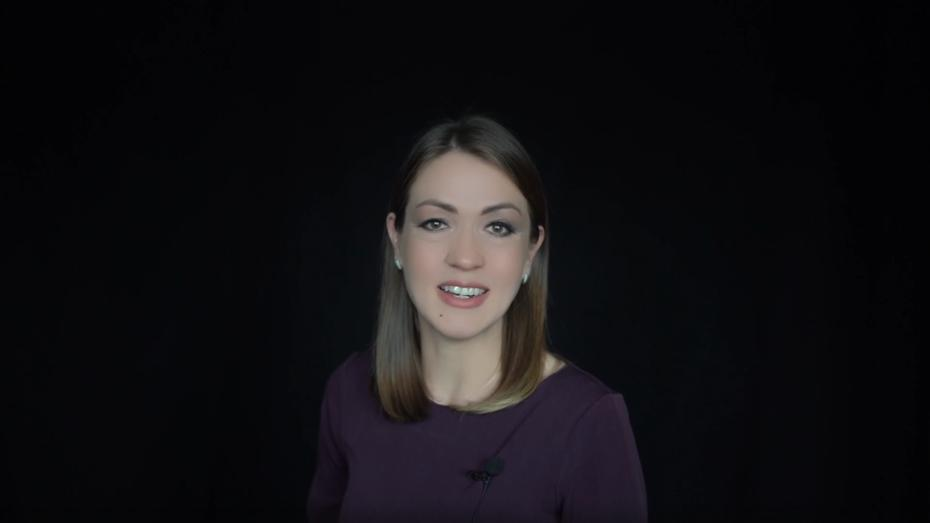
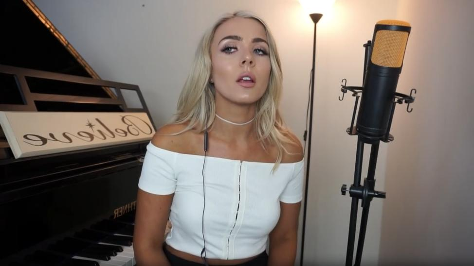
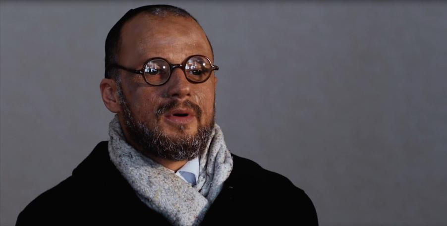
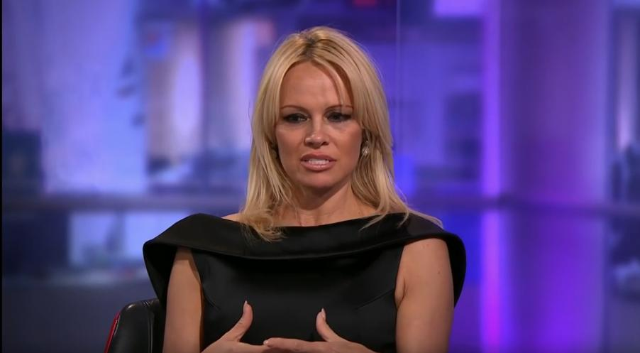
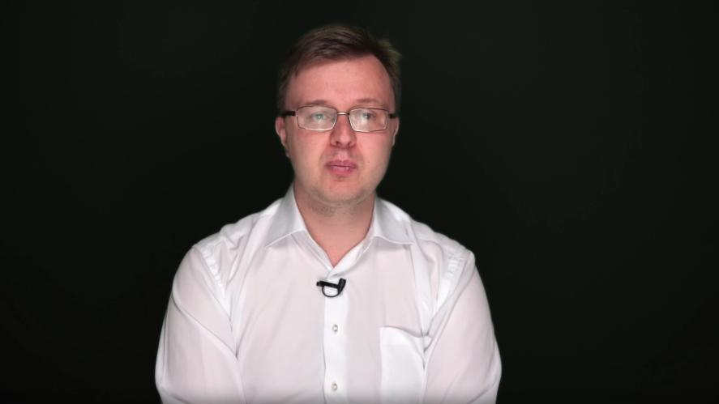

# Сегменты

## Приоритет: сегмент важнее разметки

Самое важное в работе — правильно найти и выделить сегмент; то, как именно вы потом заполните
классификатор, вторично. Формального порога согласованности ответов классификатора между
асессорами нет (многие поля прямо признаны оценочными, см.
[04-classifier.md](04-classifier.md#уточнения-по-конкретным-полям-памятка-асессоров)) — а вот
требования к качеству самого выбора сегмента (не пропустить водяной знак/рамку/склейку, найти
подходящий «золотой кадр» среди монтажа) жёсткие и именно по ним чаще всего прилетают серьёзные
ошибки. `[Видео с разбором ошибок — Аватар 2 этап]`

## Определение и границы

- ⏱️ **Длительность** сегмента — **от 10 до 300 секунд**; для этого в видео должна быть хотя бы
  **одна непрерывная сцена** (без смены ракурса, без склейки) с говорящим человеком
  длительностью более 10 сек — это минимальное условие, чтобы вообще можно было выделить
  сегмент. Если сегмент на вид «впритык» к 10 секундам — стоит замерить точнее, а не
  отбрасывать его сразу. `[Разметка ВК видео — ОС 07.08.2026]`
- ✂️ Сегмент не должен содержать артефакты: смену кадра, склейки, рамки, водяные знаки (ВЗ),
  наложенный текст и т.д. — и не должно быть смены сцены (человек не должен исчезать из кадра).
  ⚠️ Отдельный неоднозначный случай — склейки, **сглаженные нейросетью** (когда видео обработано
  ИИ так, что переход между кадрами выглядит плавным, без резкого скачка). Такие склейки в
  большинстве случаев не считаются ошибкой именно из-за отсутствия резкого перехода — но не все
  нейросети сглаживают одинаково хорошо: встречаются случаи, где обработка оставляет заметный
  скачок в доли секунды несмотря на попытку сгладить. Внимательно проверяйте такие моменты, а не
  пропускайте автоматически только потому, что переход выглядит «обработанным». `[Встреча с
  новичками по 2 этапу, 29.07.2026]` Обратный случай — резкая на вид смена плана не всегда
  настоящая склейка (реальный разбор с цитатой заказчика — см.
  [06-common-mistakes.md](06-common-mistakes.md#4-сегмент-содержит-водяной-знак--наложенный-текст--склейку)).
  Там же — примеры настоящих склеек для сравнения.
- 🔇 **Молчание** не должно превышать **2–3 секунды на границах сегмента** (в начале/конце) и
  **3–5 секунд внутри** сегмента — уточнённое практическое значение, дважды подтверждённое
  заказчиком напрямую и объединяющее более раннюю официальную инструкцию (3-4 сек) и памятку
  асессоров (2-3 сек); разбор источников — [09-disputed-points.md](09-disputed-points.md#допустимая-длительность-молчания-внутри-сегмента).
  `[Переписка с заказчиком по заявкам 26-28, 06.07.2026 и 17.07.2026]`
  Короткая пауза (1–2 сек) — **не повод** резать сегмент. `[Разметка ВК видео — ОС
  22.05/25.05/28.05 СТ2]` Короткий кашель, шмыганье носом, смешок «на вдохе» — это не молчание.
  `[Встреча с новичками по 2 этапу, 29.07.2026]`
- **Где ставить границу:** сегмент должен начинаться с начала речи человека и заканчиваться в
  момент, когда он перестаёт говорить — не ставить границы «в произвольном месте», но не
  обязательно попадать ровно (например, ровно 300.000 сек — достаточно «на глаз», условно
  297 сек вместо 300). Не ставить границу **вплотную к склейке** или **затемнению экрана как
  переходу** (см. [05-what-to-label.md](05-what-to-label.md)) — нужно оставлять небольшой запас
  *до* них, не впритык (то же для минимальных ~10-сек сегментов рядом со склейкой: валидатор
  иногда кликает именно по границе, и клик на склейку засчитывается как ошибка, даже если
  сегмент формально ≥10 сек).
  `[Памятка «Аватар 2 этап», стр.1; Разметка ВК видео — ОС 19.05 СТ2; Транскрибация «Лайфхак
  для разметки» — Аватар 2 этап; Встреча с новичками по 2 этапу, 29.07.2026]`
- Перекрытие рта **на долю секунды** — допустимо, сегмент из-за этого обрезать не нужно. Но
  более длительное перекрытие (например, стаканом на 4 секунды) уже требует корректировки
  границ сегмента (исключить проблемный участок). `[ОС заказчика, 17.06.2026 — см. 10-qa-log.md]`
  Дополнительный количественный критерий: если рот перекрыт посторонним предметом/рукой/
  микрофоном **больше половины** времени сегмента — такой сегмент не подходит целиком, а не
  только в проблемной части. `[Разметка ВК видео — ОС 28.05 СТ2]`
  То же самое правило работает и для перекрытия **лица целиком** (не только рта): короткий
  эпизод перекрытия внутри длинного сегмента можно оставить как есть, но если участок с
  перекрытым лицом длится долго — сегмент нужно разделить на два (до и после), а не выделять
  одним куском. `[Разметка ВК видео — ОС 29.05 СТ2]`
  Отдельный нюанс про широкий микрофон (например, при профессиональной записи вокала в студии):
  если он закрывает часть щеки/подбородка, но **не сами губы** — это не считается перекрытием
  рта. Если артикуляция губ и мимика всё равно хорошо видны, такой сегмент берём в разметку.
  `[Видео с разбором ошибок — Аватар 2 этап]`
- **Резкий/быстрый зум — не берём** в сегмент (аналог тряски камеры). **Медленный/плавный зум —
  берём**: границы сегмента можно и нужно расширять на такие моменты, а не дробить сцену на
  несколько сегментов из-за них — можно выделить одним сегментом.
  `[Разметка ВК видео — ОС Экзамен 18.05 / 28.05 СТ2; Памятка «Аватар 2 этап», стр.4]`

`[Инстр. Kandinsky-Аватар, стр.2, 10]`

## Ограничения интерфейса

- На одном видео можно выделить **максимум 10 сегментов** (слоты пронумерованы от 1 до 10,
  выбираются в любом порядке — не обязательно по порядку от 1).
- Не нажимайте дважды на один и тот же номер слота для двух разных участков видео — система
  засчитывает это как один сегмент, и второй фактически потеряется. Это отдельная техническая
  (не смысловая) ошибка, которую легко не заметить.
- Удалить ошибочно выделенный сегмент можно через значок корзины в панели сегмента (справа, под
  кнопкой Escape).

`[Встреча с новичками по 2 этапу, 29.07.2026]`

## Как выделять сегменты в интерфейсе

**Между сегментами должен быть зазор** — они не должны перекрываться на таймлайне.

| Правильно | Неправильно |
|---|---|
|  |  |
| Между красным и зелёным сегментом есть промежуток | Красный и зелёный сегмент налезают друг на друга (тёмно-зелёная зона) |

Для точной подгонки границ используются поля «Начало» / «Конец» — они позволяют сдвигать
границу сегмента с точностью до сотых долей секунды:

`[Памятка «Аватар 2 этап», стр.1-2]`

## Если в кадре несколько людей и один повёрнут спиной

Если в кадре два человека, но один из них повёрнут к нам спиной или больше чем в профиль:

- Такую часть видео стоит **пропустить**, но **только если** без этого человека всё равно
  набирается сегмент длиной 10+ секунд.
- Если сегмент 10+ секунд без него **не набирается** — размечаем как есть, включая
  повёрнутого спиной человека, и в классификаторе ставим «два человека в кадре».

`[Памятка «Аватар 2 этап», стр.3-4]`

## Отражение в зеркале/стекле — не в счёт

Размечаем только то, что видно **в кадре напрямую** — позу, объём тела и ракурс главного
человека. Если рядом есть его отражение (зеркало, стекло), где поза/крупность выглядят иначе
(например, в кадре человек виден по плечи, а в отражении — в полный рост) — отражение не
учитывается вообще: классификатор заполняется только по тому, что видно напрямую, без оглядки
на отражение. `[Видео с разбором ошибок — Аватар 2 этап]`

## Сколько сегментов выделять на одном видео

- На одном видео может быть **несколько сегментов**, каждый со своим классификатором.
- Сколько именно — зависит от того, однотипные фрагменты или разные: см.
  [Когда объединять/делить сегмент](#когда-объединятьделить-сегмент) ниже.

## Когда объединять/делить сегмент

- Если несколько подходящих фрагментов **однотипные** (не меняется объём и поза человека,
  ракурс и т.п.) — не нужно нарезать много одинаковых, достаточно **1-2 штуки** (по инструкции
  — 2, по памятке асессоров — 1-2, см. [09-disputed-points.md](09-disputed-points.md)). Если же
  участки, наоборот, **разные** по характеристикам (другой ракурс, другая эмоция и т.п.) — их
  нужно выделять отдельными сегментами, а не сваливать в один: правило «1-2 однотипных
  достаточно» не значит «всегда максимум 2 сегмента на видео» — оно только про **одинаковые**
  фрагменты. Разбор реального пограничного случая (когда воспринимаемое изменение картинки не
  является настоящим основанием для деления) — [06-common-mistakes.md](06-common-mistakes.md#4-сегмент-содержит-водяной-знак--наложенный-текст--склейку).
  `[Разметка ВК видео — ОС 25.05 СТ2; Переписка в Telegram с заказчиком, 10.06.2026]`
- Если на видео есть длительная сцена, подходящая под критерии (от 10 до 300 секунд) — нужно
  выделить её **всю** целиком, а не дробить и не обрезать.
- Быстрая/интенсивная/непрерывная смена эмоций — один сегмент; если смена чёткая и долгая —
  делить на сегменты, но так, чтобы они не получались одинаковыми (официально подтверждено
  заказчиком, пункт 5 «Итоги встречи 18.05»). ⚠️ Внутренний чат команды при этом давал
  противоположный ответ («нет, если нет склейки») — вопрос спорный, не решён окончательно, см.
  [09-disputed-points.md](09-disputed-points.md#нужна-ли-склейка-чтобы-разделить-сегмент-из-за-смены-эмоций-или-достаточно-самой-смены).
  `[Памятка «Аватар 2 этап», стр.4; Переписка в Telegram с заказчиком, 18.05.2026]`
- Если в кадре человек долго статичен в одном плане (кадр не меняется) — не нужно дробить
  из-за случайных «перебивок», отмечаем один подходящий сегмент. `[Переписка в Telegram с
  заказчиком, 04.02.2026 — Итоги встречи]`
- «Динамичные» фрагменты (человек активно перемещается в кадре, приближается/удаляется от
  камеры) — нужно **активно выделять**, это важно для баланса датасета. Если ролик сначала
  долго статичен, а затем в движении — лучше разделить на два сегмента (статика / движение).
  Общее требование к лицу продолжает действовать: короткая потеря анфаса при повороте в
  длинном сегменте простительна, частые повороты или потеря лица в коротком — нет.
  `[Переписка в Telegram с заказчиком, 16.07.2026]`
- Если в ролике есть чётко различимые отдельные участки речи и пения — предпочтительно
  разделить на два сегмента, а не объединять и выбирать преобладающий тип (см.
  [04-classifier.md](04-classifier.md#уточнения-по-конкретным-полям-памятка-асессоров) про поле
  «Речь / Пение»). `[Переписка в Telegram с заказчиком, 30.07.2026]`

`[Инстр. Kandinsky-Аватар, стр.2]`

## Когда видео помечается «Битое»

🚫 Если на видео **нет ни одного** сегмента, подходящего под критерии — ставится галочка
«Битое» вместо выделения сегментов. `[Инстр. Kandinsky-Аватар, стр.1]` Перед отправкой в
«Битое» важно убедиться, что во всём видео действительно нет ни одного подходящего отрезка от
10 секунд — наличие одного «плохого» признака (например, где-то есть склейка) не значит, что
всё видео нужно браковать целиком. `[Памятка «Аватар 2 этап», стр.3]`

Это два взаимоисключающих варианта: **либо** выделяются сегменты, **либо** ставится «Битое» —
никогда не то и другое одновременно. `[ОС заказчика, 17.07.2026]`

> Частая ошибка операторов — путать эти два случая (см. [06-common-mistakes.md](06-common-mistakes.md)):
> отправлять в «битое» видео, где на самом деле есть подходящий сегмент, и наоборот.

**Как правильно отправить в «Битое» технически:** если вы в процессе разметки уже успели
выделить один или несколько сегментов, а потом поняли, что видео на самом деле нужно отправить
в «Битое» — сначала удалите все выделенные сегменты и только потом ставьте галочку «Битое».
Иначе получится одновременно и сегмент, и «Битое» — отдельная, легко избегаемая ошибка категории
«Иное» (см. [06-common-mistakes.md](06-common-mistakes.md)).
`[Видео с разбором ошибок — Аватар 2 этап]`

**Оставляйте обоснование в комментарии.** Заказчик может интерпретировать неожиданно большое
число «Битых» у одного асессора как возможный фрод (будто асессор просто пропускал сложные
видео вместо честного поиска сегмента). Короткий комментарий с причиной («водяной знак на
протяжении всего видео», «нет ни одного отрезка 10+ сек без склейки» и т.п.) помогает при
оспаривании и снижает риск такой путаницы. Это управленческий момент, а не отдельный критерий
разметки — см. также заметку про антифрод-эвристики в
[00-overview.md](00-overview.md#порог-качества-по-ходу-работы-не-путать-с-порогом-экзамена).
`[Видео с разбором ошибок — Аватар 2 этап]`

## Примеры (позитивные)

**Пример 1:** https://vkvideo.ru/video712360465_456239217

Отрывок с речью. Можно выделить сегмент от 10 сек. Лицо хорошо освещено и видно,
прослеживаются мимика и движение губ. Есть тихое музыкальное сопровождение, не мешающее
восприятию. Нейтральный фон. Качество 1080p.
**Подходящий сегмент: 0:02 – 02:57.**

**Пример 2:** https://vkvideo.ru/video-45280055_456240146

Отрывок с пением. Можно выделить несколько сегментов от 10 сек. Лицо хорошо освещено и
видно. Естественный, но статичный фон (домашний интерьер). Прослеживаются мимика и
движение губ. Качество 720p.
**Подходящие сегменты:**
- сегмент с плечами: 0:08 – 0:37
- сегмент с появлением рук: 0:37 – 02:40

**Пример 3:** https://vkvideo.ru/video23364836_456240066

Человек в очках, на очках есть блики — это допустимо. Сегмент подходит.

**Пример 4:** https://vkvideo.ru/video-102814524_456240009?list=ln-6LGJHsXLGhcRMCXpnl

Сзади яркий фон, но человек виден хорошо, освещён достаточно. Нужно выделить несколько
сегментов — есть подходящие фрагменты с разными людьми и разным количеством людей в кадре.

**Пример 5:** https://vkvideo.ru/video43858666_456239035

Человек вырезан и наложен на фон — это допустимо, главное, что человек хорошо освещён и
мимика прослеживается.

`[Инстр. Kandinsky-Аватар, стр.5-7]`

## Антипримеры

**Антипример 1:** https://www.youtube.com/shorts/kLTpStNQRF0

1. Не должно быть сопроводительных текстов на видео (субтитров).
2. В видео должна быть хотя бы одна непрерывная сцена (без резкой смены ракурса) с говорящим
   человеком длительностью более 10 сек.
3. В сцене не должно быть «перебивок» и «рывков» — когда при монтаже (обычно для сокращения)
   соединено несколько нарезанных фрагментов одного человека в одной и той же сцене в разные
   близкие моменты времени (пример — на 23–24 сек этого видео). Сцены должны быть плавными и
   естественными, без купюр.

**Антипример 2:** https://vkvideo.ru/video-178707203_456239622

Разрешение 480p, черты лица смазаны, движения губ чётко не прослеживаются.

**Антипример 3:** https://vkvideo.ru/video-125270152_456239032

Наличие водяного знака (ВЗ), черты лица смазаны, движения губ чётко не прослеживаются
(хотя разрешение 720p).

**Антипример 4:** https://vkvideo.ru/video-16056379_456243794

Длительность видео 12 минут. ВЗ слева вверху, наложения по бокам.

**Антипример 5:** https://vkvideo.ru/video10751579_456241836

Плохая освещённость лица с одной стороны.

**Антипример 6:** https://vkvideo.ru/video99369342_456239095

Расслоение цветов на самом лице человека.

`[Инстр. Kandinsky-Аватар, стр.7-10]`
