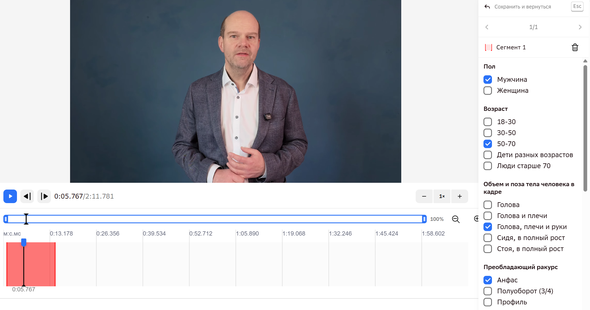
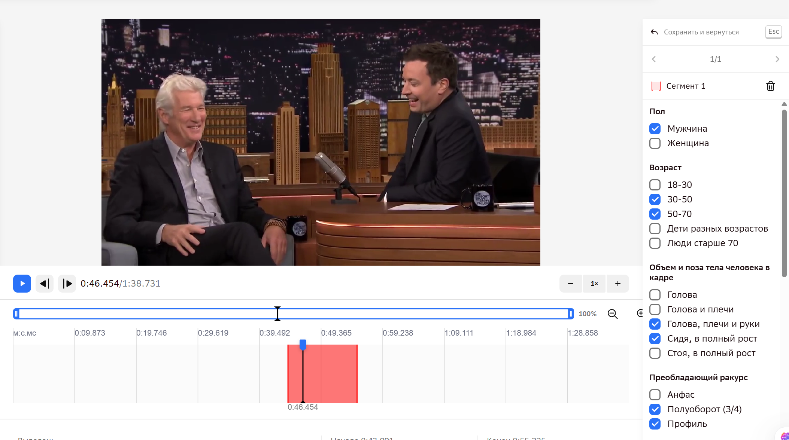
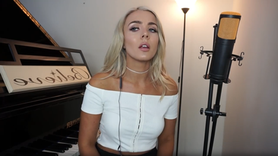
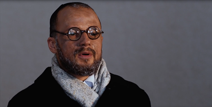

# Заполнение классификатора

## Общие правила

✅ Классификатор заполняется **на каждый сегмент** отдельно (не на всё видео целиком).

✅ В каждом критерии по умолчанию выбирается **одно значение — преобладающий характер.**

✅ **Один человек в кадре** → **один ответ** на вопрос.

`[Инстр. Kandinsky-Аватар, стр.1]`

*Пример корректного заполнения: в каждой группе отмечено ровно одно значение
(«Мужчина», «50-70», «Голова, плечи и руки», «Анфас»).*

✅ **Множественный выбор** в некоторых вопросах возможен **только** если в кадре находятся
2 и более людей одновременно — в некоторых полях можно отметить несколько значений.

✅ **Люди на заднем плане не учитываются** в полях, касающихся информации о человеке (пол,
возраст, эмоции и др.) — заполняем их **только по центральному/главному человеку в кадре**,
даже если на фоне видны другие люди. `[Разметка ВК видео — ОС 25.05 СТ2]`

⚠️ Если в кадре **два (и более) центральных человека одновременно отвечают/говорят** (например,
интервью с двумя гостями), нужно отмечать характеристики обоих, а не только одного из них.
`[Разметка ВК видео — ОС по Заявкам 26-28, 05.08.2026]`

⚠️ **Если говорят/поют сразу несколько человек** равномерно (сложно выделить одного), выбирать
«главного» необходимо по совокупности следующих признаков:

- ориентироваться на того, кто первым начал говорить/петь;
- у кого больше объём речи/пения;
- кто лучше виден в кадре.

`[Разметка ВК видео — ОС 20.05 СТ2]`

⚠️ **Молчащий, но хорошо видимый (не фоновый) человек в кадре тоже не учитывается** в полях
о человеке (пол, возраст, эмоции и т.п.). Критерий — не позиция в кадре, а то, **говорит/поёт
ли человек именно в этом сегменте**: если из двух людей на переднем плане в сегменте звучит
только один (второй присутствует молча, например ещё не вступил в песне) — поля заполняются
**только по звучащему**. Если сегмент захватывает момент, когда оба поют/говорят вместе —
заполняем поля по обоим, как в правиле выше про двух и более говорящих.

⚠️ Отдельно от полей о человеке — независимая отметка **«количество людей в кадре»** внизу
классификатора: её проставляем по фактическому числу видимых людей, независимо от того, кто
из них говорит/поёт. `[Чат исполнителей, 11.08.2026]`

⚠️ Многие категории классификатора (освещение, фон, темп речи и др.) несут **оценочный
характер** — где-то нельзя точно сказать, какой там верный ответ; это используется для
балансировки датасета, а не как жёсткий тест на правильность.
`[Переписка в Telegram с заказчиком, 04.02.2026]`

`[Инстр. Kandinsky-Аватар, стр.5]`

`[Памятка «Аватар 2 этап», стр.2-3]`

## Поля классификатора

Классификатор в интерфейсе разметки состоит из **13 полей**. Ниже — каждое поле по порядку.

### 1. Пол

<ul class="value-checklist">
<li>Мужчина</li>
<li>Женщина</li>
</ul>

Если в кадре одновременно и мужчина, и женщина — отмечаем оба варианта.

⚠️ Пол и язык (см. также [«Язык и акценты»](#10-язык-и-акценты) ниже) — поля с объективно
проверяемым ответом; заказчик трактует ошибки в них как **грубые**, а не как мягкие оценочные
(в отличие, например, от освещения) — подробнее и почему см.
[«Что заказчик считает грубой ошибкой, а что нет»](06-common-mistakes.md#что-заказчик-считает-грубой-ошибкой-а-что-нет).
`[Уточнение пользователя, 18.08.2026; ОС 28.07.2026]`

### 2. Возраст

<ul class="value-checklist">
<li>18-30</li>
<li>30-50</li>
<li>50-70</li>
<li>Дети разных возрастов</li>
<li>Люди старше 70</li>
</ul>

Если в кадре люди разных возрастных групп — отмечаем несколько вариантов.

### 3. Объём и поза тела человека в кадре

<ul class="value-checklist">
<li>Голова</li>
<li>Голова и плечи</li>
<li>Голова, плечи и руки</li>
<li>Сидя в полный рост</li>
<li>Стоя в полный рост</li>
</ul>

- **Голова** — в кадре видна только голова человека.
- **Голова и плечи** — видны голова и плечи, человека видно по грудь/пояс; руки/кисти рук
  в кадре не видны — это касается и случая, когда в кадр попадают только кончики пальцев
  (а не вся кисть руки). `[Разметка ВК видео — ОС 22.05 СТ2]`
- **Голова, плечи и руки** — видны голова, плечи и руки (даже ненадолго), например человек
  сидит за столом; сюда же относится кадр, обрезанный прямо по линии колен без запаса выше,
  и случай, когда видны только колени (часть колена), а бёдра не видны — например, человек
  сидит поджав колени к груди. `[FAQ «Примеры», дополнено 13.03; Встреча с новичками по 2
  этапу, 29.07.2026; Комментарий валидатора по заданию, 18.08.2026]`
- **Сидя в полный рост** — человек сидит, обязательно видны бёдра вместе с коленями.
  Голеностоп видеть не обязательно.
- **Стоя в полный рост** — человек стоит, обязательно видны бёдра вместе с коленями.
  Голеностоп видеть не обязательно.

`[Памятка «Аватар 2 этап», стр.5]`

⚠️ **Пальцы на долю секунды — ошибкой не считается в любом случае.** Если пальцы человека
попали в кадр буквально на долю секунды — и отметка «Голова, плечи и руки», и отметка без
рук одинаково засчитываются, ошибку за это не ставят, независимо от выбора разметчика.
`[Ответы на вопросы по Аватару, 02.09.2026]`

⚠️ Это правило (в первую очередь про руки/кисти) активно проверяется на практике — «не
отмечены руки, хотя они видны в кадре» стала одной из самых частых ошибок. `[Инстр.
Kandinsky-Аватар, стр.5, Upd 21.05]`

**Примеры:**

- [**Голова и плечи** — кисти рук не видны (78.4–95.9)](https://gigaeye-kandinsky-spark.obs.ru-moscow-1.hc.sbercloud.ru/ak/youtube/avatar/15_05_2026/eaccT4AP480/eaccT4AP480.mp4)
- [**Голова и плечи** — кисти рук не видны (0:01.03–0:31.01)](https://gigaeye-kandinsky-spark.obs.ru-moscow-1.hc.sbercloud.ru/ak/youtube/avatar/09_06_2026/KTSC0ERroEY/KTSC0ERroEY.mp4)
- [**Голова, плечи и руки** — (53.9–64.0)](https://gigaeye-kandinsky-spark.obs.ru-moscow-1.hc.sbercloud.ru/ak/youtube/avatar/15_05_2026/OoieiT1G5DY/OoieiT1G5DY.mp4)
- [**Голова, плечи и руки** — (18.9–29.3)](https://gigaeye-kandinsky-spark.obs.ru-moscow-1.hc.sbercloud.ru/ak/youtube/avatar/18_05_2026/OlfLhQb4av8/OlfLhQb4av8.mp4)
- [**Сидя в полный рост** — колени уже видны (до 0:53)](https://gigaeye-kandinsky-spark.obs.ru-moscow-1.hc.sbercloud.ru/ak/youtube/avatar/15_05_2026/alDyTf-EX1Y/alDyTf-EX1Y.mp4)
- [**Стоя в полный рост** — колени уже видны](https://gigaeye-kandinsky-spark.obs.ru-moscow-1.hc.sbercloud.ru/ak/youtube/avatar/15_05_2026/3fhv7tzaLHw/3fhv7tzaLHw.mp4)

→ больше примеров — в [банке примеров](11-example-library.md)

`[Журнал проверок ОС]`

### 4. Преобладающий ракурс

<ul class="value-checklist">
<li>Анфас</li>
<li>Полуоборот (3/4)</li>
<li>Профиль</li>
</ul>

- **Анфас** — человек смотрит прямо в камеру, лицо видно фронтально.
- **Полуоборот (3/4)** — лицо видно, но человек повёрнут к камере одним боком.
- **Профиль** — человек развёрнут боком, видна только одна сторона лица (левая или
  правая).

`[Памятка «Аватар 2 этап», стр.5]`

⚠️ Если человек постоянно **поворачивает голову (то анфас, то профиль, то полуоборот)** и
«поймать» устойчивые 10 секунд в одном положении невозможно — ставим тот ракурс, который
**преобладает** по факту в выбранном сегменте (обычно анфас, если камера расположена перед
человеком). Само по себе такое поведение — не повод отправлять видео в «Битое»: сегмент
всё равно выделяем, просто по преобладающему ракурсу. `[Видео с разбором ошибок — Аватар 2
этап]`

⚠️ **Практический критерий «профиль vs потеря лица»:**

— **профиль** — это когда человек повернут боком, но нос всё ещё виден сбоку от лица
(виден его силуэт).

— **потеря лица** — это когда человек повернул голову ещё дальше, так что нос «уходит за
угол» и перестаёт быть виден; такой момент не должен попадать в сегмент, нужно искать
более подходящий по времени участок.

💬 Отдельный нюанс (не прописан в ТЗ/ОС явно, но подтверждён практикой) — где граница между
**полуоборотом и профилем**: пока со стороны камеры виден **второй (дальний) глаз** —
это ещё полуоборот, даже если голова повёрнута почти до профиля. Как только второй глаз
перестаёт быть виден — это уже профиль. `[Практика исполнителей]`

⚠️ Если по всему сегменту ракурс делится примерно **50/50 между двумя значениями и явно
преобладающего нет** — по возможности лучше подобрать более однородный участок; если такого
участка на видео действительно нет, решение «по наитию» допустимо, но это редкий,
нежелательный случай, а не рабочая практика по умолчанию.
`[Встреча с новичками по 2 этапу, 29.07.2026]`

⚠️ Если человек постоянно крутит головой или ракурс делится 50/50 — можно отметить **любой,
но только один** ракурс, ошибку за такой выбор не ставят. `[Ответы на вопросы по Аватару,
02.09.2026]`

**Примеры:**

- [**Анфас** (0:06.48–0:18.06)](https://gigaeye-kandinsky-spark.obs.ru-moscow-1.hc.sbercloud.ru/ak/youtube/avatar/09_06_2026/5RoBwOlETRk/5RoBwOlETRk.mp4)
- [**Полуоборот (3/4)** (4.1–44.1)](https://gigaeye-kandinsky-spark.obs.ru-moscow-1.hc.sbercloud.ru/ak/youtube/avatar/22_05_2026/r0_VQdrJsSM/r0_VQdrJsSM.mp4)
- [**Профиль** (64.3–80.6)](https://gigaeye-kandinsky-spark.obs.ru-moscow-1.hc.sbercloud.ru/ak/youtube/avatar/15_05_2026/z_9xxDP2ISM/z_9xxDP2ISM.mp4)
- [**Полуоборот (3/4)**](https://gigaeye-kandinsky-spark.obs.ru-moscow-1.hc.sbercloud.ru/ak/avatar/3ac0d9c6-6b88-4a08-92bc-9be5e9cd1879/trimmed/-177876997_456239025__segment_1_25_47__seg1.mp4)
- [**Ракурс меняется в пределах ролика** — берём преобладающее значение, это не «Битое»](https://gigaeye-kandinsky-spark.obs.ru-moscow-1.hc.sbercloud.ru/ak/avatar/34369717-c2c7-4230-a8e7-c3a679803c7d/trimmed/-201254813_456239373__segment_1_2_45.mp4)
- [**Ракурс меняется в пределах ролика** — берём преобладающее значение, это не «Битое»](https://gigaeye-kandinsky-spark.obs.ru-moscow-1.hc.sbercloud.ru/ak/avatar/34369717-c2c7-4230-a8e7-c3a679803c7d/trimmed/-186339672_456239137__segment_2_175_191__seg2.mp4)

→ больше примеров — в [банке примеров](11-example-library.md)

`[Журнал проверок ОС]`

### 5. Освещение

<ul class="value-checklist">
<li>Мягкое студийное</li>
<li>Естественное</li>
<li>Сложное</li>
</ul>

- **Мягкое студийное** — любой искусственный свет (лампы, студия, комната). Если источник
  света в кадре не виден, но заметно **отражение кольцевой лампы в глазах** (характерный
  блик-кольцо) — тоже ставим это значение.
- **Естественное** — виден источник света в виде окна, либо человек снят на улице. Окно не
  обязательно должно быть видно в кадре напрямую — достаточно косвенных признаков (например,
  видно отражение дневного/закатного света в комнате).
- **Сложное** — источник света сзади (контровой) или другая явно сложная световая схема.
  Несколько **разных** источников света одновременно, с разных сторон (например, с одной
  стороны лампа, с другой — солнце из окна), либо разноцветный свет.

⚠️ На практике «Сложное» освещение встречается крайне редко — в подавляющем большинстве
случаев подходит «Мягкое студийное» или «Естественное». `[Встреча с новичками по 2 этапу,
29.07.2026]`

💡 **Простой ориентир от заказчика (02.09.2026): освещение должно соответствовать окружающей
обстановке.** Улица — значит «Естественное»; студия/помещение — значит «Мягкое студийное».
Если человек сидит в парке, а в классификаторе отмечено «Мягкое студийное» — это ошибка (и
наоборот). `[Ответы на вопросы по Аватару, 02.09.2026]`

**Примеры:**

- [**Естественное** — легко ошибочно принять за «студийное»](https://gigaeye-kandinsky-spark.obs.ru-moscow-1.hc.sbercloud.ru/ak/youtube/avatar/27_05_2026/9k4hkY8Cy5E/9k4hkY8Cy5E.mp4)
- [**Естественное** (0–86.3) — а не «мягкое студийное»](https://gigaeye-kandinsky-spark.obs.ru-moscow-1.hc.sbercloud.ru/ak/youtube/avatar/22_05_2026/0AiCXmNJGvk/0AiCXmNJGvk.mp4)
- 
- 

→ больше примеров — в [банке примеров](11-example-library.md)

### 6. Фон

<ul class="value-checklist">
<li>Нейтральный/размытый</li>
<li>Естественный, но статичный</li>
<li>Динамичный/уличный</li>
</ul>

- **Нейтральный/размытый** — однотонный, замыленный фон.
- **Естественный, но статичный** — обычная бытовая обстановка (комната, студия
  телепрограммы, школа и т.п.); лёгкие фоновые «раздражители» (дымок от сигареты/свечи,
  вдалеке прошёл размытый человек, слегка колышущаяся ткань и подобное мелкое движение);
  неподвижная тень.
- **Динамичный/уличный** — на фоне что-то происходит (не должно отвлекать от лица), в
  отражении (зеркало, стекло) присутствует движение, движущаяся/мерцающая тень.

⚠️ Если на видео видны признаки того, что съёмка происходит на улице (деревья, земля,
экстерьер), нужно ставить **«Динамичный/уличный»**, даже если сам фон статичен и нет никакого
движения (дуновения ветра и т.п.) — критерий «на улице» срабатывает сам по себе, независимо от
динамики. `[Разметка ВК видео — ОС 20.05 СТ2]`

⚠️ **Лёгкие фоновые «раздражители»** (дуновение листвы, вдалеке прошёл размытый человек и
т.п.) на 2 этапе оцениваются так же, как на 3 этапе — это всё ещё **статичный** фон, а не
динамика. `[Разметка ВК видео — ОС 20.05 СТ2]`

⚠️ Но категория **«Динамичный/уличный» — особенность именно 2 этапа**: сам факт съёмки на
улице (см. правило выше) переводит фон в «Динамичный/уличный» даже без движения. На 3 этапе
аналога этой связки нет — там «на улице, но без движения» классифицируется как
`natural_static`, а не `natural_dynamic`, см.
[мануал 3 этапа](../manual-3-etap/01-classifier.md#11-характеристика-фона-за-спиной-говорящего).
`[Разметка ВК видео — ОС 20.05 СТ2]`

⚠️ Если фокус на человеке настолько сильный, что фон превращается в «кашу» (расфокус камеры),
но в других ракурсах/кадрах того же ролика видно, что там на самом деле обычная обстановка —
классифицировать стоит по тому, что реально есть за спиной (например, «Естественный, но
статичный»), а не как «Нейтральный/размытый» — эта категория про однотонный/замыленный фон по
своей природе, а не про случайный расфокус камеры. Мнение команды, неофициально.
`[Вопросы по проекту (2ч) — Чат исполнителей]`

⚠️ Не путать со значением поля «Фон»: **виньетка (затемнение по краям кадра)** — это
наложенный эффект и признак брака, если во всём видео нет сегмента без неё; полная
формулировка правила —
[«Что не размечаем / Битое»](05b-what-not-to-label.md#-полностью-исключённые-типы-видео).

**Примеры:**

- [**Нейтральный/размытый** — однотонный тёмный фон](https://gigaeye-kandinsky-spark.obs.ru-moscow-1.hc.sbercloud.ru/ak/avatar/1f58db0b-da16-4b3c-80fe-1d647ee5c666/trimmed/-214391033_456239025__segment_1_0_92.mp4)
- [**Нейтральный/размытый** — однотонный тёмный фон](https://gigaeye-kandinsky-spark.obs.ru-moscow-1.hc.sbercloud.ru/ak/avatar/1f58db0b-da16-4b3c-80fe-1d647ee5c666/trimmed/-215695205_456239021__segment_1_17_37.mp4)
- [**Естественный, но статичный**](https://gigaeye-kandinsky-spark.obs.ru-moscow-1.hc.sbercloud.ru/ak/avatar/2d96202b-2347-4e9a-813c-d7ce2e6ccd70/trimmed/-59531176_456240190__segment_1_10_210.mp4)
- [**Естественный, но статичный**](https://gigaeye-kandinsky-spark.obs.ru-moscow-1.hc.sbercloud.ru/ak/avatar/2d96202b-2347-4e9a-813c-d7ce2e6ccd70/trimmed/-45583559_456240264__segment_2_176_206__seg2.mp4)
- [**Динамичный/уличный** — деревья на фоне, земля](https://gigaeye-kandinsky-spark.obs.ru-moscow-1.hc.sbercloud.ru/ak/youtube/avatar/15_05_2026/Zgmlx08HIR4/Zgmlx08HIR4.mp4)
- [**Динамичный/уличный** — люди позади двигаются](https://gigaeye-kandinsky-spark.obs.ru-moscow-1.hc.sbercloud.ru/ak/youtube/avatar/22_05_2026/sCkhgfDQUzI/sCkhgfDQUzI.mp4)

→ больше примеров — в [банке примеров](11-example-library.md)

### 7. Эмоции и выражение лица

<ul class="value-checklist">
<li>Нейтральные/спокойные</li>
<li>Положительные</li>
<li>Серьёзные/сосредоточенные/негативные</li>
</ul>

- **Нейтральные/спокойные** — ровный тон голоса и выражение лица без выраженной
  эмоциональной окраски; самое частое значение поля (когда нет явных признаков
  положительной или серьёзной/негативной эмоции).
- **Положительные** — радость, улыбка, интерес.
- **Серьёзные/сосредоточенные/негативные** — удивление, сомнение, грусть.

`[Инстр. Kandinsky-Аватар, стр.4; Памятка «Аватар 2 этап», стр.5]`

⚠️ При определении эмоции ориентироваться стоит в первую очередь на **интонацию и тон
голоса, а не на мимику/выражение лица саму по себе**. Улыбка на лице сама по себе не
считается положительной эмоцией, если тон голоса ей не соответствует. Показательный
пример — актёрские видеовизитки: человек может улыбаться, отыгрывая роль, но при этом
говорить грустным/подавленным тоном — в таком случае эмоция ставится по голосу
(грустная/серьёзная), а не «положительная» по лицу.
`[Встреча с новичками по 2 этапу, 29.07.2026; Ответы на вопросы по Аватару, 02.09.2026]`

⚠️ **Смена эмоций внутри одного ролика** влияет на то, сколько сегментов выделять, см. правило
и источники в [02-segments.md](02-segments.md#когда-объединятьделить-сегмент).

### 8. Тип речи

<ul class="value-checklist">
<li>Монолог (подготовленный)</li>
<li>Монолог (спонтанный)</li>
<li>Диалог (ответы на вопросы)</li>
</ul>

- **Монолог (подготовленный)** — заученная или срежиссированная речь (лекции, презентации,
  новости, актёрские видеовизитки; чёткая дикция, минимум пауз и оговорок).

⚠️ Признак **«монолог подготовленный» на актёрских видеовизитках** — не столько язык или
темп речи, сколько структура ролика: спокойное самопредставление (часто с поворотами,
демонстрацией рук) → резкая смена характера/настроения → драматический фрагмент. Если видно
такую структуру — это подготовленный монолог, даже если язык неизвестен.

⚠️ **Монолог vs закадровый голос:** если на видео есть второй, закадровый голос (например,
интервьюер за кадром), а в сегмент мы его не включаем (см.
[01-general-requirements.md](01-general-requirements.md)), то оставшийся говорящий в кадре
человек — это **монолог**, а не диалог: закадровый голос не считается вторым участником для
целей этого поля. `[ОС заказчика, 17.07.2026]`

⚠️ Сам факт, что **реплики срежиссированы для видеовизитки** (даже в формате «вопрос-ответ»),
делает тип речи **подготовленным целиком**, независимо от того, включён ли закадровый вопрос в
сегмент. Даже если убрать закадровый голос из сегмента и считать, что нет формального ответа
«здесь и сейчас» на конкретный вопрос — это не «спонтанный монолог», а всё равно
«подготовленный» на всех сегментах этого ролика без исключения.
`[Разметка ВК видео — ОС 27.05 СТ2]`

- **Монолог (спонтанный)** — неподготовленная речь (влоги, рассказы, размышления вслух, а
  также ответы на вопросы интервьюера за кадром — после того как сам закадровый вопрос убран
  из сегмента, см. ниже; естественные паузы, междометия).
- **Диалог (ответы на вопросы)** — разговор двух и более людей в кадре, отвечающих друг другу
  (интервью, подкасты; эмоциональная окраска, живая реакция на собеседника).

`[Инстр. Kandinsky-Аватар, стр.3]`

⚠️ Если в кадре 2 и более человек, это не автоматически диалог. **Диалог** ставится, только
когда они говорят между собой. Если говорит фактически один из них (второй просто
присутствует в кадре) — это **монолог** (второй человек при этом всё равно учитывается в
отдельном поле «количество людей в кадре», просто без меток по типу речи/эмоциям/etc.).
`[Ответы на вопросы по Аватару, 02.09.2026]`

⚠️ **Уточнение: «поддакивание» второго человека — это уже диалог, а не монолог.** Если один
человек говорит почти всё время, а второй издаёт короткие реплики-реакции («ага», кивки со
звуком и т.п. — «поддакивает»), это тоже считается диалогом: разница именно в том, произносит
ли второй человек что-то вслух, а не в том, кто говорит дольше.
`[Ответы на вопросы по Аватару, 02.09.2026]`

⚠️ **Если в кадре два человека ведут активный диалог, и выделить 10+ секунд с тем, кто виден
лучше, без участия второго не получается** — размечаем фрагмент целиком как диалог с двумя
людьми в кадре. **Если же можно набрать 10+ секунд, где говорит только один из них (без
второго в кадре в этот момент)** — такой фрагмент выделяем отдельно, как один человек,
«монолог спонтанный».
`[Видео с разбором ошибок — Аватар 2 этап]`

### 9. Темп речи

<ul class="value-checklist">
<li>Медленный</li>
<li>Быстрый</li>
</ul>

⚠️ **Практический критерий:** посмотрите сегмент на ускоренной перемотке (×2). Если даже на
такой скорости речь ощущается быстрой — ставьте **«Быстрый»**; во всех остальных случаях —
**«Медленный»** (это значение по умолчанию, когда явных признаков быстрой речи нет).
`[Встреча с новичками по 2 этапу, 29.07.2026]`

⚠️ Ниже для калибровки поля показан ещё и «средний темп» — это не третье значение
классификатора (в нём только «Медленный»/«Быстрый»), а ориентир, ближе к какому из двух
значений находится конкретное видео.

### 10. Язык и акценты

<ul class="value-checklist">
<li>Русский</li>
<li>Английский</li>
<li>Другой</li>
</ul>

⚠️ Если в сегменте звучит преимущественно один язык, а другой — буквально одно слово/фраза,
**отмечаем только преобладающий язык** (например, человек говорит 95% по-английски — ставим
только английский). **Второй язык отмечаем дополнительно**, только если он тоже занимает
заметную, значимую долю сегмента, а не мимолётное вкрапление. `[Разметка ВК видео — ОС
экзамен 2 этап 05.08]` Если же в сегменте ровно **50/50** говорят на двух языках —
отмечаем **оба**. `[Ответы на вопросы по Аватару, 02.09.2026]`

💬 Отдельный нюанс (не прописан в ТЗ/ОС явно, но подтверждён практикой): **названия и
имена собственные**, которые невозможно естественно произнести на преобладающем языке
(бренды, топонимы, имена людей и т.п.), **в долю «второго языка» не засчитываются** — даже
если таких слов в сегменте несколько, это не переключение языка, а непереводимое слово/
название. `[Практика исполнителей]`

⚠️ Отдельно про **сильный акцент (без смешения языков)**: если акцент сильный, но речь всё
равно разборчива и понятно, что человек говорит по-русски — ставим «русский». Если же речь
настолько смешана с другим языком/акцентом, что разобрать её тяжело — ставим «другой язык».
`[Видео с разбором ошибок — Аватар 2 этап]`

### 11. Группа данных

<ul class="value-checklist">
<li>Студия</li>
<li>Естественная среда</li>
</ul>

- **Студия** — искусственная среда (фотостудия, съёмка шоу), специально подготовленная для
  съёмки: корпоративные видео, интервью на нейтральном фоне, лекции и стримы с хорошим
  оборудованием (профессиональное освещение и звук, нейтральный статичный фон).
- **Естественная среда** — обычная бытовая обстановка (кабинеты, улица и т.д.): подкасты,
  видеоблоги, видеозвонки и интервью на улице (камера статична или движется плавно, свет и
  фон могут быть неидеальными, слышны лёгкие фоновые звуки). Обычная жилая квартира с
  нейтральной стеной — это всё ещё «Естественная среда», а не «Студия», если не выглядит
  специально подготовленной для съёмки.

`[Инстр. Kandinsky-Аватар, стр.2; Разметка ВК видео — ОС Экзамен 18.05 СТ2]`

⚠️ На практике значения «Студия» и фон «Нейтральный/размытый» чаще всего идут в паре, но это
разные поля классификатора — заполнять их нужно независимо друг от друга.
`[Встреча с новичками по 2 этапу, 29.07.2026]`

⚠️ Это поле — **одиночный выбор**: выбор сразу двух пунктов («Студия» + «Естественная среда»)
— реальная ошибка, которую отмечал заказчик. `[ОС заказчика, 17.06.2026]`

### 12. Количество людей, одновременно находящихся в кадре

<ul class="value-checklist">
<li>Один человек в кадре</li>
<li>Два и более человека в кадре</li>
</ul>

- **Один человек в кадре** — в выбранном сегменте виден и говорит один человек.
- **Два и более человека в кадре** — в выбранном сегменте видно двух и более людей.

`[Памятка «Аватар 2 этап», стр.6]`

⚠️ От значения этого поля зависит, допустим ли множественный выбор в других полях (Пол,
Возраст и т.д.), см. [«Общие правила»](#общие-правила) выше.

⚠️ Поле выглядит очевидным, но на практике регулярно становится источником ошибок — заказчик
отдельно называл «количество людей в кадре» одной из повторяющихся причин предупреждений
исполнителям, наравне с полем «Баланс по пению/говорению». Даже когда кажется, что здесь
нельзя ошибиться, лишний раз перепроверяйте. `[Встреча с новичками по 2 этапу, 29.07.2026;
Почта. ОС по Заявкам 26-28, 24.07.2026]` Одна из самых частых конкретных ошибок в реальных
проверках — засчитывать случайных людей на фоне: правильный ориентир — считаем только того,
**кого снимает камера** (главного спикера и тех, кто стоит с ним рядом в кадре), мимо
проходящие/фоновые люди не в счёт. `[Разметка ВК видео — ОС 01.09.2026]`

### 13. Баланс по пению/говорению

<ul class="value-checklist">
<li>Речь</li>
<li>Пение</li>
</ul>

- **Речь** — чистое аудио: без превалирующего фонового шума, эха или музыки (лёгкий, не
  мешающий фон — тихая музыка, звуки среды — допустим).
- **Пение** — допустимо любое музыкальное сопровождение, в том числе доминирующее; само пение
  не обязательно должно содержать слова — вокализы, напевания и мычание во время пения, а
  также бэк-вокал тоже считаются пением.

`[Инстр. Kandinsky-Аватар, стр.2; Памятка «Аватар 2 этап», стр.4]`

**Взаимоисключающие варианты** — нельзя отмечать оба одновременно. `[ОС заказчика, 17.06.2026]`

⚠️ Если в сегменте есть и то, и другое — нужно выбрать, что **преобладает** (например, если
человек в основном поёт с редкими репликами — ставим «Пение», а не оба варианта сразу).
`[Разметка ВК видео — ОС 18.05/28.05 СТ2]`

⚠️ Если в одном ролике есть чётко различимый участок с речью и отдельно участок с пением —
**предпочтительно разделить их на два разных сегмента** (один — речь, другой — пение), а не
сводить в один смешанный сегмент и выбирать преобладающий тип. Правило про «преобладающий
тип» (выше) — это решение на случай, когда речь и пение переплетены внутри короткого
отрезка и разделить их сегментами нельзя. `[Переписка в Telegram с заказчиком, 30.07.2026]`
