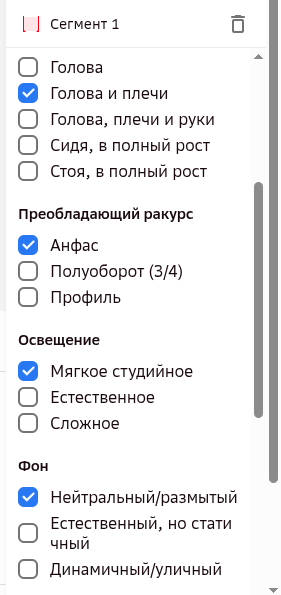
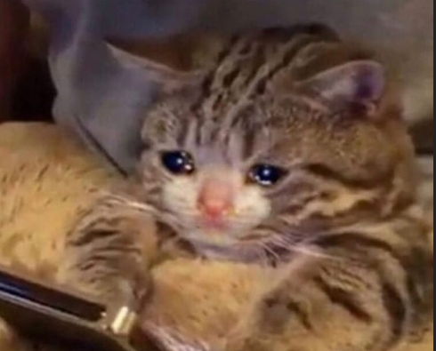
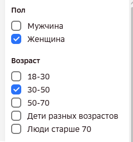
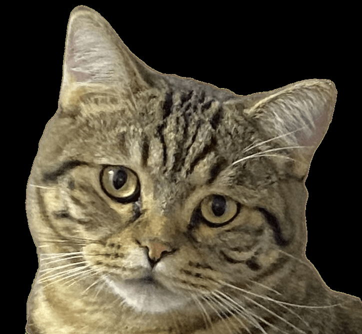
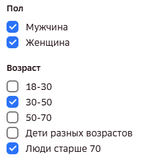

# Заполнение классификатора

Классификатор заполняется **на каждый сегмент** отдельно (не на всё видео целиком).
`[Инстр. Kandinsky-Аватар, стр.1]`

## Общее правило выбора значений

В каждом критерии по умолчанию выбирается **одно** значение — преобладающий характер
(например: «Объём и поза тела»: Голова и плечи; «Преобладающий ракурс»: Анфас).

**Множественный выбор** в некоторых вопросах возможен **только** если в кадре находятся
2 и более людей одновременно. В остальных случаях — один ответ на один вопрос.

*Пример корректного заполнения: в каждой группе отмечено ровно одно значение
(«Голова и плечи», «Анфас», «Мягкое студийное», «Нейтральный/размытый»).*

`[Инстр. Kandinsky-Аватар, стр.5]`

### Наглядно: один человек в кадре vs два и более

**Один человек в кадре → один ответ на вопрос:**

| Кадр | Классификатор |
|---|---|
|  |  |

**Два и более человек в кадре → в некоторых полях можно отметить несколько значений:**

| Кадр | Классификатор |
|---|---|
|   |  |

`[Памятка «Аватар 2 этап», стр.2-3]`

## Поля классификатора

Классификатор в интерфейсе разметки состоит из **13 полей**, расположенных в три колонки
(сверху вниз, слева направо). Ниже — все поля в этом порядке, со значениями и нюансами
заполнения каждого.

### Правило для «полей о человеке» (Пол, Возраст, Эмоции)

- **Люди на заднем плане не учитываются** в этих полях — заполняем их только по
  **центральному/главному** человеку в кадре, даже если на фоне видны другие люди.
  `[Разметка ВК видео — ОС 25.05 СТ2]`
  ⚠️ Это правило — про фон, а не про количество главных говорящих: если в кадре **два (и более)
  центральных человека одновременно отвечают/говорят** (например, интервью с двумя гостями),
  нужно отмечать характеристики **обоих**, а не только одного из них — это отдельная и
  противоположная по смыслу ошибка. `[Разметка ВК видео — ОС по Заявкам 26-28, 05.08.2026]`
  ⚠️ **Как выбрать «главного», если говорят/поют сразу несколько человек равномерно** (сложно
  выделить одного): ориентироваться на того, кто **первым начал** говорить/петь, у кого
  **больше объём** речи/пения, и кто **лучше виден** в кадре — по совокупности этих признаков.
  `[Разметка ВК видео — ОС 20.05 СТ2]`
  ⚠️ **Молчащий, но хорошо видимый (не фоновый) человек в кадре — тоже не учитывается в этих
  полях.** Правило выше формулируется через «задний план», но на практике критерий — не позиция
  в кадре, а то, **говорит/поёт ли человек именно в этом сегменте**: если из двух людей на
  переднем плане в конкретном сегменте звучит только один (второй присутствует молча, например
  ещё не вступил в песне) — пол/возраст/эмоции и т.п. заполняются **только по звучащему**.
  Отдельно от этих полей есть **отдельная отметка «количество людей в кадре»** внизу
  классификатора — её проставляем по фактическому числу видимых людей независимо от того, кто
  из них говорит/поёт (см. также пример пропущенной отметки в [10-qa-log.md](10-qa-log.md)).
  Если сегмент захватывает момент, когда оба поют/говорят вместе — тогда заполняем поля по
  обоим, как в общем правиле выше. Неофициальное разъяснение, но соответствует и подтверждает
  логику официального правила. `[Чат исполнителей, 11.08.2026]`

### Колонка 1

- **Пол** (Мужчина / Женщина): если в кадре одновременно и мужчина, и женщина — отмечаем оба
  варианта.
- **Возраст** (18-30 / 30-50 / 50-70 / Дети разных возрастов / Люди старше 70): если в кадре
  люди разных возрастных групп — отмечаем несколько вариантов.
- **Объём и поза тела человека в кадре** (Голова / Голова и плечи / Голова, плечи и руки / Сидя
  в полный рост / Стоя в полный рост):
  - Если в кадре появляются **руки** человека (даже ненадолго) → отмечать **«Голова, плечи и
    руки»**.
  - Если человека видно **по грудь/пояс**, но кисти рук в кадре не появляются → **«Голова и
    плечи»**.
  - Если в кадре видны **колени** человека (сидя/стоя) → **«Сидя в полный рост»** / **«Стоя в
    полный рост»**. Достаточно, чтобы были видны колени — голеностоп видеть не обязательно.
    ⚠️ Более строгая практика куратора при обучении новичков: нужно видеть кадр **чуть выше**
    коленей, а не только сами колени вплотную по нижнему краю кадра — если кадр обрезан прямо
    по линии колен без запаса выше, это лучше отнести к «Голова, плечи и руки». Расхождение
    небольшое (на грани точной формулировки, а не по сути правила), но при выборе на грани
    лучше ориентироваться на более строгий вариант. `[FAQ «Примеры», дополнено 13.03; Встреча с
    новичками по 2 этапу, 29.07.2026]`
  - Критерий — именно **кисти рук**, а не просто пальцы: если в кадр попадают только кончики
    пальцев (а не вся кисть), «Голова, плечи и руки» ставить **не нужно**, это всё ещё «Голова
    и плечи». `[Разметка ВК видео — ОС 22.05 СТ2]`
  - Значение должно быть **консистентным по всему сегменту**: если руки то появляются, то
    пропадают из кадра, такой сегмент считается ошибкой границ — нужно либо скорректировать
    границы, либо разбить на два сегмента с разными значениями. `[Разметка ВК видео — ОС 28.05
    СТ2]`
  - ⚠️ **Значений «до пояса»/«по пояс» на 2 этапе нет и не будет** — уточнено заказчиком
    напрямую (21.05.2026): «классификатор составляли, ориентируясь на заданную балансировку,
    поэтому, к сожалению, не получится». Это особенность более детального классификатора
    **3 этапа**, не 2-го. Упоминание «до пояса» в файле «Примеры» (дополнено 13.03) стоит
    читать как неформальное описание, а не как отдельное значение поля — на практике человека,
    видимого до живота/пояса, размечаем ближайшим подходящим из официальных 5 значений (обычно
    «Голова, плечи и руки», если руки видны, иначе «Голова и плечи»). Подробности спора —
    [09-disputed-points.md](09-disputed-points.md#поле-объём-и-поза-тела-есть-ли-значение-до-пояса-решено).
  Это правило (обновление от 21.05, в первую очередь про руки/кисти) активно проверяется на
  практике — «не отмечены руки, хотя они видны в кадре» стала одной из самых частых ошибок в
  последующих ОС, см. [10-qa-log.md](10-qa-log.md). `[Инстр. Kandinsky-Аватар, стр.5, Upd
  21.05]`
- **Преобладающий ракурс** (Анфас / Полуоборот (3/4) / Профиль):
  - Если человек постоянно поворачивает голову (то анфас, то профиль, то полуоборот) и
    «поймать» устойчивые 10 секунд в одном положении невозможно — ставим тот ракурс, который
    **преобладает** по факту в выбранном сегменте (обычно анфас, если камера расположена перед
    человеком). Само по себе такое поведение — **не повод** отправлять видео в «Битое»: сегмент
    всё равно выделяем, просто по преобладающему ракурсу. `[Видео с разбором ошибок — Аватар 2
    этап]`
  - Практический критерий «профиль vs потеря лица»: профиль — это когда человек повернут боком,
    но **нос всё ещё виден** сбоку от лица (виден его силуэт). Если человек повернул голову ещё
    дальше, так что нос «уходит за угол» и перестаёт быть виден — это уже не профиль, а потеря
    лица; такой момент не должен попадать в сегмент, нужно искать более подходящий по времени
    участок. Если по всему сегменту ракурс делится примерно 50/50 между двумя значениями и явно
    преобладающего нет — по возможности лучше подобрать более однородный участок; если такого
    участка на видео действительно нет, решение «по наитию» допустимо, но это редкий,
    нежелательный случай, а не рабочая практика по умолчанию.
    `[Встреча с новичками по 2 этапу, 29.07.2026]`

### Колонка 2

- **Освещение:** «Мягкое студийное» — любой искусственный свет (лампы, студия, комната);
  «Естественное» — виден источник света в виде окна, либо человек снят на улице; «Сложное» —
  источник света сзади (контровой) или другая явно сложная световая схема.
  ⚠️ Заказчик прямо признаёт, что это поле во многом **оценочное** («многие категории
  классификатора несут оценочный характер, где-то нельзя точно сказать, какой там верный
  ответ» — используется для балансировки датасета, не как жёсткий тест на правильность). Не
  любой свет в помещении — «естественный»: реальный кейс, где асессор прислал 2 примера
  домашней обстановки как потенциально «естественное» освещение, заказчик оценил оба именно
  как **студийное**. `[Переписка в Telegram с заказчиком, 04.02.2026]`
  Более точный практический критерий «Сложное»: несколько **разных** источников света
  одновременно, с разных сторон (например, с одной стороны лампа, с другой — солнце из окна),
  либо разноцветный свет. На практике это встречается крайне редко — в подавляющем большинстве
  случаев подходит «Мягкое студийное» или «Естественное». Окно не обязательно должно быть видно
  в кадре напрямую, чтобы поставить «Естественное» — достаточно косвенных признаков (например,
  видно отражение дневного/закатного света в комнате). А если источник света в кадре не виден,
  но заметно **отражение кольцевой лампы в глазах** (характерный блик-кольцо) — это признак
  именно искусственного света, ставим «Мягкое студийное». `[Встреча с новичками по 2 этапу,
  29.07.2026]`
- **Фон:** «Нейтральный/размытый» — однотонный, замыленный фон; «Естественный, но статичный» —
  обычная бытовая обстановка (комната, студия телепрограммы, школа и т.п.); «Динамичный/уличный»
  — на фоне что-то происходит (не должно отвлекать от лица). Лёгкие фоновые «раздражители»
  (дымок, слегка колышущаяся ткань и подобное мелкое движение) **не переводят** фон в
  «Динамичный/уличный» — это всё ещё статика. См. разбор реального кейса в [07-faq.md](07-faq.md#лёгкое-движение-на-фоне-дым-ткань--это-всё-ещё-статика).
  `[ОС заказчика, 23.07.2026]`
  ⚠️ **Важное уточнение:** «Динамичный/уличный» — это одно значение из двух слов через слэш, а
  не отдельно «динамичный» и отдельно «уличный». Если на видео видны признаки того, что съёмка
  происходит **на улице** (деревья, земля, экстерьер), нужно ставить «Динамичный/уличный», даже
  если сам фон статичен и нет никакого движения (дуновения ветра и т.п.) — критерий «на улице»
  срабатывает сам по себе, независимо от динамики. `[Разметка ВК видео — ОС 20.05 СТ2]`
  ⚠️ **Оценка фона на 2 этапе официально идёт по тем же принципам, что на 3 этапе** —
  подтверждено напрямую (20.05.2026): на вопрос «динамичный фон так же оцениваем, как в
  3м этапе?» валидатор ответил **«Да, фон оцениваем, как на 3 этапе»**. Отсюда два конкретных
  правила, дословно совпадающих с полем «Фон» инструкции 3 этапа (см.
  [мануал 3 этапа](../manual-3-etap/01-classifier.md#список-вопросов-классификатора-19)):
  - **Отражения и тени:** если в отражении (зеркало, стекло) присутствует движение — фон
    считается динамичным; неподвижная тень — статика, движущаяся/мерцающая тень — динамика.
    `[Переписка в Telegram с заказчиком, 27.07.2026]`
  - Мелкие фоновые «раздражители» (дымок, вдалеке прошёл размытый человек и подобное) — всё ещё
    статика, см. выше. `[Разметка ВК видео — ОС 20.05 СТ2]`
  ⚠️ Если фокус на человеке настолько сильный, что фон превращается в «кашу» (расфокус камеры),
  но в других ракурсах/кадрах того же ролика видно, что там на самом деле обычная обстановка —
  классифицировать стоит по тому, что реально есть за спиной (например, «Естественный, но
  статичный»), а не как «Нейтральный/размытый» — эта категория про однотонный/замыленный фон по
  своей природе, а не про случайный расфокус камеры. Мнение команды, неофициально.
  `[Вопросы по проекту (2ч) — Чат исполнителей]`
- ⚠️ Не путать со значением поля «Фон»: **виньетка** (затемнение по краям кадра) — это
  наложенный эффект и признак брака, если во всём видео нет сегмента без неё; полная
  формулировка правила —
  [«Что не размечаем / Битое»](05b-what-not-to-label.md#-полностью-исключённые-типы-видео),
  история вопроса — [09-disputed-points.md](09-disputed-points.md#виньетка-на-видео-это-битое-3-этап-или-просто-однотонный-фон-2-этап--решено).
- **Эмоции и выражение лица** (Нейтральные/спокойные / Положительные /
  Серьёзные/сосредоточенные/негативные):
  - **Не злоупотреблять «other»/«другое»:** заказчик отдельно отмечал, что асессоры слишком
    часто ставят общий вариант «other», хотя на видео чётко читается конкретная эмоция — «если
    человек радуется, то это happy, агрессивен — angry» и т.п. Смотрим на **преобладающий**
    характер эмоции по всему сегменту; «other»/«другое» — только когда ни один конкретный
    вариант действительно не подходит, а не как способ не думать над ответом. `[Переписка в
    Telegram с заказчиком, 28.07.2026]`
  - ⚠️ **Важно, откуда именно определяется эмоция:** несмотря на то, что поле называется
    «Эмоции и выражение лица», рабочая практика команды — ориентироваться в первую очередь на
    **интонацию и тон голоса**, а не на мимику/выражение лица саму по себе. Улыбка на лице сама
    по себе не считается положительной эмоцией, если тон голоса ей не соответствует.
    Показательный пример — актёрские видеовизитки: человек может улыбаться, отыгрывая роль, но
    при этом говорить грустным/подавленным тоном — в таком случае эмоция ставится по голосу
    (грустная/серьёзная), а не «положительная» по лицу. Эта трактовка не встречается дословно в
    официальном тексте инструкции — это внутренняя практика, которую куратор передаёт новым
    асессорам при обучении, так что при явном сомнении по конкретному видео стоит уточнить в
    общем чате команды. `[Встреча с новичками по 2 этапу, 29.07.2026]`
  - **Смена эмоций внутри одного ролика** влияет на то, сколько сегментов выделять, см. правило
    и источники в [02-segments.md](02-segments.md#когда-объединятьделить-сегмент).
- **Тип речи** (Монолог (подготовленный) / Монолог (спонтанный) / Диалог (ответы на вопросы)):
  - Если в кадре 2 и более человек, это **не автоматически диалог**. «Диалог» ставится, только
    когда они **говорят между собой**. Если говорит фактически один из них (второй просто
    присутствует в кадре) — это монолог.
  - **Монолог vs закадровый голос:** если на видео есть второй, закадровый голос (например,
    интервьюер за кадром), а в сегмент мы его не включаем (см.
    [01-general-requirements.md](01-general-requirements.md)), то оставшийся говорящий в кадре
    человек — это **монолог**, а не диалог: закадровый голос не считается вторым участником для
    целей этого поля. `[ОС заказчика, 17.07.2026]`
  - **Активный диалог, но набрать 10 сек с одним человеком не получается:** если в кадре два
    человека ведут активный диалог, и выделить 10+ секунд с тем, кто виден лучше, **без участия
    второго** не получается — размечаем фрагмент целиком как диалог с двумя людьми в кадре. Если
    же можно набрать 10+ секунд, где говорит только один из них (без второго в кадре в этот
    момент) — такой фрагмент выделяем отдельно, как один человек, «монолог спонтанный».
    `[Видео с разбором ошибок — Аватар 2 этап]`
  - **Актёрские видеовизитки:** «монолог подготовленный» распознаётся по структуре ролика, а не
    по языку/темпу — спокойное самопредставление (часто с поворотами, показом рук) → резкая
    смена характера и настроения → драматический фрагмент. См.
    [07-faq.md](07-faq.md#как-отличить-монолог-подготовленный-от-спонтанной-речи-не-зная-языка).
    `[ОС заказчика, 23.07.2026]`
    ⚠️ **Реальный кейс с ошибкой:** на видеовизитке актриса отвечает на вопросы за кадром;
    оператор убрал закадровый голос из сегмента и решил, что раз она формально не отвечает
    «здесь и сейчас» на конкретный вопрос — это «спонтанный монолог». Валидатор поставил
    «подготовленный» на **всех** сегментах этого ролика без исключения — сам факт, что реплики
    срежиссированы для видеовизитки (даже в формате «вопрос-ответ»), делает тип речи
    подготовленным целиком, независимо от того, включён ли закадровый вопрос в сегмент.
    `[Разметка ВК видео — ОС 27.05 СТ2]`

### Колонка 3

- **Темп речи** (Медленный / Быстрый): цель по команде в целом — равномерное распределение.
- **Язык и акценты** (Русский / Английский / Другой): если в сегменте звучит **преимущественно
  один язык**, а другой — буквально одно слово/фраза, отмечаем только преобладающий язык
  (например, человек говорит 95% по-английски — ставим только английский). Второй язык
  отмечаем **дополнительно**, только если он тоже занимает заметную, значимую долю сегмента, а
  не мимолётное вкрапление. `[Разметка ВК видео — ОС экзамен 2 этап 05.08]`
  Отдельно про сильный акцент (без смешения языков): если акцент сильный, но речь всё равно
  разборчива и понятно, что человек говорит по-русски — ставим «русский». Если же речь
  настолько смешана с другим языком/акцентом, что разобрать её тяжело — ставим «другой язык».
  `[Видео с разбором ошибок — Аватар 2 этап]`
- **Группа данных** (Студия / Естественная среда): «Студия» — искусственная среда (фотостудия,
  съёмка шоу); «Естественная среда» — обычная бытовая обстановка (кабинеты, улица и т.д.).
  ⚠️ Это поле — **одиночный выбор**: выбор сразу двух пунктов («Студия» + «Естественная среда»)
  — реальная ошибка, которую отмечал заказчик. `[ОС заказчика, 17.06.2026 — см. 10-qa-log.md]`
- **Количество людей, одновременно находящихся в кадре** (Один человек в кадре / Два и более
  человека в кадре) — от значения этого поля зависит, допустим ли множественный выбор в других
  полях (Пол, Возраст и т.д.), см. [«Общее правило выбора значений»](#общее-правило-выбора-значений)
  выше.
- **Баланс по пению/говорению** (в интерфейсе поле подписано «Речь / Пение»; «баланс по
  пению/говорению» — так его иногда называют в переписке с валидаторами):
  - Взаимоисключающие варианты — нельзя отмечать оба одновременно. `[ОС заказчика, 17.06.2026 —
    см. 10-qa-log.md]`
  - Если в сегменте есть и то, и другое — нужно выбрать, что **преобладает** (например, если
    человек в основном поёт с редкими репликами — ставим «Пение», а не оба варианта сразу).
    `[Разметка ВК видео — ОС 18.05/28.05 СТ2]`
  - ⚠️ Если в одном ролике есть чётко различимый участок с речью и отдельно участок с пением —
    **предпочтительно разделить их на два разных сегмента** (один — речь, другой — пение), а не
    сводить в один смешанный сегмент и выбирать преобладающий тип. Правило про «преобладающий
    тип» (выше) — это решение на случай, когда речь и пение переплетены внутри короткого
    отрезка и разделить их сегментами нельзя. `[Переписка в Telegram с заказчиком, 30.07.2026]`

### Не поле классификатора, но влияет на выбор сегмента

- **Динамика (движение в кадре):** насколько активно человек двигается — учитывает не только
  перемещение в кадре, но и удаление/приближение к камере (зум на объект). Такие фрагменты нужно
  активно выделять, а не избегать. Подробности и как это влияет на выделение сегментов —
  [02-segments.md](02-segments.md#когда-объединятьделить-сегмент). `[Переписка в Telegram с
  заказчиком, 16.07.2026 и 28.07.2026]`

`[Инстр. Kandinsky-Аватар, стр.1-5, Upd 21.05; Памятка «Аватар 2 этап», стр.4-6]`

## Целевые пропорции датасета (баланс)

Числа ориентировочные — используются, чтобы датасет в целом был сбалансирован, а не
перегружен однотипным контентом. Это ориентир для команды в целом, а не жёсткое правило
для одного видео.

### Зачем это нужно

Избегать:
- Накопления большого числа фрагментов из одних и тех же источников (один канал, один автор,
  один сборник подкастов и т.п.).
- Частого повторения одних и тех же персон, особенно если сцена/поведение почти не меняются.

`[Инстр. Kandinsky-Аватар, стр.3]`

### Демография

- **Пол:** к соотношению, близкому к 50/50.
- **Возраст:** равномерно по группам 18-30, 30-50, 50-70. Важно не перегружать датасет молодыми
  людьми 20-35 (частая проблема интернет-контента). Плюс дети разных возрастов и люди старше
  70 (можно меньше, чем основных групп).
- **Этническая принадлежность и тип внешности:** сознательно включать разные фенотипы (цвет
  кожи, черты лица, тип волос). Избегать ситуации, когда >85% датасета — люди одной этнической
  группы.
- **Аксессуары и особенности:** очки (разных типов), борода, усы, разнообразные причёски,
  головные уборы.

### Визуальные параметры

**Объём и поза тела в кадре:** Голова ~10% · Голова и плечи ~20% · Голова, плечи и руки ~30% ·
Сидя в полный рост ~20% · Стоя в полный рост ~20%

**Преобладающий ракурс:** Анфас ~40% · Полуоборот (3/4) ~40% (поровну справа/слева) ·
Профиль ~20% (поровну справа/слева)

**Освещение:** Мягкое студийное ~35% · Естественное (окно) ~35% · Сложное (контровой,
боковое, неравномерное) ~30%

**Фон:** Нейтральный/размытый (студия) ~40% · Естественный, но статичный ~40% ·
Динамичный/уличный (не отвлекающий) ~20%

**Эмоции:** Нейтральное/спокойное ~50% · Положительные (радость, улыбка, интерес) ~30% ·
Серьёзные/сосредоточенные/негативные ~20%

### Речевые характеристики

**Тип речи:** Монолог подготовленный (лекции, презентации, новости; чёткая дикция) ~30% ·
Монолог спонтанный (влоги, рассказы, размышления вслух; естественные паузы, междометия) ~30% ·
Диалог/ответы на вопросы (интервью, подкасты; эмоциональная окраска, реакция) ~40%

**Темп речи:** равномерное распределение от медленного/чёткого до быстрого. Три уровня для
калибровки поля (быстрая речь / средний темп / медленный темп) — примеры по каждому темпу см. в
[11-example-library.md](11-example-library.md#темп-речи).

**Тональность и громкость:** не отдельное поле классификатора, а общий ориентир по разнообразию
голосов — разный тембр, разный уровень громкости (не только спокойная ровная речь).

**Язык и акценты:** русский ~40%, английский ~40%, остальные языки/диалекты/акценты — как
получится, с естественным балансом.

### Прочий баланс

- **Группы источников:** Группа 1 (Студия) ~40% · Группа 2 (Естественная среда) ~60%
  (описание групп — [01-general-requirements.md](01-general-requirements.md#группы-интересующих-видео)).
- **Количество людей в кадре:** один человек ~60% · два и более ~40%.
- **Речь / пение:** речь ~90% · пение ~10%.

`[Инстр. Kandinsky-Аватар, стр.3-4]`

## Частые ошибки классификатора

См. раздел «Ошибка классификатора» в [06-common-mistakes.md](06-common-mistakes.md).
