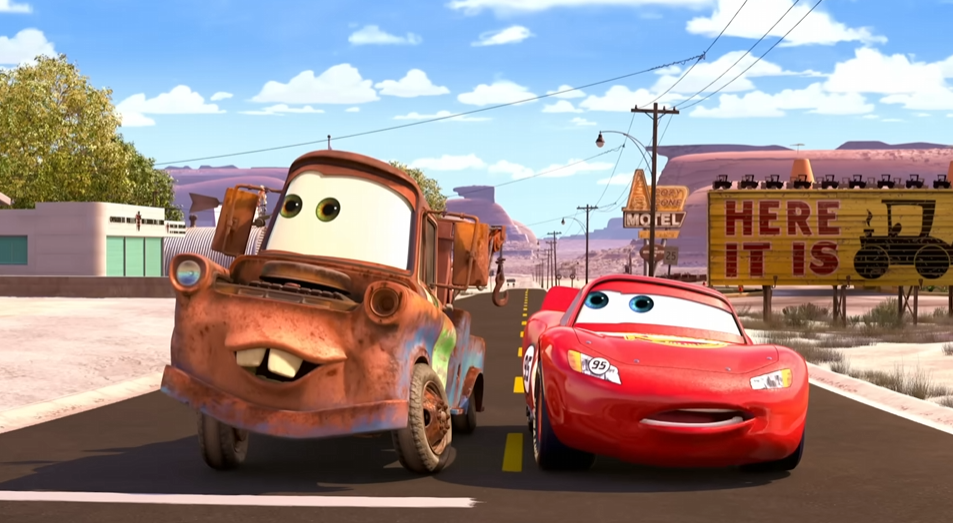

# Что размечаем / что не размечаем

Это краткий чек-лист. Подробные критерии и обоснования — в [01-general-requirements.md](01-general-requirements.md),
[02-segments.md](02-segments.md) и [03-video-quality.md](03-video-quality.md).

## Размечаем (выделяем сегмент), если

- Говорящий/поющий человек чётко в кадре, лицо хорошо освещено и не смазано.
- Длительность и границы фрагмента — см. [02-segments.md](02-segments.md#определение-и-границы).
- Молчание внутри сегмента — точный порог см. в [02-segments.md](02-segments.md#определение-и-границы).
- Движения губ соответствуют речи, мимика естественная.
- Допустимо: медленный зум/плавное движение камеры без склеек, лёгкий фон-шум/тихая музыка,
  моно-звук, блики на очках, пиксельность фона, объект в расфокусе на переднем плане (если не
  перекрывает лицо), человек «вырезан» и наложен на фон, чёрно-белое видео (если лицо хорошо
  освещено), солнцезащитные очки (если через них видно глаза).
- Напевания, мычания, подражания звукам во время пения — не считаются браком, не вырезаем.
- Чья-то рука в кадре (например, интервьюера) — не мешает, оцениваем по основному человеку в кадре.
- Бэк-вокал — допустим.
- **Мультики / антропоморфы** — размечаются по тем же общим правилам, что и обычное видео.
  Подтверждено отдельно и для 2 этапа: «Нас заказчик просил также набрать несколько видео с
  антропоморфными персонажами... На 2 этапе могут попадаться они, это корректно». Асессоры
  иногда по ошибке отправляют такие видео в «Битое», решив, что персонаж не подходит — это
  неверно, если видео соответствует остальным требованиям ТЗ.
  `[Разметка ВК видео — ОС по Заявкам 26-28, 28.05.2026]`

  **Точный критерий, что считается «антропоморфным персонажем»:** нужны человекоподобные черты
  лица, **и** руки, **и** ноги, причём персонаж должен быть **прямоходящим** (передвигаться на
  двух ногах, как человек). Просто говорящий персонаж — недостаточно: если анатомия не
  человекоподобна (нет нужной конфигурации рук/ног, не прямоходящий), такой персонаж не подходит,
  даже если он явно очеловечен, разговаривает и хорошо анимирован. Животные подходят, только
  если их анатомия соответствует этим требованиям — тут нужно смотреть индивидуально.

  Примеры для калибровки:
  - ✅ Майк Вазовски и Салли (монстры, «Корпорация монстров») — подходят: человекоподобное лицо,
    руки, ноги, прямоходящие.
  - ✅ Мистер Картофельная Голова («История игрушек») — подходит: есть лицо, руки, ноги.
  - ✅ Антропоморфный пингвин (стоит и ходит на двух лапах, как человек) — подходит.
  - ❌ Говорящая рыбка (например, Дори из «В поисках Немо») — **не подходит**: это просто
    говорящий персонаж без человекоподобной анатомии (нет ног, не прямоходящий) — сам факт речи
    и мимики недостаточен.
  - ❌ Говорящие машинки (например, Молния Маккуин из «Тачек») — **не подходят** по той же
    причине (см. реальный кейс ниже).
  - ❌ Монстр-капля без выраженных рук/ног — не подходит по той же причине: анатомия важнее
    факта речи и мимики.

  

  **Отдельно — поза и поведение в кадре тоже важны, не только анатомия.** Один и тот же вид
  животного может подходить или не подходить в зависимости от того, как он показан: если
  персонаж **сидит/ведёт себя, как обычное животное** (например, кошки сидят по-кошачьи) — это
  не считается антропоморфом; если он **явно ходит на задних лапах, как человек** — считается.
  Пример с котами из «Аристократов»: «Если они сидят, как кошки, то не надо. Если ходят на
  задних лапах, то ок».

  **Отдельно — динамика ролика и артикуляция.** Даже если персонаж по типу подходит, конкретный
  ролик всё равно может не подойти из-за резкой/прерывистой анимации или плохого липсинка — так
  же, как и у обычных «живых» видео. Особое внимание — **пластилиновым мультикам** (стоп-моушен/
  клеймейшн, например «Барашек Шон» или «Побег из курятника»): у них артикуляция чаще всего
  проблемная, нужно внимательно проверять, подходят ли динамика и артикуляция, а не брать такой
  мультфильм по умолчанию. Заказчик подтвердил это на конкретных примерах: овца из «Барашка Шона»
  и куры из «Побега из курятника» анатомически подходят под антропоморфа, но «у таких мультфильмов
  обычно рваная динамика, плохая артикуляция» — из-за этого конкретный ролик всё равно может не
  подойти. Хомяк из мультфильма «Болт» — пример животного, которое подходит.
  `[Разметка ВК видео — ОС 07.08.2026]`

  Примеры (положительные и отрицательные):
  - ✅ [g2IF5NG2vU4](https://www.youtube.com/watch?v=g2IF5NG2vU4) (с 35 секунды) — подходит.
  - ❌ [Mrwtdd6W3mw](https://www.youtube.com/watch?v=Mrwtdd6W3mw) (с 23 секунды) — не подходит:
    дело не в монтаже/сменах сцен, а именно в артикуляции персонажей — локально она прерывистая,
    неестественная; нужны более плавные движения.
  - ❌ [FqnaRHnTwck](https://www.youtube.com/shorts/FqnaRHnTwck) — не подходит сразу по двум
    причинам: это генерация нейросети (исключаем в принципе, см. ниже) и вдобавок липсинк/
    артикуляция персонажа тоже не подходит.

  `[Уточнение по антропоморфам, 07.08.2026]`

  ⚠️ **Реальный случай, подтверждающий этот критерий** (отправка в «Битое», 06.08.2026):
  мультфильм с говорящими автомобилями — у машин нарисованы только глаза и рот (на решётке
  радиатора/лобовом стекле), никакой человекоподобной фигуры, рук или ног нет.
  
  Комментарий валидатора: «Нет антропоморфных подходящих объектов. Машины слишком далеки от них,
  нужно подобие людей (прямоходящие, с руками и ногами, говорящие), здесь же только глаза и рот
  есть». `[Комментарий валидатора по заданию, 06.08.2026]`

`[Инстр. Kandinsky-Аватар, стр.1-2]`, `[Памятка «Аватар 2 этап», стр.3-4]`

## Не размечаем / исключаем полностью

- Видео с дубляжом (речь поверх оригинальной дорожки).
- Видео с сопроводительным текстом/субтитрами, рамками.
- Видео с изображениями, сгенерированными ИИ.
- Видео с нейро-аватарами (в начале может быть сказано, что это чей-то аватар).
- Любое монтажное наложение: затемнение экрана как переход, субтитры, водяной знак, коллаж,
  чьё-то лицо в кружочке и т.п. Сюда же относится представление человека титром-плашкой (имя,
  фамилия, должность) поверх видео, типичное для теленовостей/интервью — это тоже субтитры.
  Как отличить реальный физический эффект от монтажной вставки: например, снег, идущий на
  улице — это часть реальной сцены, не монтаж; но если человек находится в помещении (в
  комнате), а на видео при этом «идёт снег» — это уже подозрительно похоже на добавленный
  постфактум эффект, и такое стоит расценивать как монтаж. `[Встреча с новичками по 2 этапу,
  29.07.2026]`
- Фрагменты, где черты лица перекрыты микрофоном, рукой или другим объектом.
- Фрагменты со сменой кадра, склейками («перебивками»/«рывками»), водяными знаками,
  наложенным текстом внутри сегмента.
- Фрагменты короче 10 секунд или длиннее 300 секунд (без разбивки).
- Видео низкого разрешения, где черты лица/губы смазаны и не читаются (ориентир: 480p обычно
  не проходит); большая пиксельность на лице (в отличие от пиксельности фона — она допустима).
- Закадровый голос (например, голос интервьюера, который не виден в кадре и не говорит на камеру).
- Отставание речи от мимики рта.
- Солнцезащитные очки, если через них совсем не видно глаз.
- Тряска камеры или её сильное «гуляние».
- Отворот-поворот лица, из-за которого человек полностью теряется из кадра.
- **Видео длиннее 10 минут** — подтверждено многократно реальной ОС заказчика (в т.ч. по видео
  из заявки 28), см. [09-disputed-points.md](09-disputed-points.md) и [10-qa-log.md](10-qa-log.md).

`[Инстр. Kandinsky-Аватар, стр.2, 7-10]`, `[Памятка «Аватар 2 этап», стр.3]`

## Если ничего не подходит

Всё видео помечается как **«Битое»** — см. [02-segments.md](02-segments.md#когда-видео-помечается-битое)
(там же — что проверить перед отправкой в «Битое»).
