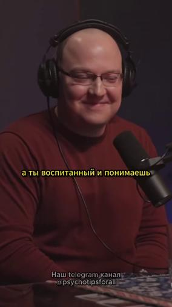
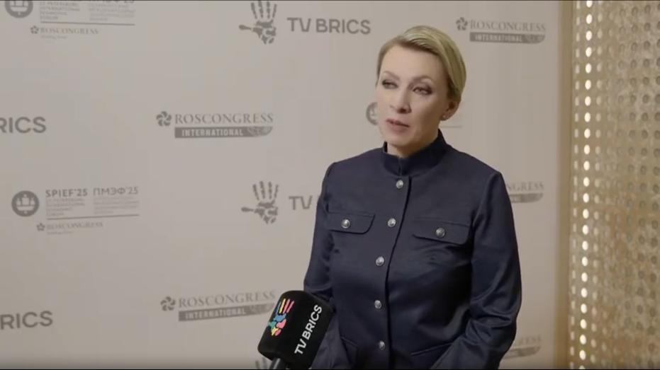
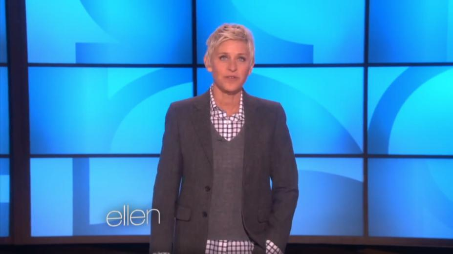
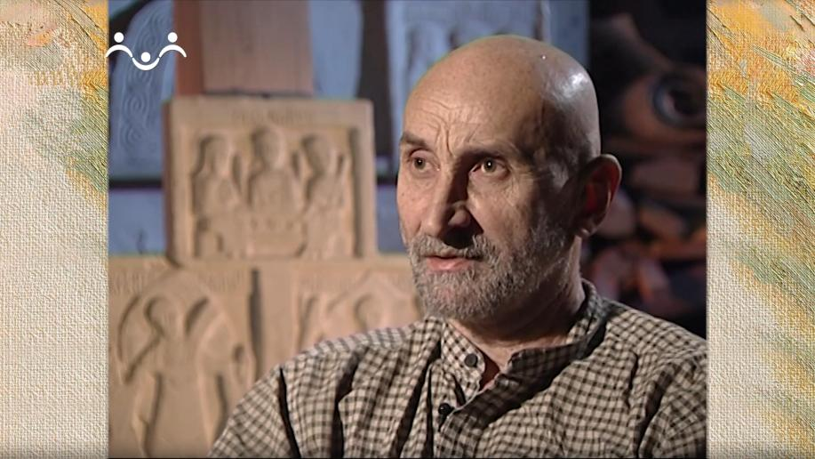
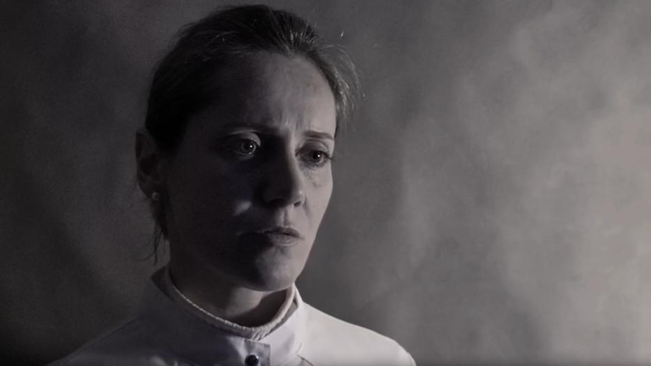
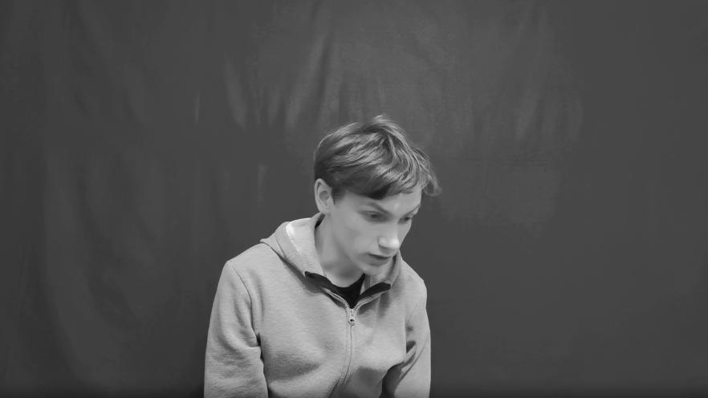

# Что не размечаем / Битое

Здесь собрано всё, из-за чего видео или сегмент не подходит: критерии исключения по категориям,
когда и как видео помечается «Битое», антипримеры для калибровки.
Что размечаем — см. [«Что размечаем»](05-what-to-label.md).

## 🚫 Полностью исключённые типы видео

- Видео с **дубляжом** (речь поверх оригинальной дорожки).
- Видео с **сопроводительным текстом/субтитрами, рамками**.
- Видео с **изображениями, сгенерированными ИИ**.
- Видео с **нейро-аватарами** (в начале может быть сказано, что это чей-то аватар).

<ul markdown="1">
<li markdown="1">

**Любое монтажное наложение**: затемнение экрана как переход, субтитры, водяной знак, коллаж,
чьё-то лицо в кружочке и т.п. Сюда же относится представление человека *титром-плашкой* (имя,
фамилия, должность) поверх видео, типичное для теленовостей/интервью — это тоже субтитры.
`[Встреча с новичками по 2 этапу, 29.07.2026]`

***Как отличить реальный физический эффект от монтажной вставки:*** например, снег, идущий на
улице — это часть реальной сцены, не монтаж; но если человек находится в помещении (в
комнате), а на видео при этом «идёт снег» — это уже подозрительно похоже на добавленный
постфактум эффект, и такое стоит расценивать как монтаж.

Калибровочные примеры — см. [ниже](#наложенный-текст--подтверждённые-примеры).

</li>
</ul>

- **Виньетка** (затемнение по краям кадра) — это наложенный эффект, и если во всём видео нет
  сегмента без виньетки — это брак. `[Разметка ВК видео — ОС 07.08.2026]`
- **Фрагменты короче 10 секунд или длиннее 300 секунд** (без разбивки на несколько) — не
  подходят; полное определение длительности сегмента и как её считать — см.
  [02-segments.md](02-segments.md#определение-и-границы). `[Инстр. Kandinsky-Аватар, стр.2, 7-10]`
- **Видео длиннее 10 минут** — не размечаем (даже если 10:05), в т.ч. по видео из заявки 28, где
  исходные видео имеют длину от 420 сек до ∞.

`[Инстр. Kandinsky-Аватар, стр.2, 7-10; Памятка «Аватар 2 этап», стр.3]`

Базовые требования к разрешению, FPS и формату — см.
[01-general-requirements.md](01-general-requirements.md#качество-и-формат-видео).

- Видео низкого разрешения, где черты лица/губы смазаны и не читаются (ориентир: 480p обычно
  не проходит); большая пиксельность на лице — сегмент не подходит (в отличие от пиксельности
  на фоне, которая допустима, см. [01-general-requirements.md](01-general-requirements.md)).
  `[Инстр. Kandinsky-Аватар, стр.2, 7-10; Памятка «Аватар 2 этап», стр.3]`
- **Как отличить пикселизацию лица на глаз**, если она неочевидна с первого взгляда: лучше всего
  она видна на **тенях**, **щеках** и **области под глазами** — если общее качество картинки
  низкое, пикселизация почти всегда там тоже присутствует. При поворотах головы дополнительно
  смотрите на **нос и подбородок**: на смазанной картинке они визуально «сливаются» друг с
  другом в момент поворота. Калибровочные примеры — см.
  [«Банк примеров»](11-example-library.md#большая-пиксельность-23).
  `[Вопросы по проекту (1-2ч) — Чат исполнителей, февраль 2026, мнение исполнителей]`
- Тряска камеры или её сильное «гуляние» — сегмент не подходит. Рабочий критерий, подтверждённый
  заказчиком: **резкое движение камеры — это тряска, плавное/аккуратное — норма** (точного
  количественного порога, вроде «скольких градусов смещения», не установлено — оценка на глаз
  по этой эвристике). Калибровочные примеры — см.
  [ниже](#тряска-камеры-vs-плавное-движение). `[Памятка «Аватар 2 этап», стр.3; Вопросы-ответы, 20.08.2026]`
  ⚠️ **Практический тест от заказчика (02.09.2026):** «гуляние» камеры само по себе — не
  проблема, если оно **не мешает восприятию происходящего на видео**. Сегмент не подходит только
  если выполняется хотя бы одно из двух условий: (1) движение камеры похожее на съёмку **на
  бегу** («если человек бежит и что-то снимает»); (2) из-за тряски появляются **эффекты
  смазанности/размытости** картинки — тогда это «Битое». Если ни то, ни другое не применимо —
  такое «гуляние» допустимо, даже если камера не абсолютно статична.
  `[Ответы на вопросы по Аватару, 02.09.2026]`
- **Слишком близкое расположение человека к камере** может само по себе давать расфокус
  («мыльность») черт лица и мимики, даже если официальное разрешение видео в порядке — такой
  сегмент не подходит (отдельная категория ошибки «Нечёткость мимики/черт лица», см.
  [06-common-mistakes.md](06-common-mistakes.md)). `[ОС заказчика, 17.07.2026]`
- **Пережатие (компрессионные артефакты)** — особенно заметно на руках и губах — на всём
  протяжении сегмента делает его непригодным. `[ОС заказчика, 17.07.2026]` Как распознать
  визуально: видео начинает **«полосить»** — при каждом движении говорящего (лицо, руки, всё,
  что движется) появляются **чёрные горизонтальные полосы** — это брак, такое видео
  отправляется в «Битое». `[Ответы на вопросы по Аватару, 02.09.2026; Разметка ВК
  видео — ОС 01.09.2026]`
- **Наложенный/сведённый фон (хромакей)** — сам по себе **не запрещён**: любой искусственно
  наложенный фон разрешён правилами разметки. Проблема не в факте наложения фона, а в том,
  переходят ли артефакты сведения **на самого человека**: если на лице/руках/теле явных
  артефактов (мелькающих цветных пятен, рваных краёв силуэта и т.п.) нет — видео можно
  размечать как обычно. Если такие артефакты на человеке есть (например, мелькающие цветные
  пятна прямо на лице) — это брак, аналогично прочим визуальным артефактам.
  `[Разметка ВК видео — ОС 01.06 СТ2; Ответы на вопросы по Аватару, 02.09.2026]`
- **Синхронизация:** общее требование к синхронности аудио и видео — см.
  [01-general-requirements.md](01-general-requirements.md) (в самом начале страницы). Отставание
  речи от мимики рта — сегмент не подходит. Конкретный пример брака по этой причине — липсинк,
  где голос явно не совпадает с полом/личностью говорящего (например, в кадре девушка, но
  звучит мужской голос) — размечать такое видео нельзя, это «Битое».
  `[Разметка ВК видео — ОС экзамен 2 этап 05.08; Инстр. Kandinsky-Аватар, стр.2, 7-10]`

Полный список исключений и группы допустимых источников — см. [01-general-requirements.md](01-general-requirements.md).
Разбор реальных случаев брака по качеству — см. [06-common-mistakes.md](06-common-mistakes.md).

## ✂️ Склейки и артефакты внутри сегмента

🎚️ Зависит от степени и контекста

<ul markdown="1">
<li markdown="1">

Сегмент не должен содержать **артефакты**: смену кадра, склейки, рамки, водяные знаки (ВЗ),
наложенный текст и т.д. — и не должно быть смены сцены (человек не должен исчезать из кадра).

⚠️ Отдельный неоднозначный случай — **склейки**, **сглаженные нейросетью** (когда видео обработано
ИИ так, что переход между кадрами выглядит плавным, без резкого скачка). Такие склейки в
большинстве случаев не считаются ошибкой именно из-за отсутствия резкого перехода — но не все
нейросети сглаживают одинаково хорошо: встречаются случаи, где обработка оставляет заметный
скачок в доли секунды несмотря на попытку сгладить. Внимательно проверяйте такие моменты, а не
пропускайте автоматически только потому, что переход выглядит «обработанным».
`[Встреча с новичками по 2 этапу, 29.07.2026]`

</li>
</ul>

- **Резкий/быстрый зум — не берём** в сегмент (аналог тряски камеры). **Медленный/плавный зум —
  берём**: границы сегмента можно и нужно расширять на такие моменты, а не дробить сцену на
  несколько сегментов из-за них — можно выделить одним сегментом. Практический ориентир при
  принятии решения на глаз: важна именно **скорость** движения камеры, а не сам факт, что она
  двигается.
  `[Разметка ВК видео — ОС Экзамен 18.05 / 28.05 СТ2; Памятка «Аватар 2 этап», стр.4]`

`[Инстр. Kandinsky-Аватар, стр.2, 7-10]`

## 🔇 Молчание и закадровый голос

🎚️ Зависит от степени и контекста

- **Молчание внутри сегмента** не должно превышать **3–4 секунды**. Короткая пауза (1–2 сек) —
  **не повод** резать сегмент. Короткий кашель, шмыганье носом, смешок «на вдохе» — это не
  молчание.
  `[Инстр. Kandinsky-Аватар, стр.1; Переписка с заказчиком по заявкам 26-28, 06.07.2026 и
  17.07.2026; Разметка ВК видео — ОС 22.05/25.05/28.05 СТ2; Встреча с новичками по 2 этапу,
  29.07.2026; Ответы на вопросы по Аватару, 02.09.2026]`
- ⚠️ **На границах (в самом начале и в самом конце) молчания быть не должно вообще** — сегмент
  должен начинаться и заканчиваться **ровно на речи**, без запаса тишины по краям.
  `[Ответы на вопросы по Аватару, 02.09.2026]`
- **Закадровый голос** (например, голос интервьюера, который не виден в кадре и не говорит на
  камеру): если такой фрагмент занимает **до 5 секунд** — он всё ещё подлежит разметке
  (закадровый голос просто не включаем в сегмент, см.
  [01-general-requirements.md](01-general-requirements.md)). Если закадровый голос длится
  **дольше 5 секунд** — видео (в этой части) не подходит и должно быть отправлено в «Битое»/
  пропущено. `[FAQ «Примеры», дополнено 13.03; Инстр. Kandinsky-Аватар, стр.2, 7-10]`

## 🤐 Лицо, рот и ракурс

🎚️ Зависит от степени и контекста

<ul markdown="1">
<li markdown="1">

**Перекрытие рта:**

<ul class="dash-list" markdown="1">
<li markdown="1">

на **1–2 секунды** (почесать нос, поправить очки и т.п.) — **допустимо**, но только если это
**не происходит в момент речи**, сегмент из-за этого обрезать не нужно. Если рот перекрыт
рукой/предметом именно тогда, когда человек **в этот момент говорит** — такой участок в
сегмент **включать нельзя**, даже если он короткий.
`[Ответы на вопросы по Аватару, 02.09.2026]`

</li>
<li markdown="1">

более длительное (например, стаканом на 4 секунды) уже требует **корректировки границ
сегмента** (исключить проблемный участок).
`[ОС заказчика, 17.06.2026]`

</li>
</ul>

⚠️ Если рот перекрыт посторонним предметом/рукой/микрофоном **больше половины времени**
сегмента — такой сегмент не подходит целиком, а не только в проблемной части.
`[Разметка ВК видео — ОС 28.05 СТ2]`

</li>
<li markdown="1">

То же самое правило работает и для **перекрытия лица целиком** (не только рта): короткий
эпизод перекрытия внутри длинного сегмента можно оставить как есть, но если участок с
перекрытым лицом длится долго — сегмент нужно разделить на два (до и после), а не выделять
одним куском. `[Разметка ВК видео — ОС 29.05 СТ2]`

Как правило, сегменты, где **черты лица перекрыты микрофоном**, не выделяем. Отдельный нюанс
про широкий микрофон (например, при профессиональной записи вокала в студии): если он
закрывает часть щеки/подбородка, но не сами губы — это не считается перекрытием рта. Если
артикуляция губ и мимика всё равно хорошо видны, такой сегмент берём в разметку.
`[Видео с разбором ошибок — Аватар 2 этап; Инстр. Kandinsky-Аватар, стр.2]`

<li markdown="1">

**Солнцезащитные очки** — допустимы, **кроме** случаев, когда через них совсем не видно глаз.
Реальный пример брака по этой причине — тёмные очки, полностью скрывающие глаза.
`[Памятка «Аватар 2 этап», стр.3; Инстр. Kandinsky-Аватар, стр.2, 7-10; Разметка ВК видео —
ОС 22.05 СТ2]` ⚠️ Даже если очки прозрачные и глаза видны — в них **не должно быть отражений**
(бликов, отражённого света и т.п.), закрывающих обзор на глаза.
`[Ответы на вопросы по Аватару, 02.09.2026]`

Если в кадре два человека и у одного из них полностью непрозрачные тёмные очки (глаз не
видно), а у второго очков нет — такой совместный кадр лучше избегать, если есть возможность
выбрать отдельный сегмент с каждым из них порознь. Но если раздельных подходящих сегментов на
видео нет — совместный кадр всё равно можно выделить, это не строгий запрет.
`[Встреча с новичками по 2 этапу, 29.07.2026]`

</li>
<li markdown="1">

**Яркие блики/вспышки/солнечные лучи, попадающие на лицо** — ухудшают качество и мешают
восприятию, сегмент нужно обрезать до того момента, как они появляются на лице говорящего
(реальный кейс — солнечные блики; аналогично для вспышек света в кадре).
`[Разметка ВК видео — ОС 01.09.2026]`

</li>
</ul>

- Если в кадре **два человека**, но один из них повёрнут к нам **спиной или больше чем в профиль**:
  такую часть видео стоит **пропустить**, но **только если** без этого человека всё равно
  набирается сегмент длиной 10+ секунд. Если сегмент 10+ секунд без него **не набирается** —
  размечаем как есть, включая повёрнутого спиной человека, и в классификаторе ставим «два
  человека в кадре». `[Памятка «Аватар 2 этап», стр.3-4]`

## Когда видео помечается «Битое»

🚫 Если на видео **нет ни одного** сегмента, подходящего под критерии — ставится галочка
«Битое» вместо выделения сегментов. `[Инстр. Kandinsky-Аватар, стр.1]` Перед отправкой в
«Битое» важно убедиться, что во всём видео действительно нет ни одного подходящего отрезка от
10 секунд — наличие одного «плохого» признака (например, где-то есть склейка) не значит, что
всё видео нужно браковать целиком. `[Памятка «Аватар 2 этап», стр.3]`

Есть ≥1 непрерывный участок 10+ сек без артефактов?

✅ Да → Сегмент

Выделяем найденный участок

🚫 Нет → Битое

Только если во всём видео нет ни одного такого участка

Это два взаимоисключающих варианта: **либо** выделяются сегменты, **либо** ставится «Битое» —
никогда не то и другое одновременно. `[ОС заказчика, 17.07.2026]`

> Частая ошибка операторов — путать эти два случая (см. [06-common-mistakes.md](06-common-mistakes.md)):
> отправлять в «битое» видео, где на самом деле есть подходящий сегмент, и наоборот.

**Как правильно отправить в «Битое» технически:** если вы в процессе разметки уже успели
выделить один или несколько сегментов, а потом поняли, что видео на самом деле нужно отправить
в «Битое» — сначала удалите все выделенные сегменты и только потом ставьте галочку «Битое».
Иначе получится одновременно и сегмент, и «Битое» — отдельная, легко избегаемая ошибка категории
«Иное» (см. [06-common-mistakes.md](06-common-mistakes.md)).
`[Видео с разбором ошибок — Аватар 2 этап]`

**Оставляйте обоснование в комментарии.** Короткий комментарий с причиной («водяной знак на
протяжении всего видео», «нет ни одного отрезка 10+ сек без склейки» и т.п.) наглядно показывает,
что решение обосновано — это ускоряет проверку и помогает при оспаривании. Это организационная
рекомендация, а не отдельный критерий разметки — про то, как в целом оценивается качество
работы, см. [00-overview.md](00-overview.md#как-оценивается-качество-работы).
`[Видео с разбором ошибок — Аватар 2 этап]`

<!-- video-eyebrow: Примеры «Битое» -->

- [Низкое качество, полоса в районе рта](https://gigaeye-kandinsky-spark.obs.ru-moscow-1.hc.sbercloud.ru/ak/avatar/0a74208b-b92f-4236-855b-661eb57c1ddc/trimmed/-134722432_456240050__segment_1_0_48.mp4).
- [3 склейки подряд](https://gigaeye-kandinsky-spark.obs.ru-moscow-1.hc.sbercloud.ru/ak/avatar/0af64f3c-521a-498c-82c6-bad558f6bf2a/trimmed/-81140789_456240567__segment_1_17_167.mp4).
- [Плохое качество при движении «пожатие», особенно в области рук](assets/stage3-antiexample-hands.mp4).
- [«Гуляющие» полосы + виньетка](https://gigaeye-kandinsky-spark.obs.ru-moscow-1.hc.sbercloud.ru/ak/avatar/7bda4c3a-d21e-4320-98d3-d634e8413d54/trimmed/-209756877_456239027__segment_1_1_61.mp4).
- [Виньетка (затемнение по углам кадра)](https://gigaeye-kandinsky-spark.obs.ru-moscow-1.hc.sbercloud.ru/ak/avatar/stage3_results/2b_lakhtionov_pool_028/-222562832_456239022__segment_1_27_106.mp4).
- [Громкий звук перекрывает речь говорящего + низкое качество](https://gigaeye-kandinsky-spark.obs.ru-moscow-1.hc.sbercloud.ru/ak/avatar/7561daa6-313c-43c8-beca-1ca316707f1c/trimmed/-153808162_456239018__segment_1_1_13.mp4).
- [Пережатие: на скорости 0.5 в области головы видна «сыпучая» картинка](https://gigaeye-kandinsky-spark.obs.ru-moscow-1.hc.sbercloud.ru/ak/avatar/2d96202b-2347-4e9a-813c-d7ce2e6ccd70/trimmed/-920580_456239632__segment_1_0_15__seg1.mp4).
- [Кашель перебивает говорящего](https://gigaeye-kandinsky-spark.obs.ru-moscow-1.hc.sbercloud.ru/ak/avatar/9851e9b8-2ed0-4804-8e1c-ebfabbf72b0f/trimmed/-9571212_456239370__segment_5_136_165__seg4.mp4).

`[Разметка ВК видео — Критерии примеры; Таблица с примерами по вопросам; Памятка Аватар 3 этап]`

### Рамка — как определить и подтверждённые примеры

Рамка по краям видео не всегда означает брак — иногда это баг плеера Tagme (возникает из-за
функции браузера «картинка в картинке») или артефакт вынесения видео в отдельный/свободный
плеер (чёрная полоска снизу, скруглённые углы по краям). Скругление углов — особенность
интерфейса плеера, а вот прямая узкая полоска понизу кадра — часть исходного видео, настоящий
брак.

**Как проверить, прежде чем отправлять в «Битое»:**

1. Перезагрузить страницу плеера (или изменить размер окна, если видео вынесено в отдельный
   плеер).
2. Открыть видео по прямой ссылке в отдельной вкладке браузера (не через встроенный плеер).
3. Рамка пропала — дело было в баге плеера, видео размечаем как обычно. Осталась — это реальный
   артефакт исходника, брак подтверждён.

💡 Тонкие/малозаметные рамки (например, узкую тёмную полосу с одного края легко пропустить на
тёмном фоне видео) лучше видны в маленьком режиме плеера на белом фоне страницы — так рамка
контрастнее. Полоска именно **снизу** кадра — самый незаметный тип, почти не видна в основном
плеере при разметке.

🎥 Видео с демонстрацией проверки: <https://disk.yandex.ru/i/oy0Yk-46mXnmZg>.

`[Разметка ВК видео — ОС 27.05 СТ2; Вопросы по проекту (1-2ч) — Чат исполнителей, февраль 2026;
Транскрибация «Лайфхак для разметки» — Аватар 2 этап]`

Ниже — видео с реальной, подтверждённой рамкой, брак не оспаривается.

- [**Рамка справа**](https://gigaeye-kandinsky-spark.obs.ru-moscow-1.hc.sbercloud.ru/ak/vk/11_02_2026/-158416167_456239208/-158416167_456239208.mp4)
- [**Рамка снизу**](https://gigaeye-kandinsky-spark.obs.ru-moscow-1.hc.sbercloud.ru/ak/vk/10_02_2026/-225740964_456239040/-225740964_456239040.mp4)
- [**Рамка снизу**](https://gigaeye-kandinsky-spark.obs.ru-moscow-1.hc.sbercloud.ru/ak/vk/10_02_2026/-52000967_456244545/-52000967_456244545.mp4)
- [**Рамка снизу**](https://gigaeye-kandinsky-spark.obs.ru-moscow-1.hc.sbercloud.ru/ak/vk/10_02_2026/-52000967_456244534/-52000967_456244534.mp4)
- [**Рамка справа**](https://gigaeye-kandinsky-spark.obs.ru-moscow-1.hc.sbercloud.ru/ak/vk/11_02_2026/-171518287_456239733/-171518287_456239733.mp4)
- [**Рамка справа и слева**](https://gigaeye-kandinsky-spark.obs.ru-moscow-1.hc.sbercloud.ru/ak/vk/16_02_2026/-733335_456241328/-733335_456241328.mp4)
- [**Рамка сверху**](https://gigaeye-kandinsky-spark.obs.ru-moscow-1.hc.sbercloud.ru/ak/vk/10_02_2026/-217972195_456239177/-217972195_456239177.mp4)
- [**Рамка слева**](https://gigaeye-kandinsky-spark.obs.ru-moscow-1.hc.sbercloud.ru/ak/vk/11_02_2026/-210980095_456239022/-210980095_456239022.mp4)
- [**Рамка снизу и сверху**](https://gigaeye-kandinsky-spark.obs.ru-moscow-1.hc.sbercloud.ru/ak/avatar/5791ff38-bf32-4249-ac9b-187c83e9df53/trimmed/-101418717_456239409__segment_1_24_35__seg1.mp4)
- [**Рамка слева**](https://gigaeye-kandinsky-spark.obs.ru-moscow-1.hc.sbercloud.ru/ak/avatar/stage3_results/2b_lakhtionov_pool_027/182002586_456241831__segment_1_7_71__seg1.mp4)

`[Разметка ВК видео — ОС 27.05 СТ2]`

### Тряска камеры vs плавное движение

**Тряска (недопустимо):**
- [Тряска на участках 3–4, 7–8, 14–16 сек](https://gigaeye-kandinsky-spark.obs.ru-moscow-1.hc.sbercloud.ru/kandi_de_team/post_train/stage2/video/avatars/b60f390b-7303-41bb-9e9e-0e343784d30a/trimmed/xNQsedaNa9Y__segment_239139406_254170148.mp4) — тайминги подтверждены прямым ответом заказчика.
- [Тряска на участках 3–4, 7–9 сек](https://gigaeye-kandinsky-spark.obs.ru-moscow-1.hc.sbercloud.ru/kandi_de_team/post_train/stage2/video/avatars/b60f390b-7303-41bb-9e9e-0e343784d30a/trimmed/ufdhq0PS7Dw__segment_221050564_242622565.mp4)

**Плавное движение (допустимо):**
- [Пример 1](https://gigaeye-kandinsky-spark.obs.ru-moscow-1.hc.sbercloud.ru/ak/avatar/0a74208b-b92f-4236-855b-661eb57c1ddc/trimmed/-146098457_456247757__segment_2_43_72__seg2.mp4)
- [Пример 2](https://gigaeye-kandinsky-spark.obs.ru-moscow-1.hc.sbercloud.ru/ak/avatar/09ac75d7-9bcf-4333-83e3-c984c0f4fedd/trimmed/-42289208_456239270__segment_5_96_110__seg5.mp4)

### Наложенный текст — подтверждённые примеры

- [Субтитры — т.к. показали ФИО](https://gigaeye-kandinsky-spark.obs.ru-moscow-1.hc.sbercloud.ru/ak/avatar/4301ce48-9f23-4e2d-b3c0-fc5ab4ddfe73/trimmed/-233912718_456239026__segment_1_3_17.mp4)
- [На 22-й секунде «субтитры»](https://gigaeye-kandinsky-spark.obs.ru-moscow-1.hc.sbercloud.ru/ak/avatar/7bda4c3a-d21e-4320-98d3-d634e8413d54/trimmed/-95383488_171970745__segment_1_14_120.mp4)

Полный банк примеров по всем критериям (198+ ссылок) — см. [11-example-library.md](11-example-library.md).

## Антипримеры

<!-- example-wide -->
**Антипример 1:** https://www.youtube.com/shorts/kLTpStNQRF0

1. Не должно быть сопроводительных текстов на видео (субтитров).
2. В видео должна быть хотя бы одна непрерывная сцена (без резкой смены ракурса) с говорящим
   человеком длительностью более 10 сек.
3. В сцене не должно быть «перебивок» и «рывков» — когда при монтаже (обычно для сокращения)
   соединено несколько нарезанных фрагментов одного человека в одной и той же сцене в разные
   близкие моменты времени (пример — на 23–24 сек этого видео). Сцены должны быть плавными и
   естественными, без купюр.

**Антипример 2:** https://vkvideo.ru/video-178707203_456239622

Разрешение 480p, черты лица смазаны, движения губ чётко не прослеживаются.

**Антипример 3:** [Антипример 3](assets/Memorable%20Monologue-%20Small%20Talk.mp4)

Наличие водяного знака (ВЗ), черты лица смазаны, движения губ чётко не прослеживаются
(хотя разрешение 720p).

**Антипример 4:** https://vkvideo.ru/video-16056379_456243794

Длительность видео 12 минут. ВЗ слева вверху, наложения по бокам.

**Антипример 5:** https://vkvideo.ru/video10751579_456241836

Плохая освещённость лица с одной стороны.

**Антипример 6:** https://vkvideo.ru/video99369342_456239095

Расслоение цветов на самом лице человека.

`[Инстр. Kandinsky-Аватар, стр.7-10]`
