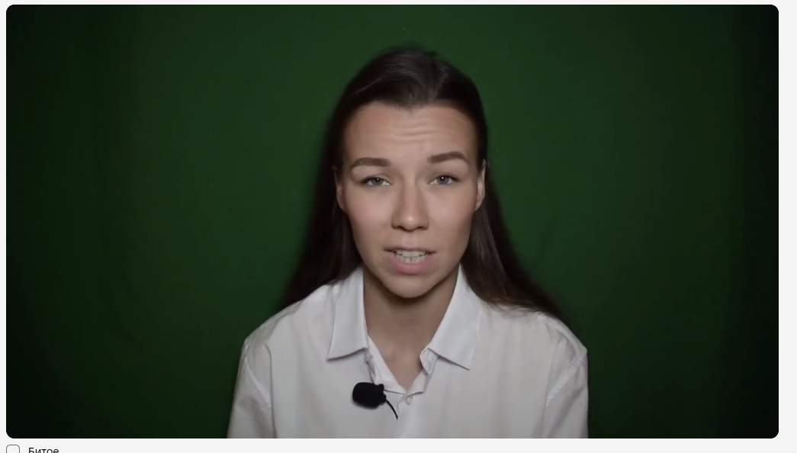

# Банк примеров по критериям

Справочная библиотека видео-примеров, сгруппированная по конкретным критериям/полям
классификатора. В отличие от [02-segments.md](02-segments.md) (примеры и антипримеры из
основной инструкции) и [10-qa-log.md](10-qa-log.md) (реальные проверки с ошибками), здесь —
именно калибровочные наборы: «вот так выглядит X», без разбора ошибок.

Источники: «Разметка ВК видео — Критерии примеры», «Разметка ВК видео — Примеры» (оба — в
`../_raw-sources/2-etap/`), «Разметка ВК видео — Таблица с примерами по вопросам» (документ
смешанного происхождения — в `../_raw-sources/both-stages/`, подробности см. в
[_sources-log.md](_sources-log.md)).

---

## Темп речи

- **Быстрая речь:** [пример 1](https://gigaeye-kandinsky-spark.obs.ru-moscow-1.hc.sbercloud.ru/ak/avatar/0a7976df-4bc0-4333-a65a-a414f8b00e8b/trimmed/-130015614_456239698__segment_1_6_21__seg1.mp4), [пример 2](https://gigaeye-kandinsky-spark.obs.ru-moscow-1.hc.sbercloud.ru/ak/avatar/0a74208b-b92f-4236-855b-661eb57c1ddc/trimmed/-211038887_456239053__segment_1_17_90__seg1.mp4)
- **Средний темп:** [пример](https://gigaeye-kandinsky-spark.obs.ru-moscow-1.hc.sbercloud.ru/ak/avatar/0a74208b-b92f-4236-855b-661eb57c1ddc/trimmed/-134722432_456239898__segment_1_0_45.mp4)
- **Медленный темп:** [пример 1](https://gigaeye-kandinsky-spark.obs.ru-moscow-1.hc.sbercloud.ru/ak/avatar/0a74208b-b92f-4236-855b-661eb57c1ddc/trimmed/-224301734_456239054__segment_1_64_76__seg1.mp4), [пример 2](https://gigaeye-kandinsky-spark.obs.ru-moscow-1.hc.sbercloud.ru/ak/youtube/avatar/15_05_2026/URfoFWogoWc/URfoFWogoWc.mp4)

## Тряска камеры vs плавное движение

**Тряска (недопустимо):**
- https://gigaeye-kandinsky-spark.obs.ru-moscow-1.hc.sbercloud.ru/ak/avatar/0a7976df-4bc0-4333-a65a-a414f8b00e8b/trimmed/467342400_456239097__segment_1_21_68__seg1.mp4
- https://gigaeye-kandinsky-spark.obs.ru-moscow-1.hc.sbercloud.ru/ak/avatar/0a74208b-b92f-4236-855b-661eb57c1ddc/trimmed/-165317374_456239032__segment_6_174_213__seg5.mp4

**Плавное движение (допустимо):**
- https://gigaeye-kandinsky-spark.obs.ru-moscow-1.hc.sbercloud.ru/ak/avatar/0a74208b-b92f-4236-855b-661eb57c1ddc/trimmed/-146098457_456247757__segment_2_43_72__seg2.mp4
- https://gigaeye-kandinsky-spark.obs.ru-moscow-1.hc.sbercloud.ru/ak/avatar/09ac75d7-9bcf-4333-83e3-c984c0f4fedd/trimmed/-42289208_456239270__segment_5_96_110__seg5.mp4

Больше примеров (16 шт., колонка «Движение камеры», в т.ч. с рабочими метками `natural_static` /
`shaky`) — см. [ниже](#вопрос-12-движение-камеры-16-примеров).

## Эмоции

⚠️ У 2 этапа только 3 значения поля «Эмоции» — «Положительные», «Нейтральные/спокойные» и
«Серьёзные/сосредоточенные/негативные»; отдельного значения «Другое»/«other» нет. 3 примера из
источника с пометкой «другое» (ирония, сарказм, выразительное чтение с долей мечтательности)
перенесены в мануал 3 этапа — это термин и категория именно оттуда (вопрос 3 «Эмоциональная
окраска голоса», значение `other`), см.
[07-example-library.md](../manual-3-etap/07-example-library.md#эмоция-other--примеры).

- **Положительные (радость, счастье):**
  [пример 1](https://gigaeye-kandinsky-spark.obs.ru-moscow-1.hc.sbercloud.ru/ak/avatar/1f4a641f-d256-41d3-b00a-8b246d8fec99/trimmed/-58787336_456239767__segment_3_79_90__seg3.mp4),
  [пример 2](https://gigaeye-kandinsky-spark.obs.ru-moscow-1.hc.sbercloud.ru/ak/avatar/1f58db0b-da16-4b3c-80fe-1d647ee5c666/trimmed/-69205063_456239229__segment_1_0_16__seg1.mp4),
  [пример 3](https://gigaeye-kandinsky-spark.obs.ru-moscow-1.hc.sbercloud.ru/ak/avatar/1f58db0b-da16-4b3c-80fe-1d647ee5c666/trimmed/-157173570_456239093__segment_1_67_79__seg3.mp4)
- **Нейтральные/спокойные:**
  [пример 1](https://gigaeye-kandinsky-spark.obs.ru-moscow-1.hc.sbercloud.ru/ak/avatar/1f58db0b-da16-4b3c-80fe-1d647ee5c666/trimmed/-119060192_456239034__segment_1_40_53__seg3.mp4),
  [пример 2](https://gigaeye-kandinsky-spark.obs.ru-moscow-1.hc.sbercloud.ru/ak/avatar/1f58db0b-da16-4b3c-80fe-1d647ee5c666/trimmed/-111933564_456239285__segment_2_47_164__seg2.mp4),
  [пример 3](https://gigaeye-kandinsky-spark.obs.ru-moscow-1.hc.sbercloud.ru/ak/avatar/1f58db0b-da16-4b3c-80fe-1d647ee5c666/trimmed/-102559235_456239254__segment_1_6_17.mp4)

Ещё 6 примеров по эмоциям — [ниже](#вопрос-3-эмоции-6-примеров).

## Вид съёмки: любительская vs профессиональная

**Любительская съёмка:**
- https://gigaeye-kandinsky-spark.obs.ru-moscow-1.hc.sbercloud.ru/ak/avatar/1f58db0b-da16-4b3c-80fe-1d647ee5c666/trimmed/-123083697_456292576__segment_1_21_95.mp4
- https://gigaeye-kandinsky-spark.obs.ru-moscow-1.hc.sbercloud.ru/ak/avatar/1f58db0b-da16-4b3c-80fe-1d647ee5c666/trimmed/-154481535_456240035__segment_1_0_22.mp4
- https://gigaeye-kandinsky-spark.obs.ru-moscow-1.hc.sbercloud.ru/ak/avatar/1f4a641f-d256-41d3-b00a-8b246d8fec99/trimmed/-211101049_456239344__segment_1_16_37__seg1.mp4

**Профессиональное студийное интервью:**
- https://gigaeye-kandinsky-spark.obs.ru-moscow-1.hc.sbercloud.ru/ak/avatar/1f58db0b-da16-4b3c-80fe-1d647ee5c666/trimmed/-17512901_171225185__segment_4_178_198__seg4.mp4
- https://gigaeye-kandinsky-spark.obs.ru-moscow-1.hc.sbercloud.ru/ak/avatar/1f58db0b-da16-4b3c-80fe-1d647ee5c666/trimmed/-16485199_456239054__segment_1_12_31__seg1.mp4
- https://gigaeye-kandinsky-spark.obs.ru-moscow-1.hc.sbercloud.ru/ak/avatar/1f4a641f-d256-41d3-b00a-8b246d8fec99/trimmed/-187830095_456244616__segment_5_94_106__seg5.mp4

Ещё 34 примера (полный набор «любительская / проф. студийное / интервью на улице / лекция» —
в рабочей терминологии встречаются метки `professional_studio`, `professional_interview`) —
[ниже](#вопрос-17-вид-съёмки-34-примеров).

## Пример однотонного фона с виньеткой ⚠️ устаревшая иллюстрация

⚠️ **Устарело (07.08.2026):** этот пример иллюстрировал старое правило «виньетка — просто
однотонный фон, не брак». Заказчик прямо подтвердил, что виньетка — наложенный эффект и брак,
если нет сегмента без неё (см. [04-classifier.md](04-classifier.md#фон)).
Картинка ниже больше не пример допустимого фона — оставлена только для истории вопроса.

Фон однотонный (студийный тёмно-зелёный), но по краям кадра заметно темнее — раньше такой фон
засчитывался как **однотонный**, сейчас это виньетка (брак, если во всём видео такой сегмент
единственный).

`[FAQ «Примеры», дополнено 13.03]`

---

## Полная таблица примеров по вопросам

Ниже — все ссылки из файла «Разметка ВК видео — Таблица с примерами по вопросам», сгруппированные
по колонкам (вопросам/критериям). Подписи есть не у всех ссылок — там, где в исходнике не было
текстового комментария, ссылка приведена как есть (по названию видеофайла). Это сырой,
несокращённый набор — используйте его, когда нужно много примеров одного типа для калибровки
глаза, а не для чтения подряд.

> ⚠️ **Важная оговорка (найдено 2026-08-06):** сам файл-источник организован по нумерации и
> терминологии классификатора **3 этапа** («13-й вопрос. Активность движения», `natural_static`,
> `professional_studio` и т.п. — см. [мануал 3 этапа](../manual-3-etap/01-classifier.md)), хотя
> подавляющее большинство ссылок ниже — это обычные 2-этапные сегменты (`avatar/{id}/trimmed/...`).
> Судя по всему, это внутренний калибровочный документ времён объединения требований 2 и 3 этапа
> (см. [00-overview.md](00-overview.md#история-проекта-этапы-во-времени)), а не официальный
> список полей 2 этапа — например, раздел «Вид съёмки» с 10 категориями **не является**
> подтверждённым полем 2 этапа (у 2 этапа есть только простое бинарное поле «Группа данных»,
> см. [04-classifier.md](04-classifier.md)). Несколько отдельных ссылок ниже прямо ведут в пул
> `avatar/stage3_results/...` — это буквально результат 3-этапного пайплайна, а не 2-этапного;
> такие ссылки помечены ниже пометкой **[3 этап]**. Используйте раздел с осторожностью: годится
> для калибровки глаза по универсальным критериям (пиксельность, битое, артефакт, тряска), но не
> как источник официальных названий полей 2 этапа.

### Большая пиксельность (23 примеров)

1. [-152481741_456239163.mp4](https://gigaeye-kandinsky-spark.obs.ru-moscow-1.hc.sbercloud.ru/ak/vk/05_02_2026/-152481741_456239163/-152481741_456239163.mp4)
2. [-225545944_456250992.mp4](https://gigaeye-kandinsky-spark.obs.ru-moscow-1.hc.sbercloud.ru/ak/vk/05_02_2026/-225545944_456250992/-225545944_456250992.mp4)
3. [-161318754_456239336.mp4](https://gigaeye-kandinsky-spark.obs.ru-moscow-1.hc.sbercloud.ru/ak/vk/05_02_2026/-161318754_456239336/-161318754_456239336.mp4)
4. [-128289621_456239218.mp4](https://gigaeye-kandinsky-spark.obs.ru-moscow-1.hc.sbercloud.ru/ak/vk/03_02_2026/-128289621_456239218/-128289621_456239218.mp4)
5. [-87184916_456240872.mp4](https://gigaeye-kandinsky-spark.obs.ru-moscow-1.hc.sbercloud.ru/ak/vk/05_02_2026/-87184916_456240872/-87184916_456240872.mp4)
6. [-49388814_456326875.mp4](https://gigaeye-kandinsky-spark.obs.ru-moscow-1.hc.sbercloud.ru/ak/vk/05_02_2026/-49388814_456326875/-49388814_456326875.mp4)
7. [-172346206_456239396.mp4](https://gigaeye-kandinsky-spark.obs.ru-moscow-1.hc.sbercloud.ru/ak/vk/05_02_2026/-172346206_456239396/-172346206_456239396.mp4)
8. [-152323139_456239077.mp4](https://gigaeye-kandinsky-spark.obs.ru-moscow-1.hc.sbercloud.ru/ak/vk/05_02_2026/-152323139_456239077/-152323139_456239077.mp4)
9. [-142310576_456244454.mp4](https://gigaeye-kandinsky-spark.obs.ru-moscow-1.hc.sbercloud.ru/ak/vk/05_02_2026/-142310576_456244454/-142310576_456244454.mp4)
10. [-91953608_456242595.mp4](https://gigaeye-kandinsky-spark.obs.ru-moscow-1.hc.sbercloud.ru/ak/vk/05_02_2026/-91953608_456242595/-91953608_456242595.mp4)
11. [-226962350_456239026.mp4](https://gigaeye-kandinsky-spark.obs.ru-moscow-1.hc.sbercloud.ru/ak/vk/03_02_2026/-226962350_456239026/-226962350_456239026.mp4)
12. [-43001606_456243618.mp4](https://gigaeye-kandinsky-spark.obs.ru-moscow-1.hc.sbercloud.ru/ak/vk/03_02_2026/-43001606_456243618/-43001606_456243618.mp4)
13. [-69132211_456240444.mp4](https://gigaeye-kandinsky-spark.obs.ru-moscow-1.hc.sbercloud.ru/ak/vk/05_02_2026/-69132211_456240444/-69132211_456240444.mp4)
14. [-42912984_456239091.mp4](https://gigaeye-kandinsky-spark.obs.ru-moscow-1.hc.sbercloud.ru/ak/vk/03_02_2026/-42912984_456239091/-42912984_456239091.mp4)
15. [-48853894_456247605.mp4](https://gigaeye-kandinsky-spark.obs.ru-moscow-1.hc.sbercloud.ru/ak/vk/03_02_2026/-48853894_456247605/-48853894_456247605.mp4)
16. [-192447970_456239143.mp4](https://gigaeye-kandinsky-spark.obs.ru-moscow-1.hc.sbercloud.ru/ak/vk/03_02_2026/-192447970_456239143/-192447970_456239143.mp4)
17. [-32038_456239819.mp4](https://gigaeye-kandinsky-spark.obs.ru-moscow-1.hc.sbercloud.ru/ak/vk/03_02_2026/-32038_456239819/-32038_456239819.mp4)
18. [-228976411_456239047.mp4](https://gigaeye-kandinsky-spark.obs.ru-moscow-1.hc.sbercloud.ru/ak/vk/05_02_2026/-228976411_456239047/-228976411_456239047.mp4)
19. [29158833_456239027.mp4](https://gigaeye-kandinsky-spark.obs.ru-moscow-1.hc.sbercloud.ru/ak/vk/05_02_2026/29158833_456239027/29158833_456239027.mp4)
20. [-213771149_456239227.mp4](https://gigaeye-kandinsky-spark.obs.ru-moscow-1.hc.sbercloud.ru/ak/vk/03_02_2026/-213771149_456239227/-213771149_456239227.mp4)
21. [-195864574_456239524.mp4](https://gigaeye-kandinsky-spark.obs.ru-moscow-1.hc.sbercloud.ru/ak/vk/05_02_2026/-195864574_456239524/-195864574_456239524.mp4)
22. [-68881927_456267630.mp4](https://gigaeye-kandinsky-spark.obs.ru-moscow-1.hc.sbercloud.ru/ak/vk/03_02_2026/-68881927_456267630/-68881927_456267630.mp4)
23. [262707630_456244830.mp4](https://gigaeye-kandinsky-spark.obs.ru-moscow-1.hc.sbercloud.ru/ak/vk/05_02_2026/262707630_456244830/262707630_456244830.mp4)

### Малая пиксельность (9 примеров)

1. [-5062417_456239277.mp4](https://gigaeye-kandinsky-spark.obs.ru-moscow-1.hc.sbercloud.ru/ak/vk/03_02_2026/-5062417_456239277/-5062417_456239277.mp4)
2. [-164137071_456239206.mp4](https://gigaeye-kandinsky-spark.obs.ru-moscow-1.hc.sbercloud.ru/ak/vk/05_02_2026/-164137071_456239206/-164137071_456239206.mp4)
3. [-98769807_456239146.mp4](https://gigaeye-kandinsky-spark.obs.ru-moscow-1.hc.sbercloud.ru/ak/vk/05_02_2026/-98769807_456239146/-98769807_456239146.mp4)
4. [-142310576_456244199.mp4](https://gigaeye-kandinsky-spark.obs.ru-moscow-1.hc.sbercloud.ru/ak/vk/05_02_2026/-142310576_456244199/-142310576_456244199.mp4)
5. [-175034282_456239026.mp4](https://gigaeye-kandinsky-spark.obs.ru-moscow-1.hc.sbercloud.ru/ak/vk/03_02_2026/-175034282_456239026/-175034282_456239026.mp4)
6. [-213074806_456239605.mp4](https://gigaeye-kandinsky-spark.obs.ru-moscow-1.hc.sbercloud.ru/ak/vk/05_02_2026/-213074806_456239605/-213074806_456239605.mp4)
7. [-158244837_456239471.mp4](https://gigaeye-kandinsky-spark.obs.ru-moscow-1.hc.sbercloud.ru/ak/vk/05_02_2026/-158244837_456239471/-158244837_456239471.mp4)
8. [47492276_456240515.mp4](https://gigaeye-kandinsky-spark.obs.ru-moscow-1.hc.sbercloud.ru/ak/vk/05_02_2026/47492276_456240515/47492276_456240515.mp4)
9. [499967389_456239308.mp4](https://gigaeye-kandinsky-spark.obs.ru-moscow-1.hc.sbercloud.ru/ak/vk/03_02_2026/499967389_456239308/499967389_456239308.mp4)

### Нет пиксельности (для сравнения) (12 примеров)

1. [-191171932_456239050.mp4](https://gigaeye-kandinsky-spark.obs.ru-moscow-1.hc.sbercloud.ru/ak/vk/03_02_2026/-191171932_456239050/-191171932_456239050.mp4)
2. [-211623471_456239688.mp4](https://gigaeye-kandinsky-spark.obs.ru-moscow-1.hc.sbercloud.ru/ak/vk/05_02_2026/-211623471_456239688/-211623471_456239688.mp4)
3. [-158416167_456239208.mp4](https://gigaeye-kandinsky-spark.obs.ru-moscow-1.hc.sbercloud.ru/ak/vk/11_02_2026/-158416167_456239208/-158416167_456239208.mp4)
4. [-225740964_456239040.mp4](https://gigaeye-kandinsky-spark.obs.ru-moscow-1.hc.sbercloud.ru/ak/vk/10_02_2026/-225740964_456239040/-225740964_456239040.mp4)
5. [-52000967_456244545.mp4](https://gigaeye-kandinsky-spark.obs.ru-moscow-1.hc.sbercloud.ru/ak/vk/10_02_2026/-52000967_456244545/-52000967_456244545.mp4)
6. [-52000967_456244534.mp4](https://gigaeye-kandinsky-spark.obs.ru-moscow-1.hc.sbercloud.ru/ak/vk/10_02_2026/-52000967_456244534/-52000967_456244534.mp4)
7. [-171518287_456239733.mp4](https://gigaeye-kandinsky-spark.obs.ru-moscow-1.hc.sbercloud.ru/ak/vk/11_02_2026/-171518287_456239733/-171518287_456239733.mp4)
8. [-733335_456241328.mp4](https://gigaeye-kandinsky-spark.obs.ru-moscow-1.hc.sbercloud.ru/ak/vk/16_02_2026/-733335_456241328/-733335_456241328.mp4)
9. [-217972195_456239177.mp4](https://gigaeye-kandinsky-spark.obs.ru-moscow-1.hc.sbercloud.ru/ak/vk/10_02_2026/-217972195_456239177/-217972195_456239177.mp4)
10. [-210980095_456239022.mp4](https://gigaeye-kandinsky-spark.obs.ru-moscow-1.hc.sbercloud.ru/ak/vk/11_02_2026/-210980095_456239022/-210980095_456239022.mp4)
11. [-101418717_456239409__segment_1_24_35__seg1.mp4](https://gigaeye-kandinsky-spark.obs.ru-moscow-1.hc.sbercloud.ru/ak/avatar/5791ff38-bf32-4249-ac9b-187c83e9df53/trimmed/-101418717_456239409__segment_1_24_35__seg1.mp4)
12. [182002586_456241831__segment_1_7_71__seg1.mp4](https://gigaeye-kandinsky-spark.obs.ru-moscow-1.hc.sbercloud.ru/ak/avatar/stage3_results/2b_lakhtionov_pool_027/182002586_456241831__segment_1_7_71__seg1.mp4) **[3 этап]**

### Битое — список сломанных видео (19 примеров)

1. [-77910190_456239450__segment_3_213_225__seg3.mp4](https://gigaeye-kandinsky-spark.obs.ru-moscow-1.hc.sbercloud.ru/ak/avatar/cdb3fdaa-fb74-4774-8172-1bd613249d22/trimmed/-77910190_456239450__segment_3_213_225__seg3.mp4)
2. [-221454595_456242647__segment_3_419_496__seg3.mp4](https://gigaeye-kandinsky-spark.obs.ru-moscow-1.hc.sbercloud.ru/ak/avatar/cdb3fdaa-fb74-4774-8172-1bd613249d22/trimmed/-221454595_456242647__segment_3_419_496__seg3.mp4)
3. [-77910190_456239450__segment_2_49_73__seg2.mp4](https://gigaeye-kandinsky-spark.obs.ru-moscow-1.hc.sbercloud.ru/ak/avatar/cdb3fdaa-fb74-4774-8172-1bd613249d22/trimmed/-77910190_456239450__segment_2_49_73__seg2.mp4)
4. [-152328477_456239028__segment_3_257_296__seg3.mp4](https://gigaeye-kandinsky-spark.obs.ru-moscow-1.hc.sbercloud.ru/ak/avatar/ca3e1d1d-03c4-49bc-8d72-4f7f68085396/trimmed/-152328477_456239028__segment_3_257_296__seg3.mp4)
5. [-152328477_456239028__segment_4_339_351__seg4.mp4](https://gigaeye-kandinsky-spark.obs.ru-moscow-1.hc.sbercloud.ru/ak/avatar/ca3e1d1d-03c4-49bc-8d72-4f7f68085396/trimmed/-152328477_456239028__segment_4_339_351__seg4.mp4)
6. [-733335_456242146__segment_3_127_186__seg3.mp4](https://gigaeye-kandinsky-spark.obs.ru-moscow-1.hc.sbercloud.ru/ak/avatar/91907733-2222-4054-b4d3-f2fc62571807/trimmed/-733335_456242146__segment_3_127_186__seg3.mp4)
7. [-733335_456242146__segment_4_194_258__seg4.mp4](https://gigaeye-kandinsky-spark.obs.ru-moscow-1.hc.sbercloud.ru/ak/avatar/91907733-2222-4054-b4d3-f2fc62571807/trimmed/-733335_456242146__segment_4_194_258__seg4.mp4)
8. [-118158003_456239945__segment_4_235_259__seg4.mp4](https://gigaeye-kandinsky-spark.obs.ru-moscow-1.hc.sbercloud.ru/ak/avatar/d5b9d745-7a95-4eec-a942-2ca541ff95aa/trimmed/-118158003_456239945__segment_4_235_259__seg4.mp4)
9. [-118158003_456239945__segment_2_155_168__seg2.mp4](https://gigaeye-kandinsky-spark.obs.ru-moscow-1.hc.sbercloud.ru/ak/avatar/d5b9d745-7a95-4eec-a942-2ca541ff95aa/trimmed/-118158003_456239945__segment_2_155_168__seg2.mp4)
10. [-169348212_456243613__segment_2_62_75__seg2.mp4](https://gigaeye-kandinsky-spark.obs.ru-moscow-1.hc.sbercloud.ru/ak/avatar/d5b9d745-7a95-4eec-a942-2ca541ff95aa/trimmed/-169348212_456243613__segment_2_62_75__seg2.mp4)
11. [-118158003_456239945__segment_5_292_310__seg5.mp4](https://gigaeye-kandinsky-spark.obs.ru-moscow-1.hc.sbercloud.ru/ak/avatar/d5b9d745-7a95-4eec-a942-2ca541ff95aa/trimmed/-118158003_456239945__segment_5_292_310__seg5.mp4)
12. [-169348212_456243613__segment_2_62_75__seg2.mp4](https://gigaeye-kandinsky-spark.obs.ru-moscow-1.hc.sbercloud.ru/ak/avatar/d5b9d745-7a95-4eec-a942-2ca541ff95aa/trimmed/-169348212_456243613__segment_2_62_75__seg2.mp4)
13. [-221367933_456239088__segment_2_270_315__seg2.mp4](https://gigaeye-kandinsky-spark.obs.ru-moscow-1.hc.sbercloud.ru/ak/avatar/d5b9d745-7a95-4eec-a942-2ca541ff95aa/trimmed/-221367933_456239088__segment_2_270_315__seg2.mp4)
14. [-221995226_456239050__segment_1_0_17__seg1.mp4](https://gigaeye-kandinsky-spark.obs.ru-moscow-1.hc.sbercloud.ru/ak/avatar/d5b9d745-7a95-4eec-a942-2ca541ff95aa/trimmed/-221995226_456239050__segment_1_0_17__seg1.mp4)
15. [-221995226_456239050__segment_2_244_269__seg2.mp4](https://gigaeye-kandinsky-spark.obs.ru-moscow-1.hc.sbercloud.ru/ak/avatar/d5b9d745-7a95-4eec-a942-2ca541ff95aa/trimmed/-221995226_456239050__segment_2_244_269__seg2.mp4)
16. [-223821396_456239094__segment_2_201_218__seg2.mp4](https://gigaeye-kandinsky-spark.obs.ru-moscow-1.hc.sbercloud.ru/ak/avatar/d5b9d745-7a95-4eec-a942-2ca541ff95aa/trimmed/-223821396_456239094__segment_2_201_218__seg2.mp4)
17. [-118158003_456239945__segment_2_155_168__seg2.mp4](https://gigaeye-kandinsky-spark.obs.ru-moscow-1.hc.sbercloud.ru/ak/avatar/d5b9d745-7a95-4eec-a942-2ca541ff95aa/trimmed/-118158003_456239945__segment_2_155_168__seg2.mp4)
18. [-171736200_456239304__segment_7_1149_1330__seg6.mp4](https://gigaeye-kandinsky-spark.obs.ru-moscow-1.hc.sbercloud.ru/ak/avatar/df0f56e0-a8e7-40bd-bc1e-99a17c0615e2/trimmed/-171736200_456239304__segment_7_1149_1330__seg6.mp4)
19. [-171736200_456239304__segment_6_901_1132__seg5.mp4](https://gigaeye-kandinsky-spark.obs.ru-moscow-1.hc.sbercloud.ru/ak/avatar/df0f56e0-a8e7-40bd-bc1e-99a17c0615e2/trimmed/-171736200_456239304__segment_6_901_1132__seg5.mp4)

### Идеальное видео (2 примеров)

1. [-211372791_456239023__segment_1_11_64.mp4](https://gigaeye-kandinsky-spark.obs.ru-moscow-1.hc.sbercloud.ru/ak/avatar/34369717-c2c7-4230-a8e7-c3a679803c7d/trimmed/-211372791_456239023__segment_1_11_64.mp4)
2. [-47199721_456239139__segment_2_38_57__seg2.mp4](https://gigaeye-kandinsky-spark.obs.ru-moscow-1.hc.sbercloud.ru/ak/avatar/c1ef0d33-fa8c-4eaf-b1a8-380a10cfb771/trimmed/-47199721_456239139__segment_2_38_57__seg2.mp4)

### Битое (доп. примеры) (24 примеров)

⚠️ В отличие от остальных списков на этой странице, здесь у каждого видео есть комментарий —
поэтому оформлено сеткой карточек, а не простым нумерованным списком.

- [плохое качество с пиксельностью](https://gigaeye-kandinsky-spark.obs.ru-moscow-1.hc.sbercloud.ru/ak/vk/05_02_2026/-211623471_456239688/-211623471_456239688.mp4)
- [низкое качество, полоса в районе рта](https://gigaeye-kandinsky-spark.obs.ru-moscow-1.hc.sbercloud.ru/ak/avatar/0a74208b-b92f-4236-855b-661eb57c1ddc/trimmed/-134722432_456240050__segment_1_0_48.mp4)
- [пиксельность](https://gigaeye-kandinsky-spark.obs.ru-moscow-1.hc.sbercloud.ru/ak/avatar/21b1377b-b3d0-496b-a4a9-6e5c85ec6cfd/trimmed/-74776957_456241310__segment_1_225_348.mp4)
- [склейка с отсутствием человека](https://gigaeye-kandinsky-spark.obs.ru-moscow-1.hc.sbercloud.ru/ak/avatar/536eced6-c1ab-4ac2-8c6d-fd202ea20fa5/trimmed/-4565_456239459__segment_1_14_85__seg1.mp4)
- [в начале чёрный фон с отсутствием человека + размазано лицо](https://gigaeye-kandinsky-spark.obs.ru-moscow-1.hc.sbercloud.ru/ak/avatar/1c35b7ef-b71d-48fc-94a7-b11274ce1cad/trimmed/219338794_456239316__segment_1_0_11.mp4)
- [размазано лицо, почти не видно глаз](https://gigaeye-kandinsky-spark.obs.ru-moscow-1.hc.sbercloud.ru/ak/avatar/1c35b7ef-b71d-48fc-94a7-b11274ce1cad/trimmed/-85053588_456239019__segment_2_79_90__seg2.mp4)
- [размазаны глаза, большие пиксели](https://gigaeye-kandinsky-spark.obs.ru-moscow-1.hc.sbercloud.ru/ak/avatar/1c35b7ef-b71d-48fc-94a7-b11274ce1cad/trimmed/113690075_456239171__segment_1_0_129.mp4)
- [в конце смена кадра на кадр без человека](https://gigaeye-kandinsky-spark.obs.ru-moscow-1.hc.sbercloud.ru/ak/avatar/384a8f39-036c-423b-b136-6ef8128c9b96/trimmed/-145781292_456239534__segment_3_99_125__seg3.mp4)
- [в начале склейка с наложением](https://gigaeye-kandinsky-spark.obs.ru-moscow-1.hc.sbercloud.ru/ak/avatar/37dde8dc-cb05-4319-8707-c11034e47e7c/trimmed/118528151_171446962__segment_2_112_132__seg2.mp4)
- [дубляж](https://gigaeye-kandinsky-spark.obs.ru-moscow-1.hc.sbercloud.ru/ak/avatar/3ac0d9c6-6b88-4a08-92bc-9be5e9cd1879/trimmed/-50750285_456239157__segment_1_11_48.mp4)
- [пиксели, размытость при движении](https://gigaeye-kandinsky-spark.obs.ru-moscow-1.hc.sbercloud.ru/ak/avatar/3ac0d9c6-6b88-4a08-92bc-9be5e9cd1879/trimmed/-167333217_456240122__segment_1_35_46.mp4)
- [громкий звук перекрывает речь говорящего + низкое качество](https://gigaeye-kandinsky-spark.obs.ru-moscow-1.hc.sbercloud.ru/ak/avatar/7561daa6-313c-43c8-beca-1ca316707f1c/trimmed/-153808162_456239018__segment_1_1_13.mp4)
- [«гуляющие» полосы](https://gigaeye-kandinsky-spark.obs.ru-moscow-1.hc.sbercloud.ru/ak/avatar/7bda4c3a-d21e-4320-98d3-d634e8413d54/trimmed/-209756877_456239027__segment_1_1_61.mp4)
- [пережатие: на скорости 0.5 в области головы видна «сыпучая» картинка (типично для сжатых «качественных» кадров)](https://gigaeye-kandinsky-spark.obs.ru-moscow-1.hc.sbercloud.ru/ak/avatar/2d96202b-2347-4e9a-813c-d7ce2e6ccd70/trimmed/-920580_456239632__segment_1_0_15__seg1.mp4)
- [отсутствие фокуса, пиксельность на лице и руках](https://gigaeye-kandinsky-spark.obs.ru-moscow-1.hc.sbercloud.ru/ak/avatar/1f58db0b-da16-4b3c-80fe-1d647ee5c666/trimmed/-166037395_456243003__segment_3_75_96__seg3.mp4)
- [перебивающий голос, низкое качество](https://gigaeye-kandinsky-spark.obs.ru-moscow-1.hc.sbercloud.ru/ak/avatar/20f7cee8-f47a-4104-8faa-cef6198042d9/trimmed/-31735024_456239258__segment_4_116_131__seg4.mp4)
- [наложение полупрозрачного кадра](https://gigaeye-kandinsky-spark.obs.ru-moscow-1.hc.sbercloud.ru/ak/avatar/536eced6-c1ab-4ac2-8c6d-fd202ea20fa5/trimmed/-160788341_456239461__segment_6_203_214__seg6.mp4)
- [пережатие](https://gigaeye-kandinsky-spark.obs.ru-moscow-1.hc.sbercloud.ru/ak/avatar/98b07575-daf2-4c46-afd7-4f2b98b7f3a8/trimmed/-229379287_456239017__segment_1_0_54.mp4)
- [кашель перебивает говорящего](https://gigaeye-kandinsky-spark.obs.ru-moscow-1.hc.sbercloud.ru/ak/avatar/9851e9b8-2ed0-4804-8e1c-ebfabbf72b0f/trimmed/-9571212_456239370__segment_5_136_165__seg4.mp4)
- [пережатие (3 этап)](https://gigaeye-kandinsky-spark.obs.ru-moscow-1.hc.sbercloud.ru/ak/avatar/stage3_results/2b_lakhtionov_pool_017/-30975723_456239030__segment_1_0_48.mp4)
- [мало fps (кадров в секунду), заметен «разрыв»](https://gigaeye-kandinsky-spark.obs.ru-moscow-1.hc.sbercloud.ru/ak/avatar/98b07575-daf2-4c46-afd7-4f2b98b7f3a8/trimmed/-167333217_456239628__segment_1_22_52__seg1.mp4)
- [наложение двух изображений — в конце видео, человек всё же виден (3 этап)](https://gigaeye-kandinsky-spark.obs.ru-moscow-1.hc.sbercloud.ru/ak/avatar/stage3_results/2b_lakhtionov_pool_019/-25605330_456240316__segment_1_48_61.mp4)
- [закруглённые рамки по углам видео — виньетка (3 этап)](https://gigaeye-kandinsky-spark.obs.ru-moscow-1.hc.sbercloud.ru/ak/avatar/stage3_results/2b_lakhtionov_pool_028/-222562832_456239022__segment_1_27_106.mp4)
- [звук ветра слишком громкий](https://gigaeye-kandinsky-spark.obs.ru-moscow-1.hc.sbercloud.ru/ak/avatar/75ed1897-eb70-4f5d-8222-a129f484476b/trimmed/-213127547_456291948__segment_4_75_98__seg4.mp4)

### Артефакт (11 примеров)

⚠️ Как и в разделе «Битое (доп. примеры)» выше — здесь у каждого видео есть комментарий,
поэтому оформлено сеткой карточек.

- [сложное освещение](https://gigaeye-kandinsky-spark.obs.ru-moscow-1.hc.sbercloud.ru/ak/avatar/686bf388-838b-4fd1-98c9-6f2ad595e68b/trimmed/-163655585_456239140__segment_1_10_30.mp4)
- [мутные глаза, мелкая пиксельность, сверху засвет, но мимика видна неплохо](https://gigaeye-kandinsky-spark.obs.ru-moscow-1.hc.sbercloud.ru/ak/avatar/0a74208b-b92f-4236-855b-661eb57c1ddc/trimmed/-230254611_456239026__segment_2_132_211__seg2.mp4)
- [мелкая пиксельность, небольшая дымка на видео](https://gigaeye-kandinsky-spark.obs.ru-moscow-1.hc.sbercloud.ru/ak/avatar/0a74208b-b92f-4236-855b-661eb57c1ddc/trimmed/-185402127_456239027__segment_1_0_81.mp4)
- [мерцание пиксельное](https://gigaeye-kandinsky-spark.obs.ru-moscow-1.hc.sbercloud.ru/ak/avatar/0a74208b-b92f-4236-855b-661eb57c1ddc/trimmed/-198074903_456239039__segment_1_0_75.mp4)
- [лёгкая размытость, мини-пиксели](https://gigaeye-kandinsky-spark.obs.ru-moscow-1.hc.sbercloud.ru/ak/avatar/37dde8dc-cb05-4319-8707-c11034e47e7c/trimmed/-68719297_456239633__segment_2_50_62__seg2.mp4)
- [артефакт](https://gigaeye-kandinsky-spark.obs.ru-moscow-1.hc.sbercloud.ru/ak/avatar/09ac75d7-9bcf-4333-83e3-c984c0f4fedd/trimmed/-166639003_456239199__segment_1_6_126.mp4)
- [пиксели (3 этап)](https://gigaeye-kandinsky-spark.obs.ru-moscow-1.hc.sbercloud.ru/ak/avatar/stage3_results/2b_lakhtionov_pool_027/4128747_456239872__segment_1_9_45.mp4)
- [мерцание](https://gigaeye-kandinsky-spark.obs.ru-moscow-1.hc.sbercloud.ru/ak/avatar/be42f18f-8152-425d-9ada-0cdf65668287/trimmed/-64931420_456239841__segment_1_24_49.mp4)
- [мерцание — ссылка на реддит, может не открываться](https://packaged-media.redd.it/qay09xe4glpf1/pb/m2-res_480p.mp4?m=DASHPlaylist.mpd&var=sgpssan&v=1&e=1774458000&s=895b34da0ec9d82e496b8753aad684fbc9c0f40f)
- [мерцание — ссылка на реддит, может не открываться](https://packaged-media.redd.it/t0qekqt24wqf1/pb/m2-res_1920p.mp4?m=DASHPlaylist.mpd&var=sgpssan&v=1&e=1774458000&s=47a9b5ae8d7de108117063873088b80531002275)
- [мерцание (3 этап)](https://gigaeye-kandinsky-spark.obs.ru-moscow-1.hc.sbercloud.ru/ak/avatar/stage3_results/2b_lakhtionov_pool_029/-203940747_456239916__segment_2_36_82__seg2.mp4)

### Вопрос 3: Эмоции (6 примеров)

⚠️ Как и в разделах «Битое (доп. примеры)» и «Артефакт» выше — здесь у каждого видео есть комментарий,
поэтому оформлено сеткой карточек. Изначально в источнике было 9 строк — 3 с пометкой «другое»
перенесены в [мануал 3 этапа](../manual-3-etap/07-example-library.md#эмоция-other--примеры): это
термин и категория именно оттуда (вопрос 3 «Эмоциональная окраска голоса», значение `other`), а у
2 этапа отдельного значения «Другое»/«other» нет.

- [Счастье](https://gigaeye-kandinsky-spark.obs.ru-moscow-1.hc.sbercloud.ru/ak/avatar/1f4a641f-d256-41d3-b00a-8b246d8fec99/trimmed/-58787336_456239767__segment_3_79_90__seg3.mp4)
- [Счастье](https://gigaeye-kandinsky-spark.obs.ru-moscow-1.hc.sbercloud.ru/ak/avatar/1f58db0b-da16-4b3c-80fe-1d647ee5c666/trimmed/-69205063_456239229__segment_1_0_16__seg1.mp4)
- [Счастье](https://gigaeye-kandinsky-spark.obs.ru-moscow-1.hc.sbercloud.ru/ak/avatar/1f58db0b-da16-4b3c-80fe-1d647ee5c666/trimmed/-157173570_456239093__segment_1_67_79__seg3.mp4)
- [Нейтральное](https://gigaeye-kandinsky-spark.obs.ru-moscow-1.hc.sbercloud.ru/ak/avatar/1f58db0b-da16-4b3c-80fe-1d647ee5c666/trimmed/-119060192_456239034__segment_1_40_53__seg3.mp4)
- [Нейтральное](https://gigaeye-kandinsky-spark.obs.ru-moscow-1.hc.sbercloud.ru/ak/avatar/1f58db0b-da16-4b3c-80fe-1d647ee5c666/trimmed/-111933564_456239285__segment_2_47_164__seg2.mp4)
- [Нейтральное](https://gigaeye-kandinsky-spark.obs.ru-moscow-1.hc.sbercloud.ru/ak/avatar/1f58db0b-da16-4b3c-80fe-1d647ee5c666/trimmed/-102559235_456239254__segment_1_6_17.mp4)

### Вопрос 17: Вид съёмки (34 примеров)

⚠️ Как и в разделах «Битое (доп. примеры)», «Артефакт», «Эмоции» выше — здесь у каждого видео есть
комментарий, поэтому оформлено сеткой карточек.

- [любительская](https://gigaeye-kandinsky-spark.obs.ru-moscow-1.hc.sbercloud.ru/ak/avatar/1f58db0b-da16-4b3c-80fe-1d647ee5c666/trimmed/-123083697_456292576__segment_1_21_95.mp4)
- [любительская](https://gigaeye-kandinsky-spark.obs.ru-moscow-1.hc.sbercloud.ru/ak/avatar/1f58db0b-da16-4b3c-80fe-1d647ee5c666/trimmed/-154481535_456240035__segment_1_0_22.mp4)
- [любительская](https://gigaeye-kandinsky-spark.obs.ru-moscow-1.hc.sbercloud.ru/ak/avatar/1f4a641f-d256-41d3-b00a-8b246d8fec99/trimmed/-211101049_456239344__segment_1_16_37__seg1.mp4)
- [проф. студийное интервью](https://gigaeye-kandinsky-spark.obs.ru-moscow-1.hc.sbercloud.ru/ak/avatar/1f58db0b-da16-4b3c-80fe-1d647ee5c666/trimmed/-17512901_171225185__segment_4_178_198__seg4.mp4)
- [проф. студийное интервью](https://gigaeye-kandinsky-spark.obs.ru-moscow-1.hc.sbercloud.ru/ak/avatar/1f58db0b-da16-4b3c-80fe-1d647ee5c666/trimmed/-16485199_456239054__segment_1_12_31__seg1.mp4)
- [проф. студийное интервью](https://gigaeye-kandinsky-spark.obs.ru-moscow-1.hc.sbercloud.ru/ak/avatar/1f4a641f-d256-41d3-b00a-8b246d8fec99/trimmed/-187830095_456244616__segment_5_94_106__seg5.mp4)
- [интервью на улице](https://gigaeye-kandinsky-spark.obs.ru-moscow-1.hc.sbercloud.ru/ak/avatar/7a9214c4-90ca-4d1c-a66a-80957e1fc431/trimmed/-55110198_456239033__segment_1_11_26__seg1.mp4)
- [интервью на улице](https://gigaeye-kandinsky-spark.obs.ru-moscow-1.hc.sbercloud.ru/ak/avatar/384a8f39-036c-423b-b136-6ef8128c9b96/trimmed/-57387976_456239776__segment_2_158_173__seg2.mp4)
- [проф. студийное — хороший свет, однотон, качество](https://gigaeye-kandinsky-spark.obs.ru-moscow-1.hc.sbercloud.ru/ak/avatar/34369717-c2c7-4230-a8e7-c3a679803c7d/trimmed/-211372791_456239023__segment_1_11_64.mp4)
- [любительское — «разностороннее» освещение, съёмка не на проф. оборудование](https://gigaeye-kandinsky-spark.obs.ru-moscow-1.hc.sbercloud.ru/ak/avatar/34369717-c2c7-4230-a8e7-c3a679803c7d/trimmed/-183227017_456240601__segment_1_23_153.mp4)
- [лекция — видим, что идёт рассказ «кому-то»](https://gigaeye-kandinsky-spark.obs.ru-moscow-1.hc.sbercloud.ru/ak/avatar/03258c04-af9a-45a5-a804-bac962bae9bc/trimmed/-211587363_456239190__segment_1_2_22.mp4)
- [проф. студийное интервью (3 этап)](https://gigaeye-kandinsky-spark.obs.ru-moscow-1.hc.sbercloud.ru/ak/avatar/stage3_results/2b_lakhtionov_pool_027/-121495031_456239048__segment_2_65_78__seg2.mp4)
- [проф. съёмка](https://gigaeye-kandinsky-spark.obs.ru-moscow-1.hc.sbercloud.ru/ak/avatar/09ac75d7-9bcf-4333-83e3-c984c0f4fedd/trimmed/-181548723_456239229__segment_1_5_23__seg1.mp4)
- [`professional_studio`](https://gigaeye-kandinsky-spark.obs.ru-moscow-1.hc.sbercloud.ru/ak/avatar/09ac75d7-9bcf-4333-83e3-c984c0f4fedd/trimmed/-121580315_456239425__segment_1_6_58.mp4)
- [`professional_studio`](https://gigaeye-kandinsky-spark.obs.ru-moscow-1.hc.sbercloud.ru/ak/avatar/09ac75d7-9bcf-4333-83e3-c984c0f4fedd/trimmed/-226897609_456239195__segment_1_7_31.mp4)
- [`professional_studio`](https://gigaeye-kandinsky-spark.obs.ru-moscow-1.hc.sbercloud.ru/ak/avatar/09ac75d7-9bcf-4333-83e3-c984c0f4fedd/trimmed/-226897609_456239196__segment_1_3_40__seg1.mp4)
- [`professional_studio`](https://gigaeye-kandinsky-spark.obs.ru-moscow-1.hc.sbercloud.ru/ak/avatar/09ac75d7-9bcf-4333-83e3-c984c0f4fedd/trimmed/-231691274_456239019__segment_1_4_193.mp4)
- [`professional_studio`](https://gigaeye-kandinsky-spark.obs.ru-moscow-1.hc.sbercloud.ru/ak/avatar/09ac75d7-9bcf-4333-83e3-c984c0f4fedd/trimmed/-69784132_456239038__segment_1_4_32.mp4)
- [`professional_studio`](https://gigaeye-kandinsky-spark.obs.ru-moscow-1.hc.sbercloud.ru/ak/avatar/2f15d090-5697-494f-96ab-3d705d0a89e1/trimmed/-203506843_456240117__segment_1_11_37.mp4)
- [`professional_studio`](https://gigaeye-kandinsky-spark.obs.ru-moscow-1.hc.sbercloud.ru/ak/avatar/fb5f770b-a3be-402e-af20-a918ebbd699c/trimmed/-169244143_456240505__segment_1_14_24__seg1.mp4)
- [`professional_studio`](https://gigaeye-kandinsky-spark.obs.ru-moscow-1.hc.sbercloud.ru/ak/avatar/fc9fad82-7a13-4aec-b36d-bf2998dceaae/trimmed/-73459582_456239038__segment_1_206_225.mp4)
- [`professional_studio`](https://gigaeye-kandinsky-spark.obs.ru-moscow-1.hc.sbercloud.ru/ak/avatar/fc9fad82-7a13-4aec-b36d-bf2998dceaae/trimmed/164276992_456239234__segment_1_33_45__seg1.mp4)
- [`professional_interview`](https://gigaeye-kandinsky-spark.obs.ru-moscow-1.hc.sbercloud.ru/ak/avatar/2d96202b-2347-4e9a-813c-d7ce2e6ccd70/trimmed/-43517310_456239036__segment_1_51_62.mp4)
- [`professional_interview`](https://gigaeye-kandinsky-spark.obs.ru-moscow-1.hc.sbercloud.ru/ak/avatar/2d96202b-2347-4e9a-813c-d7ce2e6ccd70/trimmed/-920580_456240372__segment_2_77_97__seg2.mp4)
- [`professional_interview`](https://gigaeye-kandinsky-spark.obs.ru-moscow-1.hc.sbercloud.ru/ak/avatar/2f15d090-5697-494f-96ab-3d705d0a89e1/trimmed/-206760626_456240401__segment_1_14_78.mp4)
- [`professional_interview`](https://gigaeye-kandinsky-spark.obs.ru-moscow-1.hc.sbercloud.ru/ak/avatar/fb5f770b-a3be-402e-af20-a918ebbd699c/trimmed/-44012514_456239993__segment_1_10_35.mp4)
- [`professional_interview`](https://gigaeye-kandinsky-spark.obs.ru-moscow-1.hc.sbercloud.ru/ak/avatar/fb5f770b-a3be-402e-af20-a918ebbd699c/trimmed/-79147027_456240319__segment_1_0_34.mp4)
- [`professional_interview`](https://gigaeye-kandinsky-spark.obs.ru-moscow-1.hc.sbercloud.ru/ak/avatar/fc9fad82-7a13-4aec-b36d-bf2998dceaae/trimmed/-170249627_456239030__segment_1_45_66__seg1.mp4)
- [`professional_interview`](https://gigaeye-kandinsky-spark.obs.ru-moscow-1.hc.sbercloud.ru/ak/avatar/fc9fad82-7a13-4aec-b36d-bf2998dceaae/trimmed/-218650470_456239036__segment_1_67_80__seg1.mp4)
- [`professional_interview`](https://gigaeye-kandinsky-spark.obs.ru-moscow-1.hc.sbercloud.ru/ak/avatar/fc9fad82-7a13-4aec-b36d-bf2998dceaae/trimmed/-224045410_456239102__segment_2_62_81__seg2.mp4)
- [`professional_interview`](https://gigaeye-kandinsky-spark.obs.ru-moscow-1.hc.sbercloud.ru/ak/avatar/fc9fad82-7a13-4aec-b36d-bf2998dceaae/trimmed/-224045410_456239102__segment_3_114_136__seg3.mp4)
- [`professional_interview`](https://gigaeye-kandinsky-spark.obs.ru-moscow-1.hc.sbercloud.ru/ak/avatar/fc9fad82-7a13-4aec-b36d-bf2998dceaae/trimmed/-224045410_456239102__segment_5_189_230__seg5.mp4)
- [`professional_interview`](https://gigaeye-kandinsky-spark.obs.ru-moscow-1.hc.sbercloud.ru/ak/avatar/fc9fad82-7a13-4aec-b36d-bf2998dceaae/trimmed/-37990895_456242594__segment_3_121_136__seg3.mp4)
- [`professional_interview`](https://gigaeye-kandinsky-spark.obs.ru-moscow-1.hc.sbercloud.ru/ak/avatar/fce8a423-3c2f-41a7-8593-73532ba90348/trimmed/-41031541_456239086__segment_2_115_163__seg2.mp4)

### Вопрос 4: Ракурс (5 примеров)

⚠️ Как и в разделах «Битое (доп. примеры)», «Артефакт», «Эмоции», «Вид съёмки» выше — здесь у
каждого видео есть комментарий, поэтому оформлено сеткой карточек. Пятое видео — то же самое, что
уже используется как пример для поля «Активность движения» (см. ниже), но здесь показывает
преобладающий ракурс.

- [Фронтальный (большая часть видео смотрит в камеру)](https://gigaeye-kandinsky-spark.obs.ru-moscow-1.hc.sbercloud.ru/ak/avatar/37dde8dc-cb05-4319-8707-c11034e47e7c/trimmed/-65608907_456239303__segment_2_40_181__seg2.mp4)
- [Основной говорящий (мужчина) — профиль. Женщина — лёгкий поворот, т.к. видно 2-й глаз](https://gigaeye-kandinsky-spark.obs.ru-moscow-1.hc.sbercloud.ru/ak/avatar/7a9214c4-90ca-4d1c-a66a-80957e1fc431/trimmed/-95446622_456239101__segment_4_97_111__seg4.mp4)
- [лёгкий поворот](https://gigaeye-kandinsky-spark.obs.ru-moscow-1.hc.sbercloud.ru/ak/avatar/37dde8dc-cb05-4319-8707-c11034e47e7c/trimmed/-68719297_456239633__segment_2_50_62__seg2.mp4)
- [лёгкий поворот](https://gigaeye-kandinsky-spark.obs.ru-moscow-1.hc.sbercloud.ru/ak/avatar/384a8f39-036c-423b-b136-6ef8128c9b96/trimmed/-145781292_456239534__segment_3_99_125__seg3.mp4)
- [Фронтальный](https://gigaeye-kandinsky-spark.obs.ru-moscow-1.hc.sbercloud.ru/ak/avatar/3ac0d9c6-6b88-4a08-92bc-9be5e9cd1879/trimmed/-167333217_456239923__segment_1_36_62.mp4)

### Вопрос 8: Речь с наложением (3 примеров)

⚠️ Первое видео скачано вручную с Яндекс.Диска (оригинал требовал логина/капчи для просмотра:
`https://disk.yandex.ru/i/RcmHLKFSK9bPDw`).

- [На фоне человек говорит с наложением на ГЛАВНОГО ГОВОРЯЩЕГО](assets/example-speech-overlay.mp4)
- [На фоне человек говорит с наложением на ГЛАВНОГО ГОВОРЯЩЕГО](https://gigaeye-kandinsky-spark.obs.ru-moscow-1.hc.sbercloud.ru/ak/avatar/1c35b7ef-b71d-48fc-94a7-b11274ce1cad/trimmed/-87150280_456239414__segment_1_28_51.mp4)
- [на 18-й секунде наложение речи](https://gigaeye-kandinsky-spark.obs.ru-moscow-1.hc.sbercloud.ru/ak/avatar/3ac0d9c6-6b88-4a08-92bc-9be5e9cd1879/trimmed/-52000967_456244256__segment_1_0_109.mp4)

### Вопрос 9: Сколько людей в кадре (4 примеров)

- [другие НЕ взаимодействуют с основным спикером (не смотрит на спикера, не кивает и т.д.)](https://gigaeye-kandinsky-spark.obs.ru-moscow-1.hc.sbercloud.ru/ak/avatar/3ac0d9c6-6b88-4a08-92bc-9be5e9cd1879/trimmed/-52000967_456244256__segment_1_0_109.mp4)
- [другие взаимодействуют (в конце видео кивает ему)](https://gigaeye-kandinsky-spark.obs.ru-moscow-1.hc.sbercloud.ru/ak/avatar/7a9214c4-90ca-4d1c-a66a-80957e1fc431/trimmed/-95446622_456239153__segment_2_61_73__seg2.mp4)
- [другие взаимодействуют](https://gigaeye-kandinsky-spark.obs.ru-moscow-1.hc.sbercloud.ru/ak/avatar/7a9214c4-90ca-4d1c-a66a-80957e1fc431/trimmed/-95446622_456239101__segment_4_97_111__seg4.mp4)
- [другие НЕ взаимодействуют, пустой взгляд в никуда](https://gigaeye-kandinsky-spark.obs.ru-moscow-1.hc.sbercloud.ru/ak/avatar/3ac0d9c6-6b88-4a08-92bc-9be5e9cd1879/trimmed/-147440564_456239071__segment_2_27_45__seg2.mp4)

### Вопрос 10: Наложенный текст (2 примеров)

- [субтитры — т.к. показали ФИО](https://gigaeye-kandinsky-spark.obs.ru-moscow-1.hc.sbercloud.ru/ak/avatar/4301ce48-9f23-4e2d-b3c0-fc5ab4ddfe73/trimmed/-233912718_456239026__segment_1_3_17.mp4)
- [на 22-й секунде «субтитры»](https://gigaeye-kandinsky-spark.obs.ru-moscow-1.hc.sbercloud.ru/ak/avatar/7bda4c3a-d21e-4320-98d3-d634e8413d54/trimmed/-95383488_171970745__segment_1_14_120.mp4)

### Вопрос 11: Фон (15 примеров)

⚠️ 4 примера (2 «однотонных», 2 «natural_static») перенесены с комментариями в
[04-classifier.md](04-classifier.md#фон), поле «Фон» — не дублируются здесь.

1. [-158992716_456239018__segment_1_1_130.mp4](https://gigaeye-kandinsky-spark.obs.ru-moscow-1.hc.sbercloud.ru/ak/avatar/7bda4c3a-d21e-4320-98d3-d634e8413d54/trimmed/-158992716_456239018__segment_1_1_130.mp4) — динамичный
2. [-160924535_456239620__segment_1_10_20.mp4](https://gigaeye-kandinsky-spark.obs.ru-moscow-1.hc.sbercloud.ru/ak/avatar/7bda4c3a-d21e-4320-98d3-d634e8413d54/trimmed/-160924535_456239620__segment_1_10_20.mp4) — статичный
3. [-192873057_456239143__segment_1_41_51__seg1.mp4](https://gigaeye-kandinsky-spark.obs.ru-moscow-1.hc.sbercloud.ru/ak/avatar/c26e2f37-a2f5-48a6-8f9f-c1b8dbbaa8f4/trimmed/-192873057_456239143__segment_1_41_51__seg1.mp4) — natural_static
4. [-37409291_456243523__segment_2_64_74__seg2.mp4](https://gigaeye-kandinsky-spark.obs.ru-moscow-1.hc.sbercloud.ru/ak/avatar/fce8a423-3c2f-41a7-8593-73532ba90348/trimmed/-37409291_456243523__segment_2_64_74__seg2.mp4)
5. [-228773024_456239106__segment_2_110_144__seg2.mp4](https://gigaeye-kandinsky-spark.obs.ru-moscow-1.hc.sbercloud.ru/ak/avatar/fce8a423-3c2f-41a7-8593-73532ba90348/trimmed/-228773024_456239106__segment_2_110_144__seg2.mp4) — natural_static
6. [-228773024_456239106__segment_1_4_36__seg1.mp4](https://gigaeye-kandinsky-spark.obs.ru-moscow-1.hc.sbercloud.ru/ak/avatar/fce8a423-3c2f-41a7-8593-73532ba90348/trimmed/-228773024_456239106__segment_1_4_36__seg1.mp4) — natural_static
7. [-214263036_456239127__segment_1_19_66__seg1.mp4](https://gigaeye-kandinsky-spark.obs.ru-moscow-1.hc.sbercloud.ru/ak/avatar/fce8a423-3c2f-41a7-8593-73532ba90348/trimmed/-214263036_456239127__segment_1_19_66__seg1.mp4) — natural_static
8. [-74898402_456239975__segment_2_36_64__seg2.mp4](https://gigaeye-kandinsky-spark.obs.ru-moscow-1.hc.sbercloud.ru/ak/avatar/fc9fad82-7a13-4aec-b36d-bf2998dceaae/trimmed/-74898402_456239975__segment_2_36_64__seg2.mp4) — natural_static
9. [-183227017_456240601__segment_1_23_153.mp4](https://gigaeye-kandinsky-spark.obs.ru-moscow-1.hc.sbercloud.ru/ak/avatar/34369717-c2c7-4230-a8e7-c3a679803c7d/trimmed/-183227017_456240601__segment_1_23_153.mp4) — natural_static
10. [-183227017_456240595__segment_1_11_195.mp4](https://gigaeye-kandinsky-spark.obs.ru-moscow-1.hc.sbercloud.ru/ak/avatar/34369717-c2c7-4230-a8e7-c3a679803c7d/trimmed/-183227017_456240595__segment_1_11_195.mp4) — natural_static
11. [-206760626_456240401__segment_1_14_78.mp4](https://gigaeye-kandinsky-spark.obs.ru-moscow-1.hc.sbercloud.ru/ak/avatar/2f15d090-5697-494f-96ab-3d705d0a89e1/trimmed/-206760626_456240401__segment_1_14_78.mp4) — natural_static
12. [-93289075_456239226__segment_2_22_36__seg2.mp4](https://gigaeye-kandinsky-spark.obs.ru-moscow-1.hc.sbercloud.ru/ak/avatar/2d96202b-2347-4e9a-813c-d7ce2e6ccd70/trimmed/-93289075_456239226__segment_2_22_36__seg2.mp4) — natural_static
13. [-54010268_456242563__segment_2_87_125__seg2.mp4](https://gigaeye-kandinsky-spark.obs.ru-moscow-1.hc.sbercloud.ru/ak/avatar/09ac75d7-9bcf-4333-83e3-c984c0f4fedd/trimmed/-54010268_456242563__segment_2_87_125__seg2.mp4) — natural_static
14. [-42289208_456239254__segment_1_0_15__seg1.mp4](https://gigaeye-kandinsky-spark.obs.ru-moscow-1.hc.sbercloud.ru/ak/avatar/09ac75d7-9bcf-4333-83e3-c984c0f4fedd/trimmed/-42289208_456239254__segment_1_0_15__seg1.mp4) — natural_static
15. [-42289208_456239253__segment_4_58_101__seg4.mp4](https://gigaeye-kandinsky-spark.obs.ru-moscow-1.hc.sbercloud.ru/ak/avatar/09ac75d7-9bcf-4333-83e3-c984c0f4fedd/trimmed/-42289208_456239253__segment_4_58_101__seg4.mp4) — natural_static

### Вопрос 12: Движение камеры (16 примеров)

⚠️ Комментарии есть только у первых 13 видео (источник); последние 3 оставлены без подписи.

- [тряска](https://gigaeye-kandinsky-spark.obs.ru-moscow-1.hc.sbercloud.ru/ak/avatar/0a7976df-4bc0-4333-a65a-a414f8b00e8b/trimmed/467342400_456239097__segment_1_21_68__seg1.mp4)
- [тряска](https://gigaeye-kandinsky-spark.obs.ru-moscow-1.hc.sbercloud.ru/ak/avatar/0a74208b-b92f-4236-855b-661eb57c1ddc/trimmed/-165317374_456239032__segment_6_174_213__seg5.mp4)
- [тряска](https://gigaeye-kandinsky-spark.obs.ru-moscow-1.hc.sbercloud.ru/ak/avatar/3ac0d9c6-6b88-4a08-92bc-9be5e9cd1879/trimmed/-52000967_456244256__segment_1_0_109.mp4)
- [плавная камера](https://gigaeye-kandinsky-spark.obs.ru-moscow-1.hc.sbercloud.ru/ak/avatar/3ac0d9c6-6b88-4a08-92bc-9be5e9cd1879/trimmed/-147440564_456239071__segment_2_27_45__seg2.mp4)
- [`shaky`](https://gigaeye-kandinsky-spark.obs.ru-moscow-1.hc.sbercloud.ru/ak/avatar/09ac75d7-9bcf-4333-83e3-c984c0f4fedd/trimmed/-42289208_456239273__segment_1_7_20__seg1.mp4)
- [`shaky`](https://gigaeye-kandinsky-spark.obs.ru-moscow-1.hc.sbercloud.ru/ak/avatar/09ac75d7-9bcf-4333-83e3-c984c0f4fedd/trimmed/-54010268_456242563__segment_2_87_125__seg2.mp4)
- [`shaky`](https://gigaeye-kandinsky-spark.obs.ru-moscow-1.hc.sbercloud.ru/ak/avatar/2d96202b-2347-4e9a-813c-d7ce2e6ccd70/trimmed/-45583559_456240264__segment_2_176_206__seg2.mp4)
- [`shaky`](https://gigaeye-kandinsky-spark.obs.ru-moscow-1.hc.sbercloud.ru/ak/avatar/2f15d090-5697-494f-96ab-3d705d0a89e1/trimmed/-203307846_456239060__segment_1_138_148.mp4)
- [`shaky`](https://gigaeye-kandinsky-spark.obs.ru-moscow-1.hc.sbercloud.ru/ak/avatar/2f15d090-5697-494f-96ab-3d705d0a89e1/trimmed/-227151354_456242172__segment_2_227_238__seg2.mp4)
- [`shaky`](https://gigaeye-kandinsky-spark.obs.ru-moscow-1.hc.sbercloud.ru/ak/avatar/fb5f770b-a3be-402e-af20-a918ebbd699c/trimmed/-171547673_456247626__segment_1_6_17.mp4)
- [`shaky`](https://gigaeye-kandinsky-spark.obs.ru-moscow-1.hc.sbercloud.ru/ak/avatar/fb5f770b-a3be-402e-af20-a918ebbd699c/trimmed/-44012514_456239993__segment_1_10_35.mp4)
- [`shaky`](https://gigaeye-kandinsky-spark.obs.ru-moscow-1.hc.sbercloud.ru/ak/avatar/fb5f770b-a3be-402e-af20-a918ebbd699c/trimmed/-47184087_456239049__segment_1_6_65.mp4)
- [`shaky`](https://gigaeye-kandinsky-spark.obs.ru-moscow-1.hc.sbercloud.ru/ak/avatar/fc9fad82-7a13-4aec-b36d-bf2998dceaae/trimmed/-213929157_456239053__segment_1_5_16__seg1.mp4)
- [-213294805_456242675__segment_1_0_178.mp4](https://gigaeye-kandinsky-spark.obs.ru-moscow-1.hc.sbercloud.ru/ak/avatar/fce8a423-3c2f-41a7-8593-73532ba90348/trimmed/-213294805_456242675__segment_1_0_178.mp4)
- [-29716454_456240278__segment_2_56_79__seg2.mp4](https://gigaeye-kandinsky-spark.obs.ru-moscow-1.hc.sbercloud.ru/ak/avatar/fce8a423-3c2f-41a7-8593-73532ba90348/trimmed/-29716454_456240278__segment_2_56_79__seg2.mp4)
- [-37409291_456243523__segment_2_64_74__seg2.mp4](https://gigaeye-kandinsky-spark.obs.ru-moscow-1.hc.sbercloud.ru/ak/avatar/fce8a423-3c2f-41a7-8593-73532ba90348/trimmed/-37409291_456243523__segment_2_64_74__seg2.mp4)

### Вопрос 13: Активность движения (3 примеров)

- [лёгкие движения, нет резких движений — Low](https://gigaeye-kandinsky-spark.obs.ru-moscow-1.hc.sbercloud.ru/ak/avatar/37dde8dc-cb05-4319-8707-c11034e47e7c/trimmed/-68719297_456239633__segment_2_50_62__seg2.mp4)
- [имеются резко-активные движения головой — Medium](https://gigaeye-kandinsky-spark.obs.ru-moscow-1.hc.sbercloud.ru/ak/avatar/3ac0d9c6-6b88-4a08-92bc-9be5e9cd1879/trimmed/-167333217_456239923__segment_1_36_62.mp4)
- [медиум (3 этап)](https://gigaeye-kandinsky-spark.obs.ru-moscow-1.hc.sbercloud.ru/ak/avatar/stage3_results/2b_lakhtionov_pool_027/4128747_456239872__segment_1_9_45.mp4)

### Вопрос 16: Фоновый шум (3 примеров)

- [есть шум «помещения» и музыка, но ставим музыкальный, т.к. её чётче слышно](https://gigaeye-kandinsky-spark.obs.ru-moscow-1.hc.sbercloud.ru/ak/avatar/7bda4c3a-d21e-4320-98d3-d634e8413d54/trimmed/-158992716_456239025__segment_1_16_44__seg1.mp4)
- [шум помещения, возможно кондиционер (3 этап)](https://gigaeye-kandinsky-spark.obs.ru-moscow-1.hc.sbercloud.ru/ak/avatar/stage3_results/2b_lakhtionov_pool_027/4128747_456239872__segment_1_9_45.mp4)
- [искажения микрофона из-за подобного «эха»](https://gigaeye-kandinsky-spark.obs.ru-moscow-1.hc.sbercloud.ru/ak/avatar/87bae944-ca38-4b4c-9942-80b5690d138d/trimmed/-84487977_456243165__segment_1_0_299.mp4)