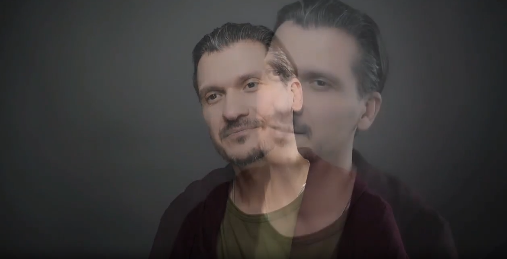

# Банк примеров и топ-5 ошибок

Аналог [11-example-library.md](../manual-2-etap/11-example-library.md) в мануале 2 этапа —
калибровочные видео-примеры без развёрнутого разбора диалога (для разбора конкретных спорных
кейсов см. [05-faq.md](05-faq.md), для статистики частых ошибок — [03-common-mistakes.md](03-common-mistakes.md)).

## Примеры

**Подходящие видео:**
- [example-1.mp4](assets/example-1.mp4) — хорошо прослеживаются черты лица, жесты.
- [example-2.mp4](assets/example-2.mp4) — человека видно хорошо, чёткое изображение.
- [example-3.mp4](assets/example-3.mp4) — человек несколько раз отворачивается, но видно
  хорошо, качество хорошее.
- [example-4.mp4](assets/example-4.mp4) — любительская съёмка, но качество допустимо.
- https://gigaeye-kandinsky-spark.obs.ru-moscow-1.hc.sbercloud.ru/ak/vk/03_02_2026/-134320284_456241955/-134320284_456241955.mp4 — подходящее качество.

**Антипримеры:**
- [antiexample-1.mp4](assets/antiexample-1.mp4) — низкое качество, смазанность и
  пиксельность, особенно видна полоса в районе рта.
- [antiexample-2.mp4](assets/antiexample-2.mp4) — плохое качество, при движении «пожатие»,
  особенно в области рук.
- [antiexample-3.mp4](assets/antiexample-3.mp4) — артефакты (блюр при движении, нестабильный
  свет), плюс много кадров с перекрытием лица → «битое».
- [antiexample-4.mp4](assets/antiexample-4.mp4) — тряска, низкое качество, лицо видно
  частично.
- [antiexample-5.mp4](assets/antiexample-5.mp4) — низкое качество, похоже на формат
  видеозвонка.
- [antiexample-6.mp4](assets/antiexample-6.mp4) — пережатый формат, видны пиксели.
- [antiexample-7.mp4](assets/antiexample-7.mp4) — нет фокуса на человеке и руках, мутное
  видео.
- https://gigaeye-kandinsky-spark.obs.ru-moscow-1.hc.sbercloud.ru/ak/vk/26_02_2026/-76745347_456243038/-76745347_456243038.mp4 — нет синхронизации, пение выглядит неестественно.
- 
  Наличие на видео наложения кадров (плавный переход, представляющий собой постепенную смену
  двух кадров в виде наложения) относим в битое! *(сохранено как кадр-картинка, не видео)*

`[Инстр. Аватар 3 этап, стр.5-6]`

## Топ-5 ошибок с примерами (upd. 01.04.2026)

### 1. Размечено битое видео (хотя должно было быть отправлено в «битое»)

- https://gigaeye-kandinsky-spark.obs.ru-moscow-1.hc.sbercloud.ru/ak/avatar/695be3dc-c45e-44a4-bf5e-8e8f61179d41/trimmed/-509_456241698__segment_2_127_157__seg2.mp4 —
  видео не подлежит разметке из-за сильной пиксельности.
- https://gigaeye-kandinsky-spark.obs.ru-moscow-1.hc.sbercloud.ru/ak/avatar/3ac0d9c6-6b88-4a08-92bc-9be5e9cd1879/trimmed/-50750285_456239157__segment_1_11_48.mp4 —
  представлен дубляж, видео не подходит, так как нет синхронизации. Дубляж не берём.
- https://gigaeye-kandinsky-spark.obs.ru-moscow-1.hc.sbercloud.ru/ak/avatar/37dde8dc-cb05-4319-8707-c11034e47e7c/trimmed/118528151_171446962__segment_2_112_132__seg2.mp4 —
  наложение кадров (плавный переход). Сюда же относим переходы с тёмным фоном, склейки без
  основного спикера и т.п.

### 2. Наличие артефакта (не проставлен)

- https://gigaeye-kandinsky-spark.obs.ru-moscow-1.hc.sbercloud.ru/ak/avatar/37dde8dc-cb05-4319-8707-c11034e47e7c/trimmed/-68719297_456239633__segment_2_50_62__seg2.mp4
- https://gigaeye-kandinsky-spark.obs.ru-moscow-1.hc.sbercloud.ru/ak/avatar/7561daa6-313c-43c8-beca-1ca316707f1c/trimmed/-28854940_456239026__segment_1_57_68__seg1.mp4
- https://gigaeye-kandinsky-spark.obs.ru-moscow-1.hc.sbercloud.ru/ak/avatar/711cdcab-f4c6-4b8c-8035-9a82f9e5bb7b/trimmed/-213259927_456239168__segment_1_42_57.mp4

Во всех трёх — некритичная пиксельность, которую не отметили галочкой «артефакт».

### 3. Наличие монтажной склейки (не проставлена)

Те же 3 видео — также в поле [«6. Непрерывная ли сцена»](01-classifier.md#6--непрерывная-ли-сцена-без-монтажных-склеек)
на странице классификатора.

- https://gigaeye-kandinsky-spark.obs.ru-moscow-1.hc.sbercloud.ru/ak/avatar/384a8f39-036c-423b-b136-6ef8128c9b96/trimmed/-6228806_456239207__segment_3_141_203__seg3.mp4 —
  не отмечено наличие склейки, хотя их на видео 2 штуки.
- https://gigaeye-kandinsky-spark.obs.ru-moscow-1.hc.sbercloud.ru/ak/avatar/1f4a641f-d256-41d3-b00a-8b246d8fec99/trimmed/-131143144_456240365__segment_2_30_233__seg2.mp4 —
  есть склейка внутри, но выбрано «непрерывно».
- https://gigaeye-kandinsky-spark.obs.ru-moscow-1.hc.sbercloud.ru/ak/avatar/711cdcab-f4c6-4b8c-8035-9a82f9e5bb7b/trimmed/-51319627_456239043__segment_10_440_462__seg10.mp4 —
  то же самое: склейка внутри, но выбрано «непрерывно».

### 4. Движение камеры (ошибка в оценке)

Те же 3 видео (плюс контрастный пример «moving») — также в поле
[«12. Смена ракурса/зум/панорамирование»](01-classifier.md#12--смена-ракурсазумпанорамирование-во-время-речи)
на странице классификатора.

- https://gigaeye-kandinsky-spark.obs.ru-moscow-1.hc.sbercloud.ru/ak/avatar/7561daa6-313c-43c8-beca-1ca316707f1c/trimmed/-3118237_456239173__segment_1_0_15.mp4 —
  нет плавного движения камеры, это тряска.
- https://gigaeye-kandinsky-spark.obs.ru-moscow-1.hc.sbercloud.ru/ak/avatar/6f09b65c-0407-46fd-b245-bcd88e8605d5/trimmed/-5918002_456239422__segment_1_0_14__seg1.mp4 —
  камера не закреплена (не static).
- https://gigaeye-kandinsky-spark.obs.ru-moscow-1.hc.sbercloud.ru/ak/avatar/20f7cee8-f47a-4104-8faa-cef6198042d9/trimmed/-31735024_456239258__segment_4_116_131__seg4.mp4 —
  нет плавного движения камеры, тряска.

### 5. Не размечено подходящее видео

- https://gigaeye-kandinsky-spark.obs.ru-moscow-1.hc.sbercloud.ru/ak/avatar/686bf388-838b-4fd1-98c9-6f2ad595e68b/trimmed/-163655585_456239140__segment_1_10_30.mp4 —
  не размечено видео с приемлемым качеством, достаточно было поставить метку «Артефакт»
  из-за сложного освещения.
- https://gigaeye-kandinsky-spark.obs.ru-moscow-1.hc.sbercloud.ru/ak/avatar/6f09b65c-0407-46fd-b245-bcd88e8605d5/trimmed/-230563923_456239030__segment_1_11_176.mp4 —
  то же: нужно было отметить наличие артефакта, а не отправлять в «битое».
- https://gigaeye-kandinsky-spark.obs.ru-moscow-1.hc.sbercloud.ru/ak/avatar/6dc9760d-8c1b-429a-88b4-eb2491129a96/trimmed/-152207410_456239048__segment_2_32_59__seg2.mp4 —
  видео подходит, нужно было отметить наличие артефакта.

`[Инстр. Аватар 3 этап, стр.6-8, upd. 01.04.2026]`

Дополнительные калиброванные примеры реальных ошибок (из проверок заказчика) — см.
[03-common-mistakes.md](03-common-mistakes.md) и разборы конкретных кейсов в
[05-faq.md](05-faq.md).
